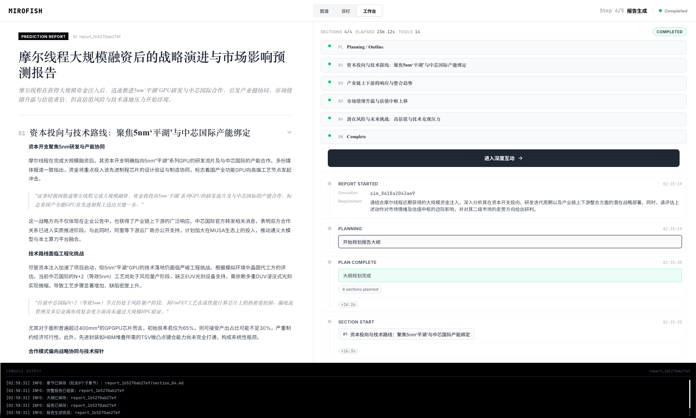
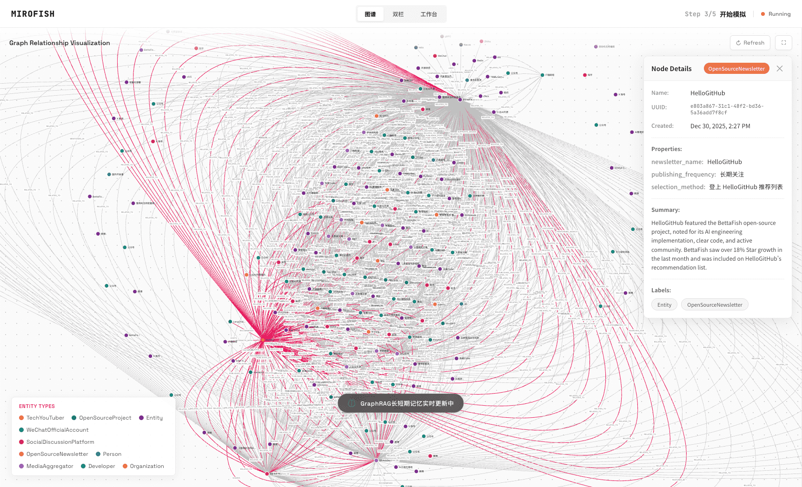

<div align="center">


<a href="https://trendshift.io/repositories/16144" target="_blank"></a>

Motor simples e versátil de inteligência coletiva para simulação e previsão
</br>
<em>A Simple and Universal Swarm Intelligence Engine, Predicting Anything</em>

<a href="https://www.shanda.com/" target="_blank"></a>

[](https://github.com/666ghj/MiroFish/stargazers)
[](https://github.com/666ghj/MiroFish/watchers)
[](https://github.com/666ghj/MiroFish/network)
[](https://hub.docker.com/)
[](https://deepwiki.com/666ghj/MiroFish)

[](https://discord.com/channels/1469200078932545606/1469201282077163739)
[](https://x.com/mirofish_ai)
[](https://www.instagram.com/mirofish_ai/)

[English](./README-EN.md) | [Documentação em português](./README.md)

</div>

## Visão geral

**MiroFish** é um motor de previsão baseado em múltiplos agentes. A ideia central é transformar sinais do mundo real, como notícias, relatórios, políticas, tendências ou até narrativas ficcionais, em um ambiente digital de alta fidelidade. Dentro desse ambiente, agentes com memória, personalidade e lógica de ação próprias interagem entre si para produzir dinâmicas sociais emergentes.

Fluxo esperado:

1. Você envia os materiais-base.
2. O sistema extrai conhecimento e constrói o grafo.
3. O ambiente da simulação é configurado automaticamente.
4. A simulação roda em paralelo nas plataformas suportadas.
5. Um agente de relatório sintetiza os resultados.
6. Você pode conversar com os agentes simulados e com o agente analítico.

## Demonstração online

Demo pública:
[mirofish-live-demo](https://666ghj.github.io/mirofish-demo/)

## Capturas do sistema

<div align="center">
<table>
<tr>
<td></td>
<td></td>
</tr>
<tr>
<td></td>
<td></td>
</tr>
<tr>
<td></td>
<td></td>
</tr>
</table>
</div>

## Vídeos de referência do projeto original

### 1. Simulação acadêmica de repercussão pública + apresentação do projeto

<div align="center">
<a href="https://www.bilibili.com/video/BV1VYBsBHEMY/" target="_blank"></a>

Clique na imagem para assistir à demonstração completa. O vídeo está hospedado no Bilibili porque faz parte do material original do projeto.
</div>

### 2. Simulação narrativa e previsão de desfecho ficcional

<div align="center">
<a href="https://www.bilibili.com/video/BV1cPk3BBExq" target="_blank"></a>

Clique na imagem para ver outro exemplo histórico do projeto original. O vídeo também está hospedado no Bilibili.
</div>

## Fluxo de trabalho

1. **Construção do grafo**: extração do material-base, injeção de memória individual e coletiva, e construção do GraphRAG.
2. **Configuração do ambiente**: extração de entidades e relações, geração de perfis e definição dos parâmetros de simulação.
3. **Execução da simulação**: simulação paralela em múltiplas plataformas, interpretação automática do objetivo e atualização dinâmica da memória temporal.
4. **Geração do relatório**: o `ReportAgent` utiliza ferramentas internas para analisar profundamente o ambiente após a simulação.
5. **Interação profunda**: conversa com agentes simulados ou diretamente com o agente de relatório.

## Início rápido

### 1. Requisitos

| Ferramenta | Versão | Observação | Verificação |
|------|------|------|------|
| **Node.js** | 18+ | Necessário para o frontend e `npm` | `node -v` |
| **Python** | >= 3.11 e <= 3.12 | Necessário para o backend | `python --version` |
| **uv** | versão atual | Gerenciador de dependências Python | `uv --version` |

### 2. Configuração de ambiente

```bash
# Copie o arquivo de exemplo
cp .env.example .env

# Edite o arquivo .env com suas chaves
```

Variáveis obrigatórias:

```env
# Configuração do modelo LLM
# Padrão recomendado: OpenAI
# Também funciona com provedores compatíveis com o formato OpenAI
# Exemplos úteis no Brasil/ocidente: OpenRouter, Azure OpenAI e Groq via gateway compatível
LLM_API_KEY=your_api_key
LLM_BASE_URL=https://api.openai.com/v1
LLM_MODEL_NAME=gpt-4o-mini

# Configuração da Zep Cloud
ZEP_API_KEY=your_zep_api_key
```

### 3. Instalação

Instalação completa:

```bash
npm run setup:all
```

Instalação por etapa:

```bash
# Dependências Node.js
npm run setup

# Dependências Python
npm run setup:backend
```

### 4. Execução

Subir frontend e backend juntos:

```bash
npm run dev
```

Endereços padrão:

- Frontend: `http://localhost:3000`
- API backend: `http://localhost:5001`

Execução separada:

```bash
npm run backend
npm run frontend
```

## Execução com Docker

```bash
# Copie as variáveis de ambiente
cp .env.example .env

# Suba os serviços
docker compose up -d
```

O `docker compose` lê o `.env` na raiz do projeto e expõe, por padrão, as portas `3000` e `5001`.

## Contato

Use preferencialmente os canais mais acessíveis no ocidente:

- Discord: https://discord.com/channels/1469200078932545606/1469201282077163739
- X: https://x.com/mirofish_ai
- Instagram: https://www.instagram.com/mirofish_ai/
- E-mail: **mirofish@shanda.com**

## Agradecimentos

**O MiroFish conta com suporte estratégico e incubação do grupo Shanda.**

O motor de simulação é impulsionado por **[OASIS](https://github.com/camel-ai/oasis)**. O projeto reconhece e agradece a contribuição open source da equipe CAMEL-AI.

## Estatísticas do projeto

<a href="https://www.star-history.com/#666ghj/MiroFish&type=date&legend=top-left">
 <picture>
   <source media="(prefers-color-scheme: dark)" srcset="https://api.star-history.com/svg?repos=666ghj/MiroFish&type=date&theme=dark&legend=top-left" />
   <source media="(prefers-color-scheme: light)" srcset="https://api.star-history.com/svg?repos=666ghj/MiroFish&type=date&legend=top-left" />
   
 </picture>
</a>
