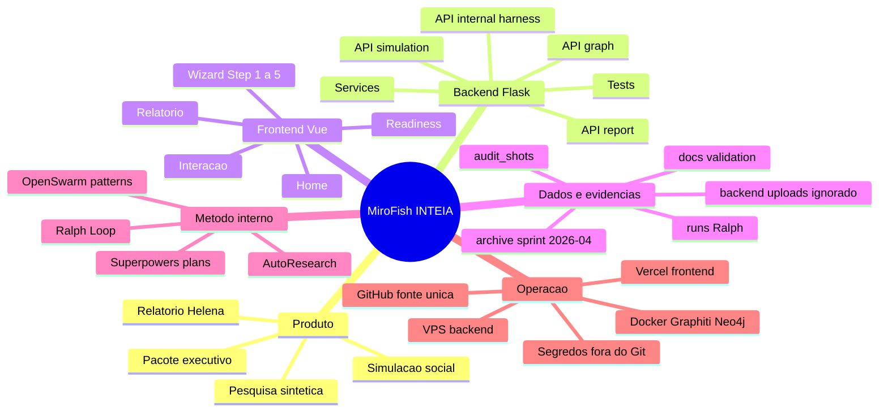
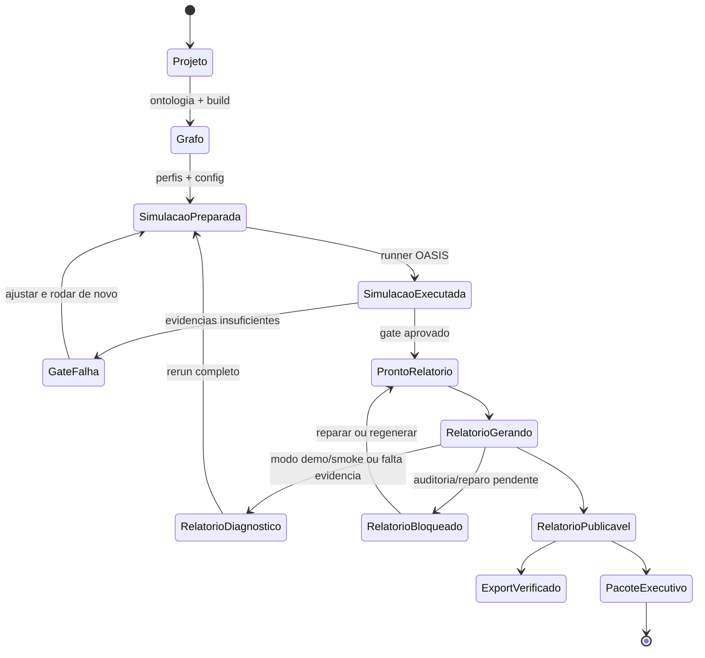
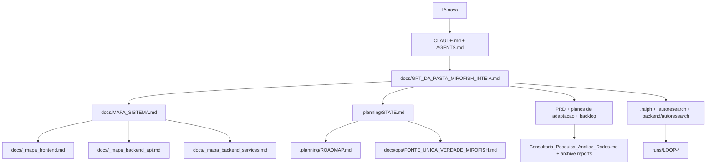

# GPT da Pasta — MiroFish INTEIA

Atualizado em: 2026-07-24
Escopo: inventário de ativos, pesquisa sintética, código, documentação, artefatos e trilha operacional desta pasta.
Pasta analisada: `C:\Users\IgorPC\.claude\projects\Mirofish INTEIA`

## 1. Como uma IA deve ler esta pasta

Este documento é a camada de orientação rápida para uma IA que chegou agora. Ele não substitui os mapas técnicos existentes; ele conecta tudo em uma wiki navegável.

Ordem recomendada:

1. Ler `CLAUDE.md` e `AGENTS.md` para regras de trabalho, branch e PR.
2. Ler este arquivo para entender o inventário completo e a história do ativo.
3. Abrir `.planning/architecture/system-architecture.html` para a arquitetura viva.
4. Abrir `.planning/architecture/helena-control-plane.html` para o control plane.
5. Consultar `graphify-out/graph.html` para relações no checkout atual.
6. Ler `docs/MAPA_SISTEMA.md` para arquitetura macro.
7. Ler `docs/_mapa_frontend.md`, `docs/_mapa_backend_api.md` e `docs/_mapa_backend_services.md` para detalhe técnico.
8. Ler `.planning/STATE.md` e `docs/ops/FONTE_UNICA_VERDADE_MIROFISH.md` para estado operacional.
9. Só depois editar código ou documentação.

Regra prática estilo wiki/Karpathy: primeiro entenda o loop de produto, depois os artefatos, depois os serviços, depois os testes. Não comece por arquivo isolado.

## 2. Síntese do ativo

MiroFish INTEIA é um fork brasileiro do MiroFish original, transformado em motor de simulação social, pesquisa sintética e entrega executiva auditável para a INTEIA.

O ativo combina:

- ingestão de materiais-base;
- geração de ontologia e grafo contextual;
- preparação de agentes e perfis sintéticos;
- simulação social multiagente;
- geração de relatório Helena;
- gates de qualidade, auditoria de evidências e cadeia de custódia;
- forecast ledger e calibração;
- exportação verificada e pacote executivo;
- método interno Ralph/OpenSwarm/AutoResearch para melhorar execução sem virar runtime do produto.

Estado observado no código atual:

- fonte oficial: `https://github.com/igormorais123/MiroFish`;
- produção: VPS `hermes`, checkout `/opt/mirofish-git`;
- site público: `https://inteia.com.br/mirofish/`;
- API pública correta: `https://inteia.com.br/mirofish/api/...`;
- centro de comando Helena publicado pelo PR `#99`, commit
  `07306e711509772038b381176781ce80edacdfa0`;
- Graphify atual: 3.955 nós, 8.443 relações e 159 comunidades;
- backend: 390 testes; frontend Helena: 8 testes no snapshot de publicação;
- inventário-base antes destes artefatos de mapa: 522 arquivos rastreados pelo Git;
- artefatos novos deste trabalho: +2 (`docs/GPT_DA_PASTA_MIROFISH_INTEIA.md` e `docs/MIROFISH_INTEIA_MAPA_MENTAL_IA.html`);
- total esperado após versionar estes mapas: 524 arquivos rastreados;
- Markdown rastreados no inventário-base: 107;
- HTML rastreados no inventário-base: 28;
- Python rastreados: 158;
- Vue/JS/CSS rastreados: 25;
- rotas Flask declaradas no código atual: 106;
- testes Python rastreados em `backend/tests`: 50 arquivos.

## 3. Mapa Mermaid — visão mental



## 4. Mapa Mermaid — pastas e subpastas

```mermaid
graph TD
  R["raiz MiroFish INTEIA"]

  R --> RootDocs["Docs raiz: README, PRD, planos, backlog, relatorios"]
  R --> Backend["backend/ 148 arquivos rastreados"]
  R --> Frontend["frontend/ 90 arquivos rastreados"]
  R --> Docs["docs/ 68 arquivos rastreados"]
  R --> Planning[".planning/ 21 arquivos rastreados"]
  R --> Ralph[".ralph/ 16 arquivos rastreados"]
  R --> AutoResearch[".autoresearch/ 8 arquivos rastreados"]
  R --> Runs["runs/ 17 arquivos rastreados"]
  R --> Archive["_archive/ 77 arquivos rastreados"]
  R --> AuditShots["audit_shots/ 19 imagens/texto"]
  R --> Deploy["deploy/ 4 arquivos rastreados"]
  R --> Scripts["scripts/ 4 scripts"]
  R --> Tools["tools/ 3 scripts"]
  R --> Static["static/ 12 imagens upstream"]
  R --> Memory["memory/ 3 rastreados + memorias locais ignoradas"]
  R --> GitHub[".github/ workflows + CODEOWNERS"]

  Backend --> BackendApp["app/ api, models, services, utils"]
  BackendApp --> BackendApi["api/: graph, simulation, report, internal"]
  BackendApp --> BackendServices["services/: grafo, simulacao, relatorio, pacote, gates"]
  BackendApp --> BackendUtils["utils/: llm, graphiti, parsing, retry, safe ids"]
  Backend --> BackendAuto["autoresearch/: engine, targets, corpora"]
  Backend --> BackendTests["tests/: 50 arquivos pytest"]
  Backend --> BackendScripts["scripts/: enrich, proxy, runners"]

  Frontend --> FrontendSrc["src/"]
  FrontendSrc --> Views["views/: Home, Main, Simulation, Report, Interaction"]
  FrontendSrc --> Components["components/: Step1 a Step5, GraphPanel, History"]
  FrontendSrc --> ApiJs["api/: graph, simulation, report, index"]
  FrontendSrc --> Assets["assets/: tema INTEIA e logos"]
  Frontend --> Public["public/: logos, video hero, report lab publicado"]

  Docs --> Ops["ops/: deploy, segredos, reconciliacao, rollout"]
  Docs --> Maps["mapas tecnicos backend/frontend/sistema"]
  Docs --> PRDDD["prd/ e ddd/"]
  Docs --> Superpowers["superpowers/plans/"]
  Docs --> Validation["validation/helena_report_lab_2026-05-07"]

  Planning --> Codebase["codebase/: arquitetura, stack, testes, concerns"]
  Planning --> Phases["phases/: diagnostico e fixes de pipeline"]

  Archive --> Sprint["sprints/sprint-2026-04: relatorios, screenshots, scripts e comparativos"]
```



## 5. Mapa Mermaid — pipeline de pesquisa sintética

```mermaid
flowchart LR
  A["Material-base<br/>docs, briefing, dossie, contexto"] --> B["Extracao e normalizacao<br/>file_parser, text_processor"]
  B --> C["Ontologia e grafo<br/>ontology_generator, graph_builder, Graphiti"]
  C --> D["Perfis e ambiente<br/>oasis_profile_generator, mission_selection, social_bootstrap"]
  D --> E["Simulacao social<br/>simulation_manager, runner, IPC, actions"]
  E --> F["Qualidade e prontidao<br/>report_system_gate, decision_readiness"]
  F --> G["Relatorio Helena<br/>report_agent, helena_report_lab, diagrams"]
  G --> H["Auditoria e reparo<br/>attribution, content_repair, method_checklist"]
  H --> I["Entrega<br/>mission_bundle, forecast_ledger, export, executive_package"]
  I --> J["IA/analista consome<br/>relatorio, anexos, manifesto, evidencias"]
```



## 6. Mapa Mermaid — governança de entrega



## 7. Mapa Mermaid — documentação como wiki



## 8. Índice de ativos por camada

| Camada | Pasta/arquivo | Papel | Observação para IA |
|---|---|---|---|
| Entrada obrigatória | `CLAUDE.md`, `AGENTS.md` | regras de coordenação, branch, PR, idioma e segurança | ler antes de qualquer edição |
| Produto público | `README.md`, `README-EN.md` | visão pública, execução, deploy, documentação | `README.md` é a fonte em PT-BR |
| Produto original | `PRD_MIROFISH_INTEIA_V2.md`, `PLANO_ADAPTACAO_*`, `BACKLOG_*` | intenção inicial, escopo e backlog do fork | referência histórica e de produto |
| Pesquisa sintética | `Consultoria_Pesquisa_Analise_Dados.md`, `_archive/sprints/sprint-2026-04/REL_*` | dossiês, simulações e relatórios antigos | úteis para entender casos de uso e falhas |
| Diagnóstico crítico | `RELATORIO_HELENA_EFESTO_MIROFISH.md` | avaliação honesta do primeiro teste ponta a ponta | explica por que gates anti-fabricação foram criados |
| Planejamento vivo | `.planning/STATE.md`, `.planning/ROADMAP.md`, `.planning/DOCUMENTATION_MAP.md` | estado, próximas fases e mapa documental | melhor ponto para retomar trabalho |
| Backend | `backend/app/` | Flask, APIs, services, models, utils | núcleo técnico da plataforma |
| Frontend | `frontend/src/` | Vue 3, wizard e interface de relatório | experiência do usuário e leitura de readiness |
| Operação | `docs/ops/` | GitHub, Vercel, VPS, segredos, rollout | fonte operacional atual |
| Método interno | `.ralph/`, `.autoresearch/`, `backend/autoresearch/`, `runs/` | disciplina de execução e avaliação de método | não é runtime de produto |
| Validação visual | `audit_shots/`, `docs/validation/`, `frontend/public/assets/helena_report_lab_2026-05-07/` | screenshots e HTMLs de validação | provas de renderização e pacote Helena |
| Deploy | `Dockerfile`, `docker-compose.yml`, `deploy/`, `vercel.json` | build, VPS, Vercel, Graphiti/Neo4j | arquivos vermelhos; editar só com PR |
| Local/ignorado | `.env`, `.vercel/`, `node_modules/`, `backend/.venv/`, `backend/uploads/`, logs | runtime local, secrets, cache e dados vivos | mapear existência, não versionar conteúdo |

## 9. O que foi feito neste projeto

Evolução condensada:

1. Fork do MiroFish original para contexto INTEIA, com PT-BR, OmniRoute, Helena e deploy.
2. Primeiro teste local com Ollama/Graphiti/OASIS provou pipeline, mas revelou falhas graves: grafo vazio, baixa atividade social e relatório com fabricação.
3. Fase v1.3 criou consultoria por simulação auditável: gate estrutural, auditoria de evidências, separação cliente/demo, pulso social inicial e bloqueio de relatórios fracos.
4. Rodada Ralph/OpenSwarm/AutoResearch trouxe readiness, checklist metodológico, export verificado, forecast ledger, pacote executivo e método interno mensurável.
5. Reconciliação GitHub/VPS/Vercel consolidou GitHub como fonte única e padronizou deploy público em `/mirofish`.
6. Fases mais recentes reforçaram segurança e robustez: rate limit caseiro em rotas LLM públicas, validação por magic bytes, dependências corrigidas, Gunicorn no container, assets no subpath e harness interno para Vox.

## 10. Ativo de pesquisa sintética

O ativo de pesquisa sintética está distribuído em quatro níveis:

| Nível | Onde está | Função |
|---|---|---|
| Casos e insumos | `Consultoria_Pesquisa_Analise_Dados.md`, `_archive/sprints/sprint-2026-04/sim_*.md`, relatórios `REL_*` | entradas e outputs de simulações político-eleitorais, jurídicas, reputacionais e pessoais |
| Motor | `backend/app/services/simulation_*`, `oasis_profile_generator.py`, `social_bootstrap.py`, `power_*` | transforma contexto em agentes, ações, eventos e perfis |
| Qualidade | `report_system_gate.py`, `delivery_governance.py`, `report_attribution.py`, `strategic_density_gate.py` | impede transformar ficção ou diagnóstico fraco em entrega cliente |
| Entrega | `report_agent.py`, `forecast_ledger.py`, `report_exporter.py`, `executive_package.py`, `mission_bundle.py` | gera leitura Helena, previsões, anexos, hashes e pacote executivo |

Principais aprendizados:

- relatório bonito sem evidência é risco operacional;
- ação social simulada precisa ter volume, diversidade e rastreabilidade;
- número, probabilidade e citação direta são claims auditáveis;
- relatório cliente só é aceitável se passar gate e auditoria;
- `demo/smoke` serve para diagnóstico, não para entrega;
- AutoResearch deve propor melhoria, não aplicar patch automático em produção.

## 11. Backend — mapa de código

Rotas declaradas no código atual:

| Blueprint | Arquivo | Rotas declaradas |
|---|---:|---:|
| App raiz/health/SPA | `backend/app/__init__.py` | 5 |
| Graph | `backend/app/api/graph.py` | 11 |
| Simulation | `backend/app/api/simulation.py` | 35 |
| Report | `backend/app/api/report.py` | 35 |
| Internal/Harness | `backend/app/api/internal.py` | 20 |
| Total | `backend/app/**` | 106 |

Services principais por domínio:

| Domínio | Arquivos |
|---|---|
| Grafo e ontologia | `graph_builder.py`, `ontology_generator.py`, `llm_entity_extractor.py`, `zep_entity_reader.py`, `zep_graph_memory_updater.py`, `zep_tools.py` |
| Simulação | `simulation_manager.py`, `simulation_runner.py`, `simulation_ipc.py`, `simulation_data_reader.py`, `simulation_config_generator.py`, `social_bootstrap.py`, `oasis_profile_generator.py` |
| Relatório Helena | `report_agent.py`, `helena_report_lab.py`, `inteia_report_html.py`, `report_diagrams.py`, `safe_markdown_renderer.py` |
| Gates e auditoria | `report_system_gate.py`, `report_attribution.py`, `report_content_repair.py`, `report_method_checklist.py`, `strategic_density_gate.py`, `delivery_governance.py` |
| Entrega executiva | `report_exporter.py`, `report_bundle_verifier.py`, `report_delivery_packet.py`, `report_finalization.py`, `executive_package.py`, `mission_bundle.py`, `forecast_ledger.py` |
| Catálogos e decisão | `power_catalog.py`, `power_persona_catalog.py`, `mission_selection.py`, `decision_readiness.py`, `decision_packet.py`, `golden_case_loader.py`, `harness_evidence_bundle.py` |
| Integrações | `apify_enricher.py`, utils `llm_client.py`, `graphiti_client.py`, `token_tracker.py`, `retry.py`, `safe_ids.py` |

## 12. Frontend — mapa de experiência

| Área | Arquivos | Papel |
|---|---|---|
| App e rotas | `App.vue`, `main.js`, `router/index.js` | shell Vue e subpath `/mirofish` |
| Home | `views/Home.vue`, `components/HistoryDatabase.vue` | entrada do usuário e histórico |
| Wizard | `MainView.vue`, `SimulationView.vue`, `SimulationRunView.vue` | fluxo de projeto, ambiente e simulação |
| Step 1 | `Step1GraphBuild.vue`, `api/graph.js` | upload, ontologia e grafo |
| Step 2 | `Step2EnvSetup.vue`, `api/simulation.js` | perfis, config e enriquecimento |
| Step 3 | `Step3Simulation.vue` | execução, qualidade, readiness e geração de relatório |
| Step 4 | `Step4Report.vue`, `api/report.js` | relatório, logs, pacote, export, forecasts |
| Step 5 | `Step5Interaction.vue`, `InteractionView.vue` | chat com relatório ou agentes simulados |
| Visual | `GraphPanel.vue`, `InteiaBackground.vue`, `inteia-theme.css` | grafo, fundo neural e identidade visual |

## 13. Índice documental completo — raiz

| Documento | Papel |
|---|---|
| `AGENTS.md` | resumo de regras para agentes não-Claude; espelho do `CLAUDE.md` |
| `CLAUDE.md` | guia canônico para agentes IA, branch, PR, deploy e idioma |
| `README.md` | visão pública do MiroFish INTEIA, stack, fluxo, deploy e docs |
| `README-EN.md` | README histórico em inglês do upstream/fork |
| `PRD_MIROFISH_INTEIA_V2.md` | requisitos originais do motor premium de simulação social |
| `PLANO_ADAPTACAO_MIROFISH_INTEIA.md` | primeira tese e roadmap de adaptação do fork |
| `PLANO_ADAPTACAO_MIROFISH_INTEIA_V2.md` | decisão de boundary INTEIA x MiroFish, pilotos e riscos |
| `BACKLOG_TECNICO_MIROFISH_INTEIA_V2.md` | backlog inicial por épicos MI-001 a MI-091 |
| `MAPEAMENTO_PT-BR.md` | mapa de tradução/adaptação PT-BR |
| `LENIA_MIROFISH_INTEGRACAO.md` | contrato inicial de integração com Lenia-RR |
| `RELATORIO_HELENA_EFESTO_MIROFISH.md` | diagnóstico estratégico/técnico do teste de 24/04/2026 |
| `Consultoria_Pesquisa_Analise_Dados.md` | relatório de inteligência sobre Banco Master/DF e risco institucional |
| `RALPH.md` | entrada curta para RalphLoop |

## 14. Índice documental completo — `docs/`

| Documento | Papel |
|---|---|
| `docs/MAPA_SISTEMA.md` | GPS técnico macro para IAs |
| `docs/_mapa_frontend.md` | mapa profundo do frontend Vue |
| `docs/_mapa_backend_api.md` | mapa da API Flask, modelos, config e deploy |
| `docs/_mapa_backend_services.md` | mapa detalhado dos services e utils backend |
| `docs/GPT_DA_PASTA_MIROFISH_INTEIA.md` | este índice consolidado |
| `docs/MIROFISH_INTEIA_MAPA_MENTAL_IA.html` | mapa mental visual em HTML/SVG navegável para estudo por IA |
| `docs/openswarm_mirofish_opportunities_2026-05-06.md` | lições úteis do OpenSwarm para entregáveis auditáveis |
| `docs/prd/2026-05-06-mirofish-systemic-intelligence-ux-prd.md` | PRD de readiness, pacote executivo e UX sistêmica |
| `docs/ddd/2026-05-06-mirofish-systemic-intelligence-ux-ddd.md` | DDD dos contextos de simulação, relatório, readiness e pacote |
| `docs/superpowers/plans/2026-05-05-mirofish-upgrade-harness-poder-preditivo.md` | plano de upgrade de poder preditivo, poderes, personas, forecast |
| `docs/superpowers/plans/2026-05-06-mirofish-auditable-executive-export.md` | plano de export executivo auditável |
| `docs/superpowers/plans/2026-05-06-mirofish-ralph-openswarm-autoresearch-trio.md` | plano trio Ralph/OpenSwarm/AutoResearch |
| `docs/superpowers/plans/2026-05-06-mirofish-systemic-intelligence-trio.md` | implementação sistêmica ampla |
| `docs/superpowers/plans/2026-05-06-mirofish-systemic-intelligence-ux-plan.md` | plano de UX sistêmica |

## 15. Índice documental completo — `docs/ops/`

| Documento | Papel |
|---|---|
| `CENTRALIZACAO_GITHUB_2026-05-06.md` | centralização GitHub, PRs, Vercel e fluxo obrigatório |
| `COMANDOS_SEGUROS_MIROFISH.md` | comandos seguros para agentes e operação |
| `FONTE_UNICA_VERDADE_MIROFISH.md` | fonte única, URLs corretas, VPS, merge e deploy |
| `MIROFISH_HARNESS_API.md` | contrato de API interna para iniciar pesquisas e consumir evidências |
| `RELATORIO_RECONCILIACAO_2026-05-06.md` | reconciliação inicial do estado operacional |
| `RELATORIO_RECONCILIACAO_2026-05-10.md` | reconciliação VPS x GitHub e deploy por `/opt/mirofish-git` |
| `ROLLOUT_INTELIGENCIA_SISTEMICA_2026-05-07.md` | cadeia de PRs da pilha sistêmica e controles |
| `SEGREDOS_E_AMBIENTES_MIROFISH.md` | política de variáveis, cofres e ambientes |
| `SUPER_AUDITORIA_IMPLANTACAO_PLANO_2026-05-07.md` | auditoria final da implantação sistêmica |
| `VALIDACAO_POS_MERGE_INTELIGENCIA_SISTEMICA_2026-05-07.md` | validação pós-merge com testes e render local |
| `VERCEL_DEPLOY.md` | deploy do frontend no Vercel e rewrites |
| `VERIFICACAO_FINAL_INTELIGENCIA_SISTEMICA_2026-05-07.md` | verificação final da pilha sistêmica |

## 16. Índice documental completo — `.planning/`

| Documento | Papel |
|---|---|
| `.planning/PROJECT.md` | visão do projeto e milestone |
| `.planning/STATE.md` | estado real v1.3, validações e pendências |
| `.planning/ROADMAP.md` | próximas fases |
| `.planning/DOCUMENTATION_MAP.md` | mapa de documentação já existente |
| `.planning/PLANO_IMPLEMENTACAO_CONSULTORIA_SIMULADA_INTEIA.md` | plano da consultoria por simulação auditável |
| `.planning/LEARNINGS_CONSULTORIA_SIMULADA.md` | aprendizados da fase v1.3 |
| `.planning/PLANO_CORRECAO_MIROFISH.md` | diagnóstico/correção histórica do pipeline |
| `.planning/SPRINT_2026-04.md` | sprint de abril |
| `.planning/UPSTREAM_SYNC.md` | sincronização com upstream `666ghj/MiroFish` |
| `.planning/codebase/ARCHITECTURE.md` | arquitetura do código |
| `.planning/codebase/CONCERNS.md` | riscos e dívidas |
| `.planning/codebase/CONVENTIONS.md` | convenções locais |
| `.planning/codebase/INTEGRATIONS.md` | integrações externas |
| `.planning/codebase/STACK.md` | stack tecnológica |
| `.planning/codebase/STRUCTURE.md` | estrutura do código |
| `.planning/codebase/TESTING.md` | padrões de teste |
| `.planning/phases/01-diagnostico-pipeline-travamento/DIAGNOSTICO_TRAVAMENTO.md` | diagnóstico de travamentos |
| `.planning/phases/01-relatorio-premium-impressao-compartilhamento-e-custos/01-01-PLAN.md` | plano de relatório premium/custos |
| `.planning/phases/02-fix-pipeline-travamento/PLAN.md` | plano de correção dos travamentos dominantes |
| `.planning/phases/02-fix-pipeline-travamento/DEPLOY.md` | deploy da fase 2 |

## 17. Índice documental completo — `.ralph`, `.autoresearch`, `runs`, `memory`

| Documento | Papel |
|---|---|
| `.ralph/RALPH.md` | pacote RalphLoop |
| `.ralph/PROJECT.md` | descrição do piloto Ralph no MiroFish |
| `.ralph/LOOP.md` | executor RalphLoop |
| `.ralph/PM.md` | papel de PM do método |
| `.ralph/SWARM.md` | contrato interno de lanes inspirado no OpenSwarm |
| `.ralph/AUTORESEARCH.md` | integração AutoResearch ao Ralph |
| `.ralph/TASK_TEMPLATE.md` | template de tarefa |
| `.ralph/VERIFY.md` | estratégia de verificação |
| `.ralph/SECURITY.md` | segurança do método |
| `.ralph/RECOVERY.md` | recuperação de falhas |
| `.ralph/STATUS_VALUES.md` | valores de status |
| `.ralph/tickets/001-first-loop.md` | primeiro loop Ralph |
| `.ralph/tickets/002-p01-readiness-assessment.md` | assessment de prontidão |
| `.ralph/tickets/003-apply-openswarm-routing-proposal.md` | aplicar proposta OpenSwarm |
| `.autoresearch/experiments/openswarm-specialist-routing-v1/DECISAO.md` | decisão de não aplicar patch no mesmo run |
| `.autoresearch/experiments/openswarm-specialist-routing-v1/RANKING.md` | ranking de proposta OpenSwarm |
| `.autoresearch/experiments/openswarm-specialist-routing-v1/PATCH_PROPOSTO.diff` | patch proposto pelo experimento |
| `backend/autoresearch/PLANO_IMPLANTACAO.md` | plano AutoResearch v2 inspirado em Karpathy/OPRO/PBT/TextGrad |
| `memory/MEMORY.md` | índice de memórias persistentes |
| `memory/project_autoresearch.md` | framework AutoResearch INTEIA |
| `memory/project_autoresearch_v2_plan.md` | plano evolutivo AutoResearch v2 |
| `runs/LOOP-20260506-012604/*` | pacote completo de um loop Ralph: task, input, output, audit, learning, metrics, verify, next |
| `runs/LOOP-20260506-104500/*` | segundo loop Ralph com a mesma estrutura |

Observação: existem memórias locais ignoradas pelo Git em `memory/` (`feedback_apify_costs.md`, `project_apify_integration.md`, `reference_omniroute_apify.md`, `decision_codex_oauth_5_5.md`). Elas aparecem no `MEMORY.md`, mas são pessoais/locais e não devem ser versionadas sem decisão explícita.

## 18. Índice documental completo — `_archive/sprints/sprint-2026-04`

| Documento | Papel |
|---|---|
| `COMPARATIVO_GPT54mini_vs_GPT55.md` | comparação GPT-5.4-mini vs GPT-5.5 |
| `COMPARATIVO_GPT55_v1_vs_v2.md` | variabilidade de runs GPT-5.5 |
| `GRAPH_ID_FIX_SUMMARY.md` | correção de propagação `graph_id` |
| `TIMING_ANALYSIS.md` | análise de tempo por etapa do pipeline |
| `TIMING_RESULTS_POSFIX.md` | resultados pós-fix |
| `sim_neto2026_campanha.md` | dossiê de campanha para simulação |
| `sim_reforma_tributaria_mirante.md` | dossiê Reforma Tributária/DF para simulação |
| `REL_5.4mini_0f152eed.md` | relatório de previsão com GPT-5.4-mini |
| `REL_5.5_fde26412.md` | relatório de previsão com GPT-5.5 |
| `REL_5.5v2_afe4b6f9.md` | relatório de previsão GPT-5.5 v2 |
| `REL_5.5v2_b1d6a913.md` | simulação sem evolução observável |
| `REL_Igor_simulacao_sim_95c309e2.md` | previsão futura de Igor usada no diagnóstico Helena/Efesto |
| `REL_MiroFish_BancoMaster_sim_1984673b7f44.md` | relatório Banco Master/DF |
| `REL_julgamento_9c556293.md` | relatório sobre julgamento Igor x Melissa |
| `REL_sergipe_ddae1b1a.md` | relatório Sergipe 2026 |
| `REL-2026-008_Helena_Master.txt/html` | relatório Helena Master histórico |

Além desses documentos, a pasta contém screenshots, scripts de correção e scripts de execução usados como evidência histórica. Não usar `_archive` como fonte do estado atual; usar para auditoria, comparação e recuperação de contexto.

## 19. Índice HTML e validações

| Arquivo/grupo | Papel |
|---|---|
| `PROPOSTA_FINANCIAMENTO_MIRANTE_NEWS.html` | proposta HTML histórica |
| `PROPOSTA_FINANCIAMENTO_MIROFISH_INTEIA.html` | proposta HTML histórica |
| `docs/validation/helena_report_lab_2026-05-07/index.html` | índice de laboratório Helena |
| `docs/validation/helena_report_lab_2026-05-07/reports/*.html` | 10 relatórios HTML de validação temática |
| `docs/validation/helena_report_lab_2026-05-07/screenshots/*.png` | screenshots desktop/internal/mobile desses relatórios |
| `docs/validation/helena_report_lab_2026-05-07/visual_validation_report.html` | relatório de validação visual |
| `frontend/public/assets/helena_report_lab_2026-05-07/**` | cópia publicada do lab para o frontend |
| `frontend/index.html` | shell HTML da SPA Vite |

Temas validados no lab Helena:

- clientes públicos/privados;
- concorrência AI;
- go-to-market 90d;
- ofertas produtizadas;
- posicionamento de mercado;
- reputação e autoridade;
- riscos operacionais;
- sistema de inteligência;
- stack de produto;
- unit economics.

## 20. Testes rastreados

Os testes cobrem API, serviços, governança, relatório, simulação, segurança, export e AutoResearch.

Lista rastreada em `backend/tests/`:

`test_api_mission_extensions.py`, `test_autoresearch_method_targets.py`, `test_decision_packet.py`, `test_decision_readiness.py`, `test_decision_readiness_api.py`, `test_delivery_governance.py`, `test_executive_package.py`, `test_forecast_ledger.py`, `test_golden_case_loader.py`, `test_graph_api_ontology.py`, `test_graph_builder.py`, `test_helena_report_lab.py`, `test_internal_harness_api.py`, `test_llm_client_json.py`, `test_mission_bundle.py`, `test_mission_selection.py`, `test_oasis_profile_generator.py`, `test_ontology_generator_v2.py`, `test_pagination.py`, `test_power_catalog.py`, `test_power_persona_catalog.py`, `test_report_attribution.py`, `test_report_bundle_verifier.py`, `test_report_content_repair.py`, `test_report_delivery_package_api.py`, `test_report_delivery_packet.py`, `test_report_diagrams.py`, `test_report_evolution_readiness.py`, `test_report_exporter.py`, `test_report_exports_api.py`, `test_report_finalization.py`, `test_report_finalization_api.py`, `test_report_manager_artifacts.py`, `test_report_method_checklist.py`, `test_report_quality.py`, `test_retry.py`, `test_safe_markdown_renderer.py`, `test_security_defaults.py`, `test_simulation_data_reader.py`, `test_simulation_history_api.py`, `test_simulation_manager.py`, `test_simulation_runner_reconcile.py`, `test_social_bootstrap.py`, `test_strategic_density_gate.py`, `test_token_tracker.py`, `test_translation.py`, `test_zep_paging_compat.py`.

Validações históricas documentadas:

- `.planning/STATE.md`: 76 testes aprovados em fase v1.3;
- `docs/ops/VERIFICACAO_FINAL_INTELIGENCIA_SISTEMICA_2026-05-07.md`: 248 testes e build frontend;
- `docs/ops/VALIDACAO_POS_MERGE_INTELIGENCIA_SISTEMICA_2026-05-07.md`: 252 testes, build Vite, AutoResearch baseline `1.0000`;
- `docs/ops/SUPER_AUDITORIA_IMPLANTACAO_PLANO_2026-05-07.md`: 21 testes focados passaram.

## 21. Arquivos e pastas locais que a IA deve tratar com cuidado

| Caminho | Status | Conduta |
|---|---|---|
| `.env`, `.env.local-ollama.bak` | ignorados; podem conter segredos | não abrir nem versionar |
| `.vercel/` | contexto local Vercel | não versionar |
| `node_modules/`, `frontend/node_modules/` | dependências instaladas | ignorar no mapa profundo |
| `backend/.venv/` | ambiente Python local | ignorar no mapa profundo |
| `backend/uploads/` | dados vivos de projetos/simulações/relatórios | não versionar; referenciar por ID |
| `backend/logs/`, `*.log` | logs vivos | não versionar |
| `frontend/dist/` | build gerado | não versionar |
| `graph_platforms/` | screenshots/credenciais locais de plataformas de grafo | ignorado pelo Git; não tratar como fonte canônica |
| `.claude/`, `.gstack/` | estado local de ferramentas | ignorar salvo pedido explícito |

## 22. Leitura rápida para auditoria futura

Para auditar produto:

1. `README.md`
2. `docs/MAPA_SISTEMA.md`
3. `.planning/STATE.md`
4. `docs/ops/SUPER_AUDITORIA_IMPLANTACAO_PLANO_2026-05-07.md`
5. `backend/tests/`

Para auditar pesquisa sintética:

1. `RELATORIO_HELENA_EFESTO_MIROFISH.md`
2. `.planning/PLANO_IMPLEMENTACAO_CONSULTORIA_SIMULADA_INTEIA.md`
3. `.planning/LEARNINGS_CONSULTORIA_SIMULADA.md`
4. `_archive/sprints/sprint-2026-04/REL_*.md`
5. `backend/app/services/report_system_gate.py`

Para auditar deploy:

1. `docs/ops/FONTE_UNICA_VERDADE_MIROFISH.md`
2. `docs/ops/VERCEL_DEPLOY.md`
3. `docs/ops/RELATORIO_RECONCILIACAO_2026-05-10.md`
4. `deploy/docker-compose.vps.yaml`
5. `vercel.json`

Para auditar método interno:

1. `.ralph/RALPH.md`
2. `.ralph/SWARM.md`
3. `.autoresearch/experiments/openswarm-specialist-routing-v1/DECISAO.md`
4. `backend/autoresearch/PLANO_IMPLANTACAO.md`
5. `runs/LOOP-*`

## 23. Lacunas e alertas para a próxima IA

- Os mapas técnicos existentes são muito úteis, mas alguns números parecem defasados: `docs/MAPA_SISTEMA.md` fala em 70 arquivos principais e `docs/_mapa_backend_api.md` fala em 58 endpoints, enquanto o código atual declara 106 rotas Flask.
- `docs/ops/SUPER_AUDITORIA_IMPLANTACAO_PLANO_2026-05-07.md` registra que PRD/DDD ficaram defasados em relação ao contrato real de readiness.
- Ainda falta validação manual com uma missão real ponta a ponta: simulação real, readiness no Step 3, relatório, pacote executivo publicável, downloads e abertura dos arquivos.
- Testes de readiness devem cobrir explicitamente `report_diagnostic`, `report_blocked` e `report_in_progress`.
- PDF/DOCX/deck executivo e QA visual automatizado continuam como próximos passos, não como entregue final.

## 24. Resumo final para IA

Este repositório não é apenas um app Vue/Flask. Ele é um laboratório-produto de pesquisa sintética com governança pesada para não transformar simulação fraca em decisão falsa.

O centro do projeto é:

```text
material real -> grafo -> agentes -> simulação -> gate -> relatório Helena -> pacote verificável
```

O maior valor já criado está na combinação de:

- motor social;
- gates anti-fabricação;
- evidência local;
- forecast/calibração;
- pacote executivo auditável;
- método interno Ralph/AutoResearch para melhorar sem soltar autopatch.

A próxima IA deve preservar essa lógica antes de adicionar qualquer feature.

## 25. Auditoria deste próprio mapa

O que este trabalho adicionou:

- `docs/GPT_DA_PASTA_MIROFISH_INTEIA.md`: índice textual consolidado, com mapas Mermaid, inventário de ativos, documentos e trilhas de leitura.
- `docs/MIROFISH_INTEIA_MAPA_MENTAL_IA.html`: mapa mental visual em HTML/SVG, navegável, com zoom, busca e cartões de estudo.
- `docs/AUDITORIA_MAPA_IA_2026-05-18.md`: registro da auditoria do próprio trabalho, achados, correções e limites.
- links de entrada em `README.md`, `.planning/DOCUMENTATION_MAP.md` e `docs/MAPA_SISTEMA.md`.

Checks executados:

- âncoras internas do HTML conferidas: nenhum `href="#..."` quebrado;
- SVG, script e seções principais presentes;
- cercas Mermaid do Markdown conferidas;
- `git diff --check` sem erro novo de whitespace; avisos de CRLF são comportamento local do Windows;
- contagens-base conferidas por `git ls-files`: 522 arquivos, 107 Markdown, 28 HTML, 158 Python, 25 Vue/JS/CSS.

Limites assumidos:

- este mapa cobre todo o conteúdo por índice, síntese, domínio, trilha e referência; ele não transcreve integralmente os 107 documentos, porque isso tornaria o artefato pior para estudo por IA;
- arquivos ignorados com risco de segredo, como `.env`, `backend/uploads`, logs, `.vercel`, `node_modules` e `backend/.venv`, foram mapeados por existência e política, não por conteúdo;
- números de mapas técnicos antigos são históricos; o Graphify e os mapas
  Archify são as referências estruturais atuais;
- o HTML é estático e abre direto no navegador, sem servidor, build ou dependência externa.

Melhorias futuras para este mapa:

- gerar automaticamente o inventário a partir de `git ls-files` para reduzir drift;
- criar uma versão JSON do índice para consumo direto por agentes;
- adicionar backlinks por documento quando houver uma convenção de anchors estável;
- adicionar uma versão compacta para contexto curto de LLM.
