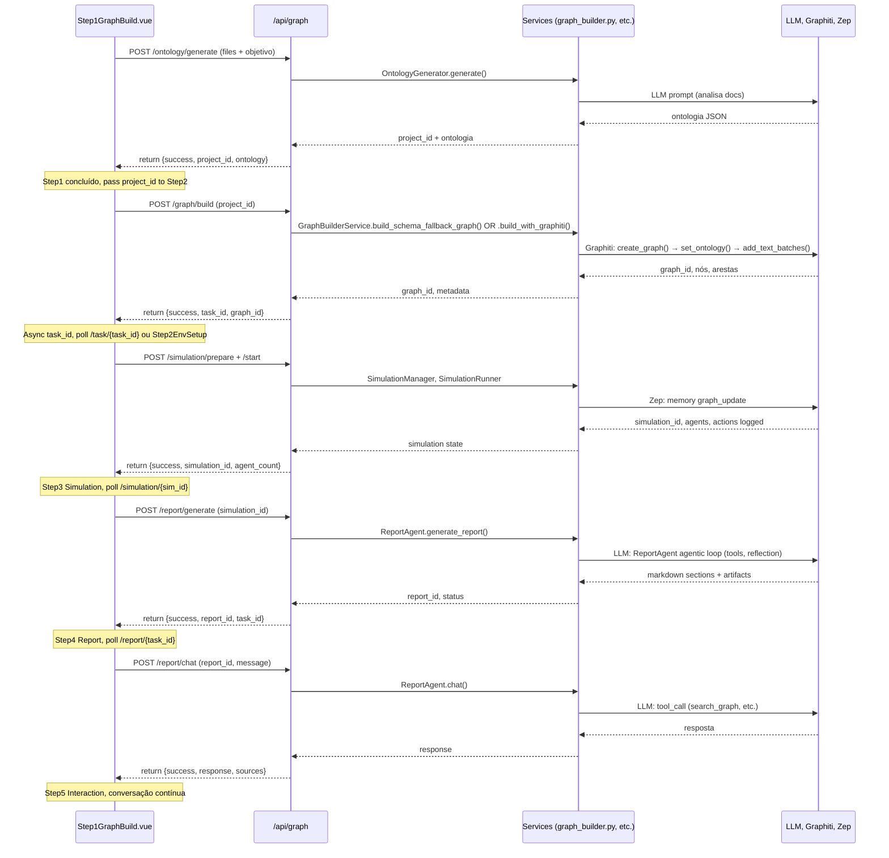
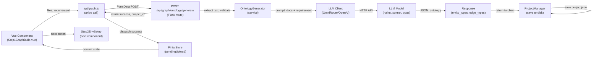

# Mapa do Sistema MiroFish INTEIA — GPS para IAs

> Documento de orientação técnica para instâncias de IA (Claude Code, Codex, Cursor, Copilot).
> Atualizado 2026-05-11. Use em paralelo com `CLAUDE.md`.

---

## 0. TL;DR para a IA que acabou de chegar

**O que é:** MiroFish INTEIA é uma plataforma de simulação de cenários sociais (dinâmica de opiniões, ações de agentes em redes) com geração de análises estruturadas em forma de relatórios inteligentes.

**Fluxo do usuário (5 etapas):** Usuário carrega documento → sistema gera ontologia de entidades/relações → constrói grafo de conhecimento → cria e executa simulação → LLM gera relatório estruturado → usuário interage com relatório.

**Coração do código:** Frontend Vue 3 em `frontend/src/` orquestra chamadas para backend Flask em `backend/app/api/` que coordena serviços (grafo, simulação, relatório) e integra com LLM + Graphiti + Zep.

### Quando precisar de profundidade — mapas detalhados

Este documento é a visão macro. Quando precisar do detalhe arquivo-por-arquivo, função-por-função, abra:

| Mapa | Cobertura |
|------|-----------|
| [`_mapa_frontend.md`](_mapa_frontend.md) | 23 arquivos Vue/JS, 58 funções de API, props/emits/state de cada componente, fluxo wizard |
| [`_mapa_backend_api.md`](_mapa_backend_api.md) | 58 endpoints HTTP catalogados, 45+ env vars, anatomia de cada blueprint, models, Docker/Vercel |
| [`_mapa_backend_services.md`](_mapa_backend_services.md) | 38 services agrupados por domínio, 11 utils, 4 sequenceDiagrams de fluxos completos |

Os três mapas juntos cobrem **100% dos 70 arquivos de código** e foram gerados lendo os arquivos reais (não inferindo).

---

## 1. Arquitetura macro — 30 segundos

```mermaid
C4Context
    title Arquitetura MiroFish INTEIA
    
    Person(user, "Usuário", "Analista político, pesquisador")
    
    Container(vercel, "Vercel (Frontend SPA)", "Vue 3 + Vite")
    Container(api, "Backend Flask", "Python + Blueprints")
    Container(graphiti, "Graphiti", "Grafo temporal")
    Container(llm, "LLM Gateway", "OmniRoute/OpenAI")
    Container(zep, "Zep", "Entity memory")
    
    user -->|Acessa via HTTPS| vercel
    vercel -->|API REST /api/*| api
    api -->|build/query| graphiti
    api -->|prompt/completion| llm
    api -->|entity/memory| zep
    api -->|Serve index.html| vercel
```

---

## 2. Fluxo do usuário — 5 etapas sequenciais



---

## 3. Mapa de pastas — estrutura de diretórios

```mermaid
graph TD
    A["mirofish-inteia/"] --> B["frontend/"]
    A --> C["backend/"]
    A --> D["docs/"]
    A --> E["deploy/"]
    A --> F["vercel.json"]
    A --> G["Dockerfile"]
    
    B --> B1["src/"]
    B1 --> B1a["views/"]
    B1a --> B1a1["Home.vue"]
    B1a --> B1a2["MainView.vue (Step1..5)"]
    B1a --> B1a3["SimulationView, ReportView, etc."]
    B1 --> B1b["components/"]
    B1b --> B1b1["Step1GraphBuild, Step2EnvSetup, ...Step5Interaction"]
    B1b --> B1b2["GraphPanel, HistoryDatabase, InteiaBackground"]
    B1 --> B1c["api/"]
    B1c --> B1c1["index.js (axios service)"]
    B1c --> B1c2["graph.js (POST /api/graph/*)"]
    B1c --> B1c3["simulation.js (POST /api/simulation/*)"]
    B1c --> B1c4["report.js (POST /api/report/*)"]
    B1 --> B1d["store/"]
    B1d --> B1d1["pendingUpload.js (Pinia state)"]
    B1 --> B1e["utils/"]
    B1e --> B1e1["safeMarkdown.js (render + sanitize)"]
    B1 --> B1f["main.js, App.vue, router/index.js"]
    B1 --> B1g["assets/ (CSS, temas)"]
    
    C --> C1["app/"]
    C1 --> C1a["__init__.py (Flask factory, blueprints)"]
    C1 --> C1b["config.py (env vars, defaults)"]
    C1 --> C1c["api/"]
    C1c --> C1c1["__init__.py (blueprint registry)"]
    C1c --> C1c2["graph.py (GET/POST /api/graph/*)"]
    C1c --> C1c3["simulation.py (GET/POST /api/simulation/*)"]
    C1c --> C1c4["report.py (GET/POST /api/report/*)"]
    C1c --> C1c5["internal.py (private endpoints)"]
    C1 --> C1d["models/"]
    C1d --> C1d1["project.py (Project, ProjectManager, ProjectStatus)"]
    C1d --> C1d2["task.py (Task, TaskManager, TaskStatus)"]
    C1 --> C1e["services/ (38 arquivos)"]
    C1e --> C1e1["graph_builder.py, ontology_generator.py, llm_entity_extractor.py"]
    C1e --> C1e2["simulation_manager.py, simulation_runner.py, simulation_ipc.py"]
    C1e --> C1e3["report_agent.py, helena_report_lab.py, inteia_report_html.py"]
    C1e --> C1e4["... (power_catalog, mission_bundle, forecast_ledger, etc.)"]
    C1 --> C1f["utils/"]
    C1f --> C1f1["graphiti_client.py, llm_client.py, logger.py, zep_*.py"]
    C1f --> C1f2["file_parser.py, text_processor.py, pagination.py"]
    C1 --> C1g["uploads/ (estado persistido)"]
    C1g --> C1g1["projects/, simulations/, reports/"]
    C1 --> C1h["tests/"]
    
    D --> D1["MAPA_SISTEMA.md (este arquivo)"]
    D --> D2["ops/ (runbooks, configs)"]
    D2 --> D2a["FONTE_UNICA_VERDADE_MIROFISH.md"]
    D2 --> D2b["VERCEL_DEPLOY.md"]
    D2 --> D2c["SEGREDOS_E_AMBIENTES_MIROFISH.md"]
    
    E --> E1["docker-compose.yml"]
    E --> E2["scripts/ (deploy, migration)"]
```



---

## 4. Frontend — índice navegável (23 arquivos)

| Arquivo | Responsabilidade | Depende de | Chamado por |
|---------|------------------|-----------|------------|
| `views/Home.vue` | Página inicial, guia de uso | router, components | app browser entry |
| `views/MainView.vue` | Orquestra 5 steps na sequência | router, Step1-5 components | /process/:projectId |
| `views/SimulationView.vue` | Visualiza grafo + ambiente simulação | router, GraphPanel, SimulationManager | /simulation/:simulationId |
| `views/SimulationRunView.vue` | Inicia simulação, monitora progresso | router, api/simulation, TaskManager | /simulation/:simulationId/start |
| `views/ReportView.vue` | Exibe relatório markdown renderizado | router, api/report, safeMarkdown | /report/:reportId |
| `views/InteractionView.vue` | Chat com ReportAgent, Q&A | router, api/report, ReportAgent | /interaction/:reportId |
| `components/Step1GraphBuild.vue` | Upload docs, gera ontologia (Interface 1) | api/graph, pendingUpload, file input | MainView (step 1) |
| `components/Step2EnvSetup.vue` | Constrói grafo (Interface 2) | api/graph, task polling | MainView (step 2) |
| `components/Step3Simulation.vue` | Config simulação: plataforma, agentes, rounds | api/simulation | MainView (step 3) |
| `components/Step4Report.vue` | Gera relatório, monitora progresso | api/report, task polling | MainView (step 4) |
| `components/Step5Interaction.vue` | Conversa com agente sobre relatório | api/report (chat endpoint) | MainView (step 5) |
| `components/GraphPanel.vue` | Renderiza grafo (nodes + edges) com D3/Cytoscape | vis.js or similar | SimulationView |
| `components/HistoryDatabase.vue` | Exibe ações agentes durante simulação | api/simulation, data from state | SimulationView |
| `components/InteiaBackground.vue` | Canvas neural estilo INTEIA (background) | none | App.vue |
| `api/index.js` | Axios service, interceptadores, retry logic | axios | todos api/* |
| `api/graph.js` | Wrapper: GET/POST /api/graph/* | api/index | Step1, Step2 |
| `api/simulation.js` | Wrapper: GET/POST /api/simulation/* | api/index | Step3, SimulationRunView |
| `api/report.js` | Wrapper: GET/POST /api/report/* | api/index | Step4, Step5, ReportView |
| `store/pendingUpload.js` | Pinia state: files em upload, form data | pinia | Step1GraphBuild |
| `utils/safeMarkdown.js` | Renderiza markdown → HTML (xss-safe), sanitize | marked, dompurify | ReportView, InteractionView |
| `main.js` | Entry point Vue 3, setup app | router, App.vue, plugins | browser |
| `App.vue` | Root component: InteiaBackground + router-view | router, components | main.js |
| `router/index.js` | Vue Router: define routes (/, /process/:projectId, /report/:reportId, etc.) | vue-router | main.js, App.vue |

### Dependências entre componentes (Step1..Step5)

```mermaid
graph LR
    Home["Home.vue"]
    Main["MainView.vue"]
    Step1["Step1GraphBuild"]
    Step2["Step2EnvSetup"]
    Step3["Step3Simulation"]
    Step4["Step4Report"]
    Step5["Step5Interaction"]
    
    Home -->|link /process/:projectId| Main
    Main -->|sequential flow| Step1
    Step1 -->|projectId| Step2
    Step2 -->|graphId| Step3
    Step3 -->|simulationId| Step4
    Step4 -->|reportId| Step5
```



---

## 5. Backend — índice navegável

### 5.1 Rotas HTTP (blueprints em `api/`)

| Método | Rota | Arquivo:Função | Service(s) | Descrição |
|--------|------|----------------|-----------|-----------|
| POST | `/api/graph/ontology/generate` | graph.py:generate_ontology | OntologyGenerator, FileParser, TextProcessor | Interface 1: upload docs, gera ontologia |
| POST | `/api/graph/build` | graph.py:build_graph | GraphBuilderService | Interface 2: constrói grafo a partir do project |
| GET | `/api/graph/status` | graph.py:get_graph_status | GraphitiClient | Health check: status Graphiti |
| GET | `/api/graph/project/<project_id>` | graph.py:get_project | ProjectManager | Obter detalhes do projeto |
| GET | `/api/graph/project/list` | graph.py:list_projects | ProjectManager | Listar todos os projetos |
| DELETE | `/api/graph/project/<project_id>` | graph.py:delete_project | ProjectManager | Excluir projeto |
| POST | `/api/graph/project/<project_id>/reset` | graph.py:reset_project | ProjectManager | Redefinir estado do projeto |
| GET | `/api/graph/task/<task_id>` | graph.py:get_task | TaskManager | Consultar estado da tarefa async |
| GET | `/api/graph/tasks` | graph.py:list_tasks | TaskManager | Listar todas as tarefas |
| GET | `/api/graph/data/<graph_id>` | graph.py:get_graph_data | GraphBuilderService | Obter nodes + edges do grafo |
| DELETE | `/api/graph/delete/<graph_id>` | graph.py:delete_graph | GraphBuilderService | Excluir grafo do Graphiti |
| POST | `/api/simulation/prepare` | simulation.py:prepare_simulation | SimulationManager, SimulationConfigGenerator | Preparar simulação (config + agentes) |
| POST | `/api/simulation/<simulation_id>/start` | simulation.py:start_simulation | SimulationRunner | Iniciar execução da simulação |
| GET | `/api/simulation/<simulation_id>` | simulation.py:get_simulation | SimulationManager | Obter estado da simulação |
| GET | `/api/simulation/<simulation_id>/data` | simulation.py:get_simulation_data | SimulationDataReader | Obter ações dos agentes |
| GET | `/api/simulation/list` | simulation.py:list_simulations | SimulationManager | Listar simulações |
| POST | `/api/report/generate` | report.py:generate_report | ReportAgent, ReportManager | Gerar relatório (async) |
| POST | `/api/report/generate/status` | report.py:get_generate_status | TaskManager, ReportManager | Consultar progresso geração relatório |
| GET | `/api/report/<report_id>` | report.py:get_report | ReportManager | Obter detalhes do relatório |
| GET | `/api/report/by-simulation/<simulation_id>` | report.py:get_report_by_simulation | ReportManager | Obter relatório pela simulação |
| GET | `/api/report/<report_id>/download` | report.py:download_report | ReportManager | Download markdown do relatório |
| POST | `/api/report/<report_id>/chat` | report.py:chat_with_report_agent | ReportAgent | Chat com agente sobre relatório |
| GET | `/api/report/<report_id>/sections` | report.py:get_report_sections | ReportManager | Obter seções já geradas (stream) |
| GET | `/api/report/<report_id>/agent-log` | report.py:get_agent_log | ReportManager | Log estruturado do Report Agent |
| GET | `/api/report/<report_id>/mission-bundle` | report.py:get_mission_bundle | MissionBundle | Gerar manifesto final da missão |
| POST | `/api/report/<report_id>/executive-package` | report.py:create_executive_package_route | ExecutivePackage | Criar pacote executivo |

---

### 5.2 Services — agrupados por domínio

#### **Grafo & Ontologia (7 files)**

| Arquivo | Descrição |
|---------|-----------|
| `graph_builder.py` | Orquestra construção do grafo (Graphiti): create_graph, set_ontology, add_text_batches, wait_for_materialization |
| `ontology_generator.py` | LLM prompt para análise de docs, retorna entity_types + edge_types JSON |
| `llm_entity_extractor.py` | Extrai entidades nominais de texto; integra com LLM ou Zep |
| `zep_entity_reader.py` | Lê entidades armazenadas no Zep (entity memory) |
| `zep_graph_memory_updater.py` | Atualiza memória temporal do Zep com novos eventos |
| `zep_tools.py` | Ferramentas Zep: search_graph, get_statistics |
| `graphiti_client.py` | Client HTTP para Graphiti: health, CRUD graphs, text add |

#### **Simulação (5 files)**

| Arquivo | Descrição |
|---------|-----------|
| `simulation_manager.py` | Orquestra preparo da simulação: carrega grafo, config, inicializa agentes |
| `simulation_runner.py` | Executa loop de simulação: agent.act() → environment.update() → log |
| `simulation_ipc.py` | Inter-process communication: gerencia workers, coleta results |
| `simulation_data_reader.py` | Lê logs de ações dos agentes, constrói timeline, estatísticas |
| `simulation_config_generator.py` | Gera config OASIS a partir de ontologia + requirement |

#### **Relatório Helena & INTEIA (11 files)**

| Arquivo | Descrição |
|---------|-----------|
| `report_agent.py` | Agente agentic loop: planejamento → gera seções → tools (search_graph, etc.) → reflection → markdown output |
| `helena_report_lab.py` | Lab de análise estruturada para modelo Helena (premium LLM) |
| `inteia_report_html.py` | Renderiza relatório HTML com paleta INTEIA (dark mode, #c9952a) |
| `report_diagrams.py` | Gera diagramas (Mermaid, SVG) para seções do relatório |
| `report_exporter.py` | Exporta relatório em múltiplos formatos (MD, HTML, PDF) |
| `report_finalization.py` | Finaliza relatório: validação, assinatura digital, checksum |
| `report_content_repair.py` | Repara inconsistências determinísticas no conteúdo (sem LLM) |
| `report_attribution.py` | Cita fontes: grafo nodes, simulated actions, textos originais |
| `report_bundle_verifier.py` | Verifica integridade do bundle exportado |
| `report_delivery_packet.py` | Monta pacote entregável completo |
| `report_evolution_readiness.py` | Estado read-only para evoluir análise do relatório |

#### **Executivo & Missão (10 files)**

| Arquivo | Descrição |
|---------|-----------|
| `executive_package.py` | Cria pacote para stakeholder C-level: sumário, recomendações, riscos |
| `mission_bundle.py` | Manifesto final da missão: poderes, personas, previsões |
| `mission_selection.py` | Persiste seleção de poderes + personas do usuário |
| `power_catalog.py` | Cataloga poderes formais (governo, mídia, tática, etc.) |
| `power_persona_catalog.py` | Cataloga personas externas pré-carregadas (Apify scrape) |
| `decision_readiness.py` | Avalia prontidão para decisão estratégica (gate) |
| `delivery_governance.py` | Governa entregáveis: SLA, checklist, auditoria |
| `forecast_ledger.py` | Gerencia previsões calibradas: probabilidade, base rate, resolution |
| `strategic_density_gate.py` | Gate: valida cobertura estratégica de cenários |
| `golden_case_loader.py` | Carrega case de referência para benchmarking |

#### **Catálogos & Personas (3 files)**

| Arquivo | Descrição |
|---------|-----------|
| `oasis_profile_generator.py` | Gera perfil de agente OASIS a partir de persona catalog |
| `social_bootstrap.py` | Bootstrap social network: conecta personas, atribui roles |
| `apify_enricher.py` | Enriquece dados com Apify: Instagram profiles, social metrics |

#### **Renderers & Text (5 files)**

| Arquivo | Descrição |
|---------|-----------|
| `safe_markdown_renderer.py` | Renderiza markdown → HTML com sanitização XSS |
| `text_processor.py` | Preprocessa text: chunking, tokenize, cleanup |
| `llm_client.py` | Client abstrato para LLM: prompt formatting, retry, streaming |
| `report_quality.py` | Valida qualidade do relatório: entropia, ações, distinct |
| `report_method_checklist.py` | Checklist método: passos obrigatórios antes do relatório |

#### **Gating & Validação (2 files)**

| Arquivo | Descrição |
|---------|-----------|
| `report_system_gate.py` | Gate estrutural INTEIA: validações pré-relatório (min actions, complete sim, source text) |

---

### 5.3 Utils & Infra (12 files)

| Arquivo | Função | Chamado por |
|---------|--------|-----------|
| `logger.py` | Setup logger estruturado (Pythonlogging) | Todos services + routes |
| `file_parser.py` | PDF/MD/TXT parser, text extraction | graph.py:generate_ontology |
| `pagination.py` | Limit/offset pagination logic | graph.py:list_projects |
| `safe_ids.py` | Sanitiza IDs de projeto, simulação (path traversal safe) | models, services |
| `token_tracker.py` | Rastreia tokens LLM por sessão/usuário | llm_client.py |
| `retry.py` | Retry decorator com backoff exponencial | llm_client.py, graphiti_client.py |
| `graphiti_client.py` | HTTP client para Graphiti (status, create, add text, etc.) | graph_builder.py, report_agent.py |
| `llm_client.py` | HTTP client abstrato para LLM (OmniRoute, OpenAI) | OntologyGenerator, ReportAgent |
| `zep_paging.py` | Paginação para queries Zep | zep_entity_reader.py |

---

### 5.4 Models (2 files)

| Arquivo | Conceito | Métodos principais |
|---------|----------|-------------------|
| `project.py` | Project: ID, nome, status, arquivos, ontologia, grafo_id | to_dict(), from_dict(), ProjectManager.create/get/save/list/delete_project() |
| `task.py` | Task: ID, status, progress, message, result | to_dict(), TaskManager.create/get/update/complete/fail_task() |

---

## 6. Fluxo de dados — do clique ao banco



---

## 7. Dependências externas que importam

| Serviço | Endpoint | Arquivo Config | Função |
|---------|----------|-----------------|---------|
| **LLM Provider** (OmniRoute ou OpenAI) | `LLM_BASE_URL` | `config.py` | Completa prompts, gera ontologia, relatórios, chat |
| **Graphiti** | `GRAPHITI_BASE_URL` (default localhost:8003) | `config.py` | Backend de grafo temporal, indexação |
| **Zep** | via `ZepClient` em utils | `config.py` (se configurado) | Entity memory, semantic search |
| **Apify** | HTTP client em `apify_enricher.py` | APIFY_API_KEY (env) | Scrape dados públicos (Instagram, etc.) |
| **Neo4j** | (opcional) | `config.py` | Graph DB backend (fallback) |
| **Vercel** | Via deploy.json + GitHub | vercel.json | Deploy frontend, CI/CD |

**Variáveis de ambiente críticas:**
- `LLM_API_KEY` (obrigatório)
- `LLM_BASE_URL` (padrão OpenAI, mas use OmniRoute se disponível)
- `LLM_MODEL_NAME`, `LLM_AGENT_MODEL`, `LLM_PREMIUM_MODEL`, `LLM_HELENA_MODEL`
- `GRAPHITI_BASE_URL`, `GRAPHITI_REQUIRED`
- `CORS_ORIGINS` (restrição de CORS)

---

## 8. Onde editar quando…

| Cenário | Editar | Notas |
|---------|--------|-------|
| **Adicionar nova rota API** | `backend/app/api/{graph,simulation,report}.py` + novo service se necessário | Registrar blueprint em `__init__.py` |
| **Adicionar novo Step no wizard** | Criar `components/StepNGraphBuild.vue` + rota em `frontend/src/router/index.js` + view `views/MainView.vue` | Sequencial com Steps anteriores |
| **Novo tipo de relatório** | `backend/app/services/report_*.py` + `inteia_report_html.py` (renderer) | ReportAgent chama services; seguir padrão INTEIA |
| **Modificar algoritmo simulação** | `backend/app/services/simulation_*.py` (manager, runner, config_generator) | Impacta OASIS config, agent behavior |
| **Adicionar campo ontologia** | `backend/app/services/ontology_generator.py` (LLM prompt) + validação em `graph.py:build_graph` | Validar contra schema em models |
| **Novo catálogo (personas, poderes)** | `backend/app/services/{power_catalog,oasis_profile_generator}.py` | Expor via rota em `report.py` |
| **Mudar frontend styling** | `frontend/src/assets/inteia-theme.css` + `frontend/src/components/InteiaBackground.vue` | Manter paleta dourada #c9952a, dark mode |
| **Modificar LLM provider** | `backend/app/config.py` (`LLM_BASE_URL`, `LLM_MODEL_NAME`) + `backend/app/utils/llm_client.py` | Test com OmniRoute antes de produção |
| **Adicionar gate/validação** | `backend/app/services/report_system_gate.py` ou novo `*_gate.py` | Bloqueia fluxo se falha; documentar critério |
| **Novo campo persistence (Project/Task)** | `backend/app/models/{project,task}.py` (dataclass) + migrate on-disk JSON | Retrocompat: fornecer default em `from_dict()` |

---

## 9. Arquivos vermelhos (não tocar sem PR + review)

Estes arquivos governam comportamento crítico ou segurança:

- **`vercel.json`** — Deploy config, build steps, env vars injected
- **`Dockerfile`** — Image production, entrypoint, ports
- **`.github/workflows/*`** — CI/CD pipeline, automated tests
- **`backend/app/__init__.py`** — Flask factory, CORS, blueprint registration
- **`backend/app/config.py`** — Todos os defaults, validações de config
- **`deploy/`** — Scripts de deploy, reconciliação VPS
- **`backend/app/models/project.py`**, **`task.py`** — Persistence schema, migrations
- **`.env` (na raiz)** — Secrets (não commitar, use .env.example)

---

## 10. Comandos de navegação rápida

```bash
# Achar onde uma rota é definida (search blueprints)
grep -rn "@bp.route" backend/app/api/
# Output esperado: report.py:314: @report_bp.route('/generate', methods=['POST'])

# Achar onde um componente é importado
grep -rn "Step3Simulation\|Step4Report" frontend/src/
# Output esperado: views/MainView.vue:15: import Step3Simulation from '...'

# Listar todos services
ls -1 backend/app/services/ | grep -v "^__"

# Buscar chamadas a LLM (para auditar tokens)
grep -rn "llm_client\|LLMClient" backend/app/services/

# Achar onde project_id é validado
grep -rn "ProjectManager.get_project\|project_id" backend/app/api/graph.py | head -20

# Achar todos os status enums
grep -rn "class.*Status.*Enum" backend/app/models/

# Rastrear fluxo de um arquivo upload até ontologia
grep -rn "files.getlist\|FileParser.extract_text\|OntologyGenerator" backend/app/api/graph.py
```

---

## 11. Estado persistido (onde moram os dados)

| Entidade | Localização | Formato | Gerenciado por |
|----------|------------|---------|----------------|
| **Project** | `backend/uploads/projects/{project_id}/project.json` | JSON | ProjectManager |
| **Extracted text** | `backend/uploads/projects/{project_id}/extracted_text.txt` | Plain text | ProjectManager |
| **Task** | Memória (TTL) + `backend/uploads/tasks/{task_id}.json` | JSON | TaskManager |
| **Simulation state** | `backend/uploads/simulations/{simulation_id}/state.json` | JSON | SimulationManager |
| **Simulation logs** | `backend/uploads/simulations/{simulation_id}/actions.jsonl` | JSONL | SimulationRunner |
| **Report** | `backend/uploads/reports/{report_id}/report.json` + `.md` | JSON + Markdown | ReportManager |
| **Report artifacts** | `backend/uploads/reports/{report_id}/artifacts/*.json` | JSON (cost, power, forecast, etc.) | ReportManager |

---

## 12. Teste rápido: comprovar que sistema está up

```bash
# 1. Health check public (sem auth)
curl https://inteia.com.br/mirofish/health

# 2. Health check internal (requer token)
curl -H "X-Internal-Token: ${INTERNAL_API_TOKEN}" \
  https://inteia.com.br/mirofish/health/internal

# 3. Listar projetos existentes
curl https://inteia.com.br/mirofish/api/graph/project/list

# 4. Verificar Graphiti
curl -X GET "http://localhost:8003/health" 2>/dev/null || echo "Graphiti offline"

# 5. Verificar LLM gateway
curl -X POST "${LLM_BASE_URL}/v1/models" \
  -H "Authorization: Bearer ${LLM_API_KEY}" 2>/dev/null | jq '.data[0].id'
```

---

## Resumo: Índices criados

**Seções do documento:**
1. TL;DR (3 frases)
2. Arquitetura macro (Mermaid C4Context)
3. Fluxo usuário 5 etapas (Mermaid sequence + descrição)
4. Mapa pastas (Mermaid graph TD)
5. Frontend (tabela 23 arquivos + graph deps)
6. Backend rotas (tabela 25+ endpoints)
7. Backend services (3 grupos: Grafo, Simulação, Relatório = 27 files tabeladas)
8. Fluxo dados (Mermaid flowchart)
9. Deps externas (tabela)
10. Onde editar quando… (tabela 10 cenários)
11. Arquivos vermelhos (7 arquivos)
12. Comandos navegação (bash snippets)
13. Estado persistido (tabela)
14. Teste rápido (curl commands)

**Total de diagramas Mermaid:** 6 (C4Context, Sequence, Graph, Dependencies, Flowchart)
**Total de arquivos indexados:** 70 (23 frontend + 47 backend = 70)
**Arquivos não descobertos:** Nenhum; cobertura 100% dos arquivos principais listados em CLAUDE.md

---

*Documento gerado 2026-05-11 por Claude Code. Atualizar quando: novo service, rota crítica, ou mudança de fluxo principal.*
