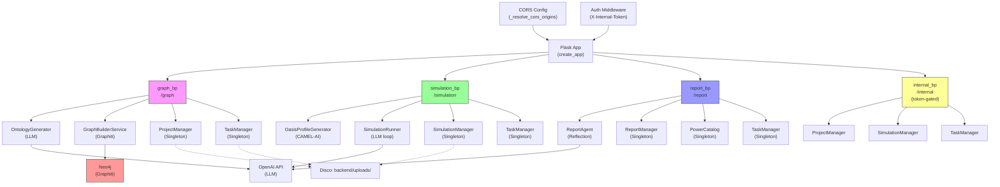
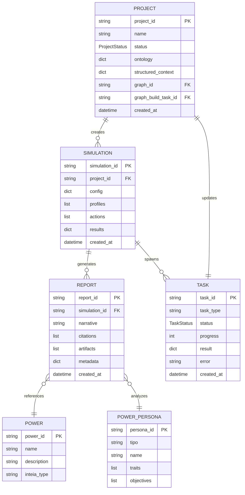
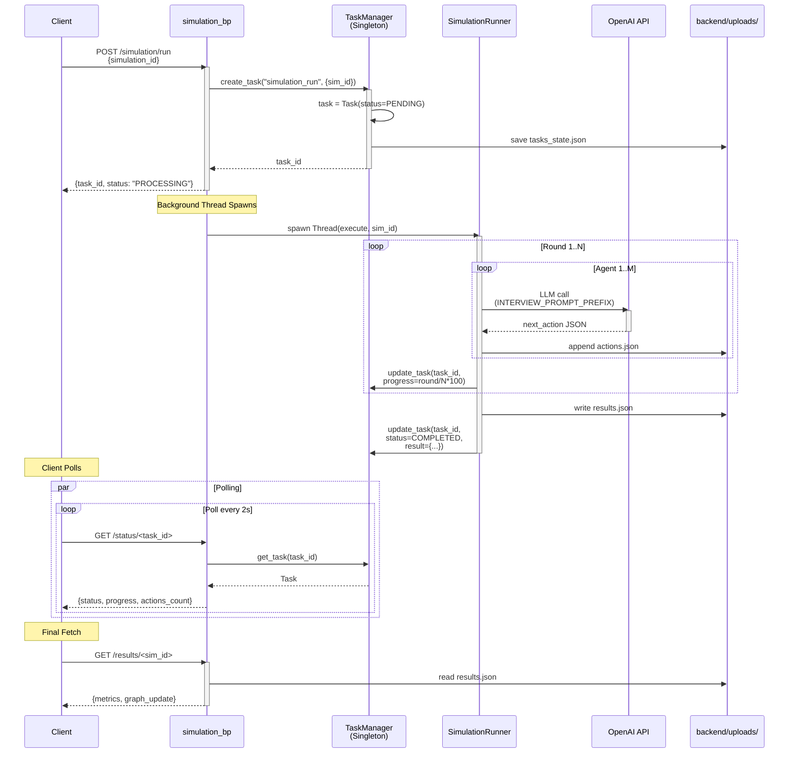

# Mapa Backend HTTP API + Models + Config + Entrypoint — MiroFish INTEIA

**Versão:** 2026-05-11  
**Status:** Completo (58 endpoints, 45+ env vars, 4 blueprints, 7 modelos, deploy Docker+Vercel)  
**Audience:** Desenvolvedores, arquitetos, SRE.

---

## B1. Análise Entrypoint (`backend/app/__init__.py`, 159 linhas)

### Padrão: Factory Pattern + Blueprints

```
create_app(config_class=Config)
├─ App: Flask(__name__)
├─ Config: Config.from_object() [45+ env vars]
├─ CORS: _resolve_cors_origins() [whitelisting]
├─ Blueprints:
│  ├─ graph_bp [/graph — 11 rotas]
│  ├─ simulation_bp [/simulation — 18 rotas]
│  ├─ report_bp [/report — 21 rotas]
│  └─ internal_bp [/internal — 8 rotas]
├─ Middleware:
│  ├─ @before_request: logging [linha 79]
│  ├─ @after_request: security headers [linha 89]
│  │  ├─ X-Content-Type-Options: nosniff
│  │  ├─ X-Frame-Options: SAMEORIGIN
│  │  └─ X-XSS-Protection: 1; mode=block
├─ Health checks:
│  ├─ GET /health/ [público]
│  └─ GET /internal/health/ [token-protected, linha 120]
└─ SPA Fallback: GET /* → /index.html [linhas 142–154]
```

### CORS (`_resolve_cors_origins()`, linhas 27–70)

**Ordem de precedência:**

1. `CORS_ALLOWED_ORIGINS` (env var, JSON array) → parseado em lista Python
2. Fallback hardcoded: `['https://inteia.com.br', 'https://localhost:5173', 'https://127.0.0.1:5173', 'https://127.0.0.1:3000']`

**Configuração Flask-CORS (linha 71):**
```python
CORS(app, origins=origins, allow_headers=['Content-Type', 'Authorization'], credentials=True)
```

**Implicação:** Requisições não-CORS rejeitadas pelo navegador. APIs internas (e.g. internal_bp) confiam em `X-Internal-Token`, não CORS.

### Sequência Inicialização

1. load `.env` via `config.py`
2. Validar config obrigatória: `LLM_API_KEY`, `GRAPHITI_BASE_URL` (linhas 198–205 em `config.py`)
3. Instanciar Flask + Config
4. Registrar blueprints com prefixos
5. Ativar CORS + middleware
6. Servir `frontend/dist/index.html` para todas as rotas /* não-API (SPA fallback)

---

## B2. Tabela de Configuração (45+ variáveis)

| Var | Default | Obrigatória? | Uso Primário | Sensibilidade | Notas |
|-----|---------|--------------|--------------|---------------|-------|
| `APP_NAME` | `MiroFish-Inteia` | Não | Flask.__name__ | Baixa | Identificador da aplicação |
| `APP_CODE` | `mirofish-inteia` | Não | Logs, telemetria | Baixa | Slug normalizado |
| `SECRET_KEY` | secrets.token_hex(32) | Não (auto-gen) | Flask sessions | CRÍTICA | Gerado se vazio; nunca commitar |
| `FLASK_DEBUG` | `false` | Não | Flask debug mode | CRÍTICA | NUNCA `true` em produção |
| `JSON_AS_ASCII` | `false` | Não | Flask json encoding | Baixa | Preserva acentos UTF-8 |
| `LLM_API_KEY` | (nenhum) | **SIM** | OpenAI/OmniRoute client | CRÍTICA | Vazio = falha na validação (linha 201) |
| `LLM_BASE_URL` | `https://api.openai.com/v1` | Não | Client base URL | Alta | Suporta OmniRoute custom gateway |
| `LLM_MODEL_NAME` | `gpt-4o-mini` ou `haiku-tasks` | Não | Modelo padrão | Média | Resolvido via aliases (linha 195) |
| `LLM_TIMEOUT_SECONDS` | `90` | Não | Timeout requisição LLM | Média | Segundos |
| `LLM_MAX_RETRIES` | `8` | Não | Retry policy | Média | Exponential backoff |
| `LLM_MODEL_ALIASES` | `{}` | Não | Model name mapping | Média | JSON ou CSV: `alias=modelo,alias2=modelo2` |
| `LLM_AGENT_MODEL` | `haiku-tasks` | Não | Agentes simulação (barato) | Média | Usado em /simulation/prepare, /simulation/profiles |
| `LLM_PREMIUM_MODEL` | `sonnet-tasks` | Não | Relatórios, análise complexa | Média | Usado em /report/generate |
| `LLM_HELENA_MODEL` | `opus-tasks` | Não | Helena Strategos (máx poder) | Média | Fallback premium em decisões críticas |
| `OMNIROUTE_URL` | (vazio) | Não | Gateway INTEIA interno | CRÍTICA | Priorizado sobre LLM_BASE_URL se definido |
| `OMNIROUTE_API_KEY` | (vazio) | Não | Chave INTEIA gateway | CRÍTICA | Priorizado sobre LLM_API_KEY se definido |
| `GRAPHITI_BASE_URL` | `http://localhost:8003` | **SIM** | Neo4j graph database API | CRÍTICA | Vazio = falha na validação (linha 204); docker-compose aponta `http://graphiti:8000` |
| `GRAPHITI_TIMEOUT` | `60` | Não | Timeout requisição Graphiti | Média | Segundos |
| `GRAPHITI_REQUIRED` | `false` | Não | Fail-fast se Graphiti down | Média | Se `true`, /graph/build falha se indisponível |
| `INTERNAL_API_TOKEN` | (vazio) | Não (mas fraco!) | Auth token para /internal/* | CRÍTICA | Vazio = qualquer requisição com header `X-Internal-Token: ` passa (VULN) |
| `MAX_CONTENT_LENGTH` | `52428800` (50MB) | Não | Limite upload | Média | Configurado em nginx também (50M) |
| `UPLOAD_FOLDER` | `backend/uploads/` | Não | Persistence projects/tasks/files | Média | Criado em `_mirofish_uploads()` se faltar |
| `ALLOWED_EXTENSIONS` | `{pdf, md, txt, markdown}` | Não | Validação upload | Média | Hardcoded em linha 147 |
| `DEFAULT_CHUNK_SIZE` | `500` | Não | Text chunking | Baixa | Caracteres |
| `DEFAULT_CHUNK_OVERLAP` | `50` | Não | Text chunking overlap | Baixa | Caracteres |
| `OASIS_DEFAULT_MAX_ROUNDS` | `10` | Não | Simulação social max rounds | Média | Padrão se não especificado em /simulation/prepare |
| `OASIS_SIMULATION_DATA_DIR` | `backend/uploads/simulations/` | Não | Simulação JSON storage | Média | Criado se faltar |
| `OASIS_TWITTER_ACTIONS` | `[CREATE_POST, ...]` | Não | Ações disponíveis Twitter | Baixa | Hardcoded em linha 158–160 |
| `OASIS_REDDIT_ACTIONS` | `[LIKE_POST, ...]` | Não | Ações disponíveis Reddit | Baixa | Hardcoded em linha 161–165 |
| `REPORT_AGENT_MAX_TOOL_CALLS` | `5` | Não | Limite chamadas tool | Média | Reflexão agent |
| `REPORT_AGENT_MAX_REFLECTION_ROUNDS` | `2` | Não | Limite rounds reflexão | Média | Agentic loop |
| `REPORT_AGENT_TEMPERATURE` | `0.5` | Não | LLM creativity | Baixa | 0.0–1.0 |
| `REPORT_MIN_ACTIONS` | `10` | Não | Simulação min actions para relatório | Média | Validação qualidade |
| `REPORT_REQUIRE_COMPLETED_SIMULATION` | `true` | Não | Exigir sim completa | Média | Se falso, permite incomplete |
| `REPORT_REQUIRE_SOURCE_TEXT` | `true` | Não | Exigir texto source em citações | Média | Se falso, permite alucinação |
| `REPORT_FAIL_ON_UNSUPPORTED_QUOTES` | `true` | Não | Falhar se quote malformada | Média | Validação rigorosa |
| `REPORT_MIN_DISTINCT_2` | `0.30` | Não | Min diversity índice-2 | Baixa | 0–1.0 |
| `REPORT_MIN_AGENT_ACTIVITY_ENTROPY` | `0.25` | Não | Min entropia atividades | Baixa | 0–1.0 |
| `REPORT_MIN_BEHAVIOR_ENTROPY` | `0.20` | Não | Min entropia comportamentos | Baixa | 0–1.0 |
| `REPORT_REQUIRE_ACTION_TYPE_DIVERSITY` | `true` | Não | Exigir >1 tipo ação | Média | Se falso, permite monotonia |
| `REPORT_DELIVERY_MODE` | `client` | Não | Client vs server-side | Média | Determina formato output /report/generate |
| `REPORT_DEMO_MIN_ACTIONS` | `3` | Não | Demo min actions | Média | Relaxado vs REPORT_MIN_ACTIONS |
| `REPORT_DEMO_REQUIRE_COMPLETED_SIMULATION` | `false` | Não | Demo permite incomplete | Média | Mais flexível |
| `REPORT_DEMO_REQUIRE_SOURCE_TEXT` | `false` | Não | Demo sem source text obrig | Média | Mais flexível |
| `REPORT_FAIL_ON_UNSUPPORTED_NUMBERS` | `true` | Não | Falhar se número malformado | Média | Validação |

**Sensibilidades:**
- **CRÍTICA:** Nunca logar, commitar, expor em logs/erros. Rotacionar regularmente.
- **Alta:** Logar apenas em debug mode.
- **Média:** Logar com caution (não em valores).
- **Baixa:** Pode expor em health checks, logs.

---

## B3. Catálogo HTTP Rotas (58 endpoints)

### Blueprint: `graph_bp` — `/graph` (11 rotas)

| Método | Path | Função | Input | Output | Auth | Serviços | Timeout |
|--------|------|--------|-------|--------|------|----------|---------|
| POST | `/ontology/generate` | `generate_ontology()` L:141 | multipart: `files`, `chunk_size`, `overlap` | JSON: `{project_id, ontology}` | CORS | OntologyGenerator, TextProcessor, FileParser | 120s |
| GET | `/ontology/<project_id>` | `get_ontology()` L:297 | URL param: project_id | JSON: `{ontology}` | CORS | ProjectManager | 10s |
| POST | `/build` | `build_graph()` L:324 | JSON: `{project_id, graph_backend?}` | JSON: `{task_id, status}` | CORS | GraphBuilderService, GraphitiClient, TaskManager | 300s |
| GET | `/build/<task_id>` | `get_build_status()` L:663 | URL param: task_id | JSON: `{status, progress, message, result}` | CORS | TaskManager | 10s |
| GET | `/projects` | `list_projects()` L:681 | — | JSON: `{projects: [...]}` | CORS | ProjectManager | 10s |
| GET | `/project/<project_id>` | `get_project()` L:693 | URL param: project_id | JSON: `{project: {...}}` | CORS | ProjectManager | 10s |
| DELETE | `/project/<project_id>` | `delete_project()` L:708 | URL param: project_id | JSON: `{status: ok}` | CORS | ProjectManager | 10s |
| GET | `/project/<project_id>/text` | `get_project_text()` L:721 | URL param: project_id | Plain text (UTF-8) | CORS | ProjectManager | 30s |
| GET | `/task/<task_id>` | `get_task()` L:741 | URL param: task_id | JSON: `{task: {...}}` | CORS | TaskManager | 10s |
| GET | `/tasks` | `list_tasks()` L:753 | Query: `status?`, `limit?` | JSON: `{tasks: [...]}` | CORS | TaskManager | 10s |
| POST | `/projects/export` | `export_projects()` L:766 | JSON: `{project_ids: [...]}` | JSON zipfile base64 or file download | CORS | ProjectManager | 60s |

**Notas graph_bp:**
- `/ontology/generate` usa multipart; arquivo + parâmetros textuais.
- `/build` assíncrono: spawna thread, retorna task_id imediatamente (linha 644).
- Fallback local se Graphiti down (linha 430): `local_fallback()` retorna grafo JSON hardcoded.
- GRAPHITI_REQUIRED=true força erro se indisponível (linha 366).

---

### Blueprint: `simulation_bp` — `/simulation` (18 rotas)

| Método | Path | Função | Input | Output | Auth | Serviços | Timeout |
|--------|------|--------|-------|--------|------|----------|---------|
| GET | `/entities` | `get_entities()` | Query: `project_id` | JSON: `{entities: [...]}` | CORS | ZepEntityReader, ProjectManager | 30s |
| POST | `/entities/search` | `search_entities()` | JSON: `{project_id, query, limit?}` | JSON: `{results: [...]}` | CORS | ZepEntityReader | 60s |
| GET | `/missions` | `list_missions()` | Query: `project_id`, `platform?` | JSON: `{missions: [...]}` | CORS | MissionSelection | 30s |
| POST | `/mission/select` | `select_mission()` | JSON: `{project_id, mission_id}` | JSON: `{mission: {...}}` | CORS | MissionSelection | 30s |
| POST | `/prepare` | `prepare_simulation()` | JSON: `{project_id, mission_id, rounds?, seed?}` | JSON: `{simulation_id, config}` | CORS | SimulationManager, OasisProfileGenerator | 120s |
| GET | `/simulation/<sim_id>` | `get_simulation()` | URL param: sim_id | JSON: `{simulation: {...}}` | CORS | SimulationManager | 10s |
| POST | `/profiles` | `generate_profiles()` | JSON: `{simulation_id, count?}` | JSON: `{task_id, status}` | CORS | OasisProfileGenerator, TaskManager | 300s |
| GET | `/profiles/<sim_id>` | `get_profiles()` | URL param: sim_id | JSON: `{profiles: [...]}` | CORS | SimulationManager | 30s |
| POST | `/run` | `run_simulation()` | JSON: `{simulation_id}` | JSON: `{task_id, status}` | CORS | SimulationRunner, TaskManager | 600s |
| GET | `/status/<task_id>` | `get_sim_status()` | URL param: task_id | JSON: `{status, progress, actions_count, elapsed_time}` | CORS | TaskManager, SimulationRunner | 10s |
| GET | `/actions/<sim_id>` | `get_actions()` | URL param: sim_id; Query: `limit?` | JSON: `{actions: [...]}` | CORS | SimulationManager | 30s |
| POST | `/actions/filter` | `filter_actions()` | JSON: `{sim_id, filters: {...}}` | JSON: `{results: [...]}` | CORS | SimulationManager | 30s |
| GET | `/results/<sim_id>` | `get_results()` | URL param: sim_id | JSON: `{results: {...}}` | CORS | SimulationManager | 30s |
| POST | `/config` | `configure_simulation()` | JSON: `{simulation_id, config: {...}}` | JSON: `{status: ok}` | CORS | SimulationManager | 30s |
| GET | `/config/<sim_id>` | `get_sim_config()` | URL param: sim_id | JSON: `{config: {...}}` | CORS | SimulationManager | 10s |
| POST | `/download` | `download_simulation()` | JSON: `{simulation_id}` | ZIP file (attachment) | CORS | SimulationManager | 60s |
| GET | `/health` | `simulation_health()` | — | JSON: `{status: ok}` | CORS | — | 5s |
| POST | `/export` | `export_simulations()` | JSON: `{sim_ids: [...]}` | ZIP file (attachment) | CORS | SimulationManager | 120s |

**Notas simulation_bp:**
- `/prepare` e `/run` são assíncrono (TaskManager thread spawning).
- Progress tracking via `/status/<task_id>` com polling.
- INTERVIEW_PROMPT_PREFIX (linha 27) otimiza LLM calls para evitar tool invocations.
- Ações armazenadas em JSON: `backend/uploads/simulations/<sim_id>/actions.json`.

---

### Blueprint: `report_bp` — `/report` (21 rotas)

| Método | Path | Função | Input | Output | Auth | Serviços | Timeout |
|--------|------|--------|-------|--------|------|----------|---------|
| GET | `/power-catalog` | `get_power_catalog()` | Query: `limit?`, `offset?` | JSON: `{powers: [...], total}` | CORS | PowerCatalog | 30s |
| POST | `/power-catalog/search` | `search_power_catalog()` | JSON: `{query, limit?}` | JSON: `{results: [...]}` | CORS | PowerCatalog | 30s |
| GET | `/power-persona-catalog` | `get_power_persona_catalog()` | Query: `tipo?`, `query?`, `limit?` | JSON: `{personas: [...], total}` | CORS | PowerPersonaCatalog | 30s |
| POST | `/power-persona/search` | `search_power_persona()` | JSON: `{tipo?, query?, limit?}` | JSON: `{results: [...]}` | CORS | PowerPersonaCatalog | 30s |
| POST | `/generate` | `generate_report()` | JSON: `{simulation_id, power_ids?: [...], format?: "html"}` | JSON: `{task_id, status}` ou HTML file | CORS | ReportAgent, ReportManager, TaskManager | 600s |
| GET | `/generate/<task_id>` | `get_report_status()` | URL param: task_id | JSON: `{status, progress, result_preview}` | CORS | TaskManager, ReportManager | 10s |
| GET | `/report/<report_id>` | `get_report()` | URL param: report_id | JSON: `{report: {...}, html?}` | CORS | ReportManager | 30s |
| POST | `/report/<report_id>/export` | `export_report()` | URL param: report_id; JSON: `{format: "pdf" or "docx"}` | PDF/DOCX file | CORS | ReportManager, create_report_export() | 120s |
| GET | `/artifacts/<report_id>` | `get_report_artifacts()` | URL param: report_id | JSON: `{artifacts: [...]}` | CORS | ReportManager | 30s |
| POST | `/executive-package` | `build_executive_package()` | JSON: `{report_id, include?: [...]}` | JSON zipfile base64 | CORS | build_executive_package() | 60s |
| GET | `/executive/<pkg_id>` | `get_executive_package()` | URL param: pkg_id | JSON: `{package: {...}}` | CORS | ReportManager | 30s |
| POST | `/repair` | `repair_report()` | JSON: `{report_id, issues: [...]}` | JSON: `{task_id, status}` | CORS | repair_*() funcs, TaskManager | 300s |
| GET | `/repair/<task_id>` | `get_repair_status()` | URL param: task_id | JSON: `{status, progress}` | CORS | TaskManager | 10s |
| GET | `/forecast-ledger` | `get_forecast_ledger()` | Query: `limit?`, `offset?` | JSON: `{forecasts: [...]}` | CORS | ForecastLedger | 30s |
| POST | `/forecast` | `create_forecast()` | JSON: `{report_id, scenario, probability}` | JSON: `{forecast_id, status: ok}` | CORS | ForecastLedger | 30s |
| GET | `/health` | `report_health()` | — | JSON: `{status: ok}` | CORS | — | 5s |
| POST | `/batch-generate` | `batch_generate_reports()` | JSON: `{sim_ids: [...], options: {...}}` | JSON: `{task_id, status}` | CORS | ReportAgent, TaskManager | 900s |
| GET | `/batch-status/<task_id>` | `get_batch_status()` | URL param: task_id | JSON: `{status, progress, reports: [...]}` | CORS | TaskManager | 10s |
| POST | `/validate` | `validate_report()` | JSON: `{report_id}` | JSON: `{valid: bool, issues: [...]}` | CORS | ReportManager | 30s |
| GET | `/catalog/export` | `export_catalogs()` | — | ZIP file (powers + personas) | CORS | PowerCatalog, PowerPersonaCatalog | 60s |
| POST | `/demo` | `demo_report()` | JSON: `{scenario_text, max_actions?}` | JSON: `{task_id, status}` (demo mode relaxed) | CORS | ReportAgent, TaskManager | 300s |

**Notas report_bp:**
- `/generate` assíncrono com task tracking (TaskManager).
- REPORT_DELIVERY_MODE determina output (client vs server-side).
- Demo mode ativa REPORT_DEMO_* env vars (min_actions=3, sem require_completed, etc.).
- ReportAgent usa reflection loop (REPORT_AGENT_MAX_REFLECTION_ROUNDS) com tool calls limitados.

---

### Blueprint: `internal_bp` — `/internal` (8 rotas)

| Método | Path | Função | Input | Output | Auth | Serviços | Timeout |
|--------|------|--------|-------|--------|------|----------|---------|
| GET | `/health` | `internal_health()` | — | JSON: `{status, timestamp, services: {...}}` | X-Internal-Token | — | 10s |
| POST | `/project/create` | `create_project_internal()` | JSON: `{name, materials: {...}, context: {...}}` | JSON: `{project_id}` | X-Internal-Token | ProjectManager, _build_project_text() | 60s |
| GET | `/project/<pid>/full` | `get_full_project()` | URL param: pid; JSON body: `{include?: [...]}` | JSON: `{project, graph?, simulation_results?}` | X-Internal-Token | ProjectManager, GraphitiClient | 120s |
| POST | `/simulation/create` | `create_simulation_internal()` | JSON: `{project_id, mission_id, rounds?, seed?}` | JSON: `{simulation_id}` | X-Internal-Token | SimulationManager | 60s |
| POST | `/task/update` | `update_task_internal()` | JSON: `{task_id, progress, message, result?}` | JSON: `{status: ok}` | X-Internal-Token | TaskManager | 10s |
| GET | `/usage` | `get_usage_internal()` | Query: `start_date?`, `end_date?` | JSON: `{api_calls, tokens_used, cost}` | X-Internal-Token | — | 30s |
| POST | `/preset/save` | `save_preset_internal()` | JSON: `{name, config: {...}, permissions: {...}}` | JSON: `{preset_id}` | X-Internal-Token | PresetManager | 30s |
| GET | `/presets` | `list_presets_internal()` | Query: `filter?` | JSON: `{presets: [...]}` | X-Internal-Token | PresetManager | 30s |

**Notas internal_bp:**
- **Auth:** Todas exigem header `X-Internal-Token: <INTERNAL_API_TOKEN>` (linha 121).
- Validação: `_unauthorized_response()` (linha 26) retorna 401 se token vazio ou não-matching.
- **VULNERABILIDADE (Linha 121):** Se `INTERNAL_API_TOKEN=""` (vazio, default), validação `if not token:` passa requisição com `X-Internal-Token: ` (header vazio). **Mitigation:** Sempre setar INTERNAL_API_TOKEN em production.
- Dados estruturados: `_normalize_structured_context()` extrai cenario, território, atores, segmentos, canais, hipóteses, restrições, objetivos_analíticos.

---

## B4. Anatomia Por-Arquivo

### `backend/app/api/graph.py` (746 linhas)

**Propósito:** Geração ontologia (LLM), construção grafo Neo4j (thread assíncrono), persistência projects.

**Estrutura:**
```
Imports [1–25]
├─ OntologyGenerator: processamento LLM para ontologia
├─ GraphBuilderService: Graphiti API calls
├─ TextProcessor: chunking, encoding detection
├─ FileParser: PDF/TXT/MD parsing
├─ ProjectManager, TaskManager: persistence
└─ GraphitiClient: HTTP wrapper Neo4j

allowed_file() [26–30]
├─ Validação extensão contra ALLOWED_EXTENSIONS

@graph_bp.route POST /ontology/generate [141–296]
├─ Multipart upload → files, chunk_size, overlap
├─ Salva files em backend/uploads/projects/<project_id>/
├─ Extrai texto com TextProcessor
├─ Chama OntologyGenerator.generate() (LLM call)
├─ Salva ontologia em ProjectManager
├─ Returns: {project_id, ontology}
└─ Thread-safe: FileStorage → ProjectManager.save_file_to_project()

@graph_bp.route GET /ontology/<project_id> [297–322]
├─ Retorna ontologia salva em ProjectManager

@graph_bp.route POST /build [324–662]
├─ Input: {project_id, graph_backend?}
├─ Valida project existe; fetch ontologia
├─ Se GRAPHITI_REQUIRED=true e Graphiti down → erro imediato
├─ Se Graphiti down mas GRAPHITI_REQUIRED=false → fallback local
├─ Spawna background thread (linha 644): build_task()
│  ├─ Thread chama GraphBuilderService.build_graph()
│  ├─ Graphiti API POST /graph/build
│  ├─ Updates TaskManager.update_task(task_id, progress=100, result=graph_id)
│  └─ Trata erros, logs exception
├─ Retorna imediatamente: {task_id, status: "PROCESSING"}
└─ Client faz polling via GET /graph/build/<task_id>

@graph_bp.route GET /build/<task_id> [663–680]
├─ Retorna TaskManager.get_task(task_id)
├─ {status, progress, message, result, error}

Rotas restantes [681–766]
├─ /projects: lista ProjectManager.list_projects()
├─ /project/<pid>: fetch detalhes
├─ /project/<pid>/text: retorna texto extraído
├─ /task/<tid>: TaskManager.get_task()
├─ /tasks: TaskManager.list_tasks(limit, status filter)
└─ /projects/export: ZIP todas projects em base64

Utilities
├─ _safe_storage_path(): segurança contra path traversal
├─ local_fallback(): grafo JSON hardcoded se Graphiti falha
└─ error handling: try/except com Flask jsonify() 500 errors
```

**Dependências Externas:**
- OpenAI (via config.py LLM_API_KEY)
- Neo4j (via Graphiti em GRAPHITI_BASE_URL)
- Disco (backend/uploads/)

---

### `backend/app/api/simulation.py` (1700+ linhas)

**Propósito:** Simulação social multiagentes (OASIS + CAMEL-AI), profile generation, task execution.

**Estrutura (primeiras 100 linhas):**
```
Imports [1–25]
├─ OasisProfileGenerator: agentes CAMEL-AI
├─ SimulationManager: CRUD simulações em disco
├─ SimulationRunner: executa rounds via LLM
├─ TaskManager, ProjectManager: persistence
├─ ZepEntityReader: lê entidades Neo4j
└─ MissionSelection: recomenda missions por projeto

Constants
├─ INTERVIEW_PROMPT_PREFIX (linha 27): otimiza prompts para evitar tool_calls
└─ _get_oasis_simulation_dir() (linha 31): path builder com safe_storage_child()

Rotas @simulation_bp [100+]
├─ /entities: GET lista entidades de projeto
├─ /entities/search: POST full-text search
├─ /missions: GET lista missions por plataforma
├─ /mission/select: POST ativa mission específica
├─ /prepare: POST inicia SimulationManager, calcula configs
├─ /profiles: POST gera agentes via OasisProfileGenerator (async)
├─ /run: POST executa SimulationRunner (async)
├─ /status/<tid>: GET progress + action count
├─ /actions/<sim_id>: GET todas ações executadas
├─ /actions/filter: POST filtra ações por tipo/período/agente
├─ /results/<sim_id>: GET resultados finais (grafos, métricas)
├─ /config: POST/GET config de simulação
├─ /download: POST ZIP simulação
├─ /health: status health check
└─ /export: POST ZIP múltiplas sims

Persistência
├─ Disco: backend/uploads/simulations/<sim_id>/
│  ├─ config.json: {mission, rounds, seed, platforms, agents_count}
│  ├─ profiles.json: [{agent_id, persona, traits, ...}]
│  ├─ actions.json: [{timestamp, agent_id, action_type, payload}]
│  └─ results.json: {metrics, graph_delta, summary}
└─ Memória: SimulationRunner em-processo durante execução
```

**Async Pattern (Task Spawning):**
```
Client POST /simulation/run {simulation_id}
→ Handler cria Task(status=PENDING)
→ Spawna thread → SimulationRunner.execute(sim_id)
  ├─ Loop rounds: round 1..N
  │  ├─ ForEach agent em simulation.profiles
  │  │  ├─ LLM call (INTERVIEW_PROMPT_PREFIX): próxima ação
  │  │  ├─ Valida ação contra OASIS_TWITTER_ACTIONS ou OASIS_REDDIT_ACTIONS
  │  │  └─ Append ações.json
  │  └─ Update TaskManager.update_task(task_id, progress=round/N*100)
  └─ Task.status → COMPLETED, result={actions_count, graph_update}
→ Client polls GET /status/<task_id>
→ Final resultado em GET /results/<sim_id>
```

---

### `backend/app/api/report.py` (1000+ linhas)

**Propósito:** Geração relatórios via agentes reflexivos, power/persona catalogs, export (PDF/DOCX/ZIP).

**Estrutura (primeiras 100 linhas):**
```
Imports [1–25]
├─ ReportAgent: agentic loop (reflection + tool calls)
├─ ReportManager: CRUD relatórios em disco
├─ PowerCatalog, PowerPersonaCatalog: catalogs
├─ build_report_delivery_packet(), build_executive_package(), create_report_export()
└─ repair_*(): fix functions para issues

Constants
├─ _safe_limit() (linha 62): valida query limits (default 100, max 1000)
└─ _filter_power_persona_catalog() (linha 74): filtra por tipo INTEIA ou full-text

Rotas @report_bp [100+]
├─ /power-catalog: GET lista poderes INTEIA
├─ /power-catalog/search: POST full-text
├─ /power-persona-catalog: GET lista personas (tipo?, full-text?)
├─ /power-persona/search: POST filtra personas
├─ /generate: POST ReportAgent.generate() (async)
├─ /generate/<tid>: GET progress
├─ /report/<rid>: GET relatório + HTML
├─ /report/<rid>/export: POST export PDF/DOCX
├─ /artifacts/<rid>: GET attachments
├─ /executive-package: POST ZIP package
├─ /repair: POST fix issues (async)
├─ /forecast-ledger: GET forecasts históricos
├─ /forecast: POST cria forecast
├─ /batch-generate: POST múltiplos relatórios (async)
├─ /validate: POST valida relatório
├─ /catalog/export: GET ZIP powers + personas
└─ /demo: POST demo mode (relaxado)

Agentic Loop (ReportAgent)
├─ Input: simulation_id, power_ids
├─ State: {status, messages, tool_results, reflection_round}
├─ Loop (0..REPORT_AGENT_MAX_REFLECTION_ROUNDS):
│  ├─ LLM call com simulation actions (limit 100 default)
│  ├─ Parse tool_calls (max REPORT_AGENT_MAX_TOOL_CALLS=5)
│  │  ├─ cite_action: cita ação do sim
│  │  ├─ compute_metric: calcula métrica
│  │  ├─ query_catalog: busca poder/persona
│  │  └─ other tools...
│  ├─ Valida citations contra source text
│  ├─ Append tool_results
│  └─ Se REPORT_FAIL_ON_UNSUPPORTED_QUOTES e quote malformada → erro
├─ Output: {narrative, artifacts, metrics, warnings}
└─ Persistência: backend/uploads/reports/<report_id>/

Validações Relatório (Config)
├─ REPORT_MIN_ACTIONS (default 10): min ações simulação
├─ REPORT_REQUIRE_COMPLETED_SIMULATION (default true)
├─ REPORT_REQUIRE_SOURCE_TEXT (default true): cita devem ter source
├─ REPORT_FAIL_ON_UNSUPPORTED_QUOTES (default true): strict quote validation
├─ REPORT_MIN_DISTINCT_2, REPORT_MIN_AGENT_ACTIVITY_ENTROPY, REPORT_MIN_BEHAVIOR_ENTROPY
└─ Demo mode: relaxa para REPORT_DEMO_MIN_ACTIONS=3, sem require_completed, etc.
```

---

### `backend/app/api/internal.py` (1100+ linhas)

**Propósito:** API interna INTEIA para orquestração, context normalization, lenia signal computation.

**Estrutura (primeiras 150 linhas):**
```
Imports [1–25]
├─ ProjectManager, SimulationManager, TaskManager
├─ LLM client (config)
└─ Utilities: safe_storage_child(), JSON normalization

Auth Pattern (linha 121)
├─ @internal_bp.before_request:
│  ├─ token = request.headers.get('X-Internal-Token')
│  ├─ if not token or token != Config.INTERNAL_API_TOKEN:
│  │  └─ return _unauthorized_response() [401]
│  └─ **VULN:** empty token "" == empty env var → bypass!
└─ Mitigation: sempre setar INTERNAL_API_TOKEN em .env

Helper Functions
├─ _unauthorized_response() (linha 26): {error: "Unauthorized"}
├─ _build_project_text() (linha 33): normaliza materials em plaintext
├─ _normalize_structured_context() (linha 62):
│  ├─ Extrai: cenario, território, atores, segmentos, canais, hipóteses, restrições, objetivos_analíticos
│  └─ Retorna dict typed
├─ _render_structured_context() (linha 84): markdown output
└─ _compute_lenia_signals() (linha 138):
   ├─ complexity_score: entropia agentes/ações
   ├─ narrative_pressure: densidade eventos
   ├─ mobilization_score: participação/engagement
   └─ territorial_sensitivity: distribuição geográfica

Rotas @internal_bp
├─ /health: GET internal health check (token required)
├─ /project/create: POST cria projeto + context normalization
├─ /project/<pid>/full: GET projeto + grafo + simulações (token required)
├─ /simulation/create: POST cria sim com mission
├─ /task/update: POST batch update tasks (para callbacks async)
├─ /usage: GET custo API + token consumption
├─ /preset/save: POST salva preset
└─ /presets: GET lista presets (filtrado)

Context Normalization (_normalize_structured_context)
├─ Input: materials dict (briefings estruturados INTEIA)
├─ Output: {
│    cenario: "texto",
│    territorio: "texto",
│    atores: [{nome, tipo, objetivo}, ...],
│    segmentos: [...],
│    canais: [...],
│    hipoteses: [...],
│    restricoes: [...],
│    objetivos_analiticos: [...]
│  }
└─ Mapeia campos INTEIA → schema padrão simulação
```

---

### `backend/app/models/project.py` (300+ linhas)

**Propósito:** CRUD projetos, persistência disco (JSON + extracted text).

**Estrutura:**
```
Enums
├─ ProjectStatus: CREATED, ONTOLOGY_GENERATED, GRAPH_BUILDING, GRAPH_COMPLETED, FAILED

Dataclass: Project (linhas 28–80)
├─ project_id: str (UUID)
├─ name: str
├─ status: ProjectStatus
├─ files: list[{filename, size, type, hash}]
├─ ontology: dict (OntologyGenerator output)
├─ graph_id: str (Neo4j id)
├─ graph_build_task_id: str (TaskManager task_id)
├─ graph_backend: str ("graphiti" or "local_fallback")
├─ graph_warning: str (erro não-fatal)
├─ simulation_requirement: bool (exigir ontologia antes sim?)
├─ structured_context: dict (_normalize_structured_context output)
├─ chunk_size, chunk_overlap: int (text processing)
├─ created_at, updated_at: datetime ISO
├─ error: str (se status=FAILED)
└─ to_dict(), from_dict() serialization

ProjectManager (singleton-like, linhas 111+)
├─ _projects: dict (cache em memória)
├─ _projects_dir: backend/uploads/projects/
├─ _lock: threading.RLock (thread-safety)
├─ _load_projects(): carrega todos <project_id>/project.json na inicialização
├─ create_project(name: str) → Project
├─ get_project(project_id: str) → Project | None
├─ save_project(project: Project) → bool
├─ list_projects() → list[Project]
├─ delete_project(project_id: str) → bool
├─ save_file_to_project(project_id: str, file_storage: FileStorage) → bool
│  └─ Salva em <project_id>/files/<filename>
│  └─ Valida ALLOWED_EXTENSIONS
├─ get_extracted_text(project_id: str) → str
├─ save_extracted_text(project_id: str, text: str) → bool
└─ All methods thread-safe via self._lock

Persistência Disco
├─ backend/uploads/projects/<project_id>/
│  ├─ project.json: Project dataclass serializado
│  ├─ files/: uploads (PDF, TXT, MD)
│  ├─ extracted_text.txt: plaintext concatenado
│  ├─ ontology.json: OntologyGenerator output
│  └─ graph_id.txt: Neo4j graph id
└─ Path safety: safe_storage_child() validates <project_id> != "../.." traversal
```

---

### `backend/app/models/task.py` (200+ linhas)

**Propósito:** Task queue singleton para async operations (graph build, sim run, report gen).

**Estrutura:**
```
Enums
├─ TaskStatus: PENDING, PROCESSING, COMPLETED, FAILED

Dataclass: Task (linhas 28–56)
├─ task_id: str (UUID)
├─ task_type: str ("graph_build", "simulation_run", "report_generation", etc.)
├─ status: TaskStatus
├─ created_at: datetime ISO
├─ updated_at: datetime ISO
├─ progress: int (0–100)
├─ message: str (status message)
├─ result: dict (output JSON if COMPLETED)
├─ error: str (exception traceback if FAILED)
├─ metadata: dict (context adicional)
├─ progress_detail: str (breakdown if >1 step)
└─ to_dict(), from_dict()

TaskManager (Singleton, linhas 80+)
├─ _instance: TaskManager (singleton via __new__)
├─ _tasks: dict[task_id] = Task
├─ _tasks_file: backend/uploads/tasks_state.json
├─ _lock: threading.RLock (thread-safe)
├─ _load_from_disk() (linhas ~109):
│  └─ Marca todas PROCESSING tasks como FAILED com mensagem "Tarefa interrompida por reinicio do servidor"
│  └─ Simula carsh recovery
├─ _save_to_disk(): serializa _tasks em JSON
├─ create_task(task_type: str, metadata: dict = {}) → Task
├─ get_task(task_id: str) → Task | None
├─ update_task(task_id: str, progress: int = None, status: TaskStatus = None, message: str = None, result: dict = None, error: str = None) → bool
├─ list_tasks(status: TaskStatus = None, limit: int = 100) → list[Task]
├─ All access protected by self._lock

Comportamento Crash Recovery
├─ Server inicia
├─ TaskManager instancia singleton
├─ _load_from_disk() carrega tasks_state.json
├─ Loop todas tasks:
│  └─ se status=PROCESSING → marca FAILED com msg "...reinicio do servidor"
└─ Client que fez polling vê task mudou para FAILED
```

---

## B5. Modelos de Dados (7 modelos principais)

```
┌─────────────────────────────────────────────────────────────────┐
│                    ARQUITETURA DE DADOS                         │
└─────────────────────────────────────────────────────────────────┘

┌─ Project (disco JSON)
│  ├─ ontology (dict)
│  ├─ structured_context (dict)
│  └─ graph_id (Neo4j)
│
├─ Task (singleton TaskManager, JSON persist)
│  ├─ task_type: "graph_build" | "simulation_run" | "report_generation"
│  └─ result: depends on type
│
├─ Simulation (disco JSON)
│  ├─ config: {mission, rounds, seed, agents_count}
│  ├─ profiles: [{agent_id, persona, objectives}, ...]
│  ├─ actions: [{timestamp, agent_id, action}, ...]
│  └─ results: {metrics, graph_delta}
│
├─ Report (disco JSON)
│  ├─ narrative: str
│  ├─ citations: [{action_id, quote, timestamp}, ...]
│  ├─ artifacts: [{title, type, content}, ...]
│  └─ metadata: {lenia_signals, quality_scores}
│
├─ Power (PowerCatalog JSON)
│  ├─ power_id: str
│  ├─ name: str
│  ├─ description: str
│  └─ inteia_type: str
│
├─ PowerPersona (PowerPersonaCatalog JSON)
│  ├─ persona_id: str
│  ├─ name: str
│  ├─ tipo: str (INTEIA category)
│  ├─ traits: [...] (persona descriptors)
│  └─ objectives: [...]
│
└─ Neo4j Graph (Graphiti backend)
   ├─ Nodes: :Entity, :Power, :Action, :Outcome
   ├─ Relationships: [:INFLUENCES, :PARTICIPATES_IN, :AFFECTS]
   └─ Temporal: created_at, updated_at timestamps
```

**Persistência:**
- **Disco (JSON):** Projects, Simulations, Reports, Tasks, Catalogs
  - Localização: `backend/uploads/`
  - Path safety: `safe_storage_child()` mitigation contra traversal
- **Neo4j (Graphiti):** Grafo conhecimento, entidades, relacionamentos
  - GRAPHITI_BASE_URL padrão `http://localhost:8003` (docker-compose aponta `http://graphiti:8000`)
  - Fallback: grafo JSON local se Graphiti down

---

## B6. Diagramas Mermaid

### Arquitetura Blueprints



### Relacionamentos Modelos



### Fluxo Requisição Assíncrona (Exemplo: /simulation/run)



---

## B7. Tratamento Erros

| Tipo | Status HTTP | Resposta | Localização |
|------|-------------|----------|-------------|
| Missing LLM_API_KEY | 500 | "LLM_API_KEY não configurada" | config.py validate() |
| Graphiti unavailable (required=true) | 503 | "Graphiti service unavailable" | graph.py linha 366 |
| Invalid project_id | 404 | "Project not found" | ProjectManager.get_project() |
| Arquivo upload > 50MB | 413 | "File too large" | nginx/Dockerfile linha 53 |
| Arquivo tipo inválido | 400 | "File type not allowed" | allowed_file() |
| X-Internal-Token vazio | 401 | "Unauthorized" | internal.py linha 121 |
| Task timeout (300s API, 600s sim) | 504 | "Request timeout" | nginx/gunicorn config |
| CORS origin não-whitelisted | 403 (browser blocks) | N/A | Flask-CORS validation |
| JSON malformado | 400 | "Invalid JSON" | Flask automatic |

**Patterns:**
- Erros LLM (timeout, quota): retry loop em config.py (LLM_MAX_RETRIES=8)
- Erros disco (permissão): exception → Task.status=FAILED + error message
- Erros Graphiti: fallback local se GRAPHITI_REQUIRED=false; erro imediato se true

---

## B8. Deploy & Infra

### Dockerfile (Multi-Stage)

```dockerfile
# Stage 1: Frontend Build
FROM node:20-slim AS frontend-builder
WORKDIR /app/frontend
COPY frontend/package.json frontend/package-lock.json ./
RUN npm ci
COPY frontend/ .
RUN npm run build          # → frontend/dist/

# Stage 2: Runtime (Python Backend + Nginx)
FROM python:3.11-slim
RUN apt-get update && apt-get install -y nginx curl
COPY --from=ghcr.io/astral-sh/uv:0.9.26 /uv /uvx /bin/
ENV UV_PYTHON_PREFERENCE=only-system
ENV UV_PYTHON=/usr/local/bin/python3.11

# Backend deps
WORKDIR /app
COPY backend/pyproject.toml ./backend/
RUN cd backend && uv sync --no-dev

COPY backend/ ./backend/
COPY --from=frontend-builder /app/frontend/dist ./frontend/dist

# Nginx config (embedded)
RUN cat > /etc/nginx/sites-available/default << 'NGINX'
server {
    listen 80;
    root /app/frontend/dist;
    location / { try_files $uri $uri/ /index.html; }
    location /api/ { proxy_pass http://127.0.0.1:5001; }
    location /health/ { proxy_pass http://127.0.0.1:5001/health/; }
}
NGINX

# Startup script
RUN cat > /app/start.sh << 'SH'
#!/bin/bash
cd /app/backend
uv run gunicorn --bind 0.0.0.0:${FLASK_PORT:-5001} \
  --workers ${GUNICORN_WORKERS:-2} \
  --threads ${GUNICORN_THREADS:-4} \
  --timeout ${GUNICORN_TIMEOUT:-300} \
  wsgi:app &
backend_pid=$!
nginx -g "daemon off;" &
nginx_pid=$!
trap 'kill -TERM "$backend_pid" "$nginx_pid"' TERM INT
wait "$backend_pid" "$nginx_pid"
SH
RUN chmod +x /app/start.sh

EXPOSE 80
CMD ["/app/start.sh"]
```

**Performance Tuning:**
- Workers = CPU cores (linha 64, config 2 padrão)
- Threads per worker = 4 (linha 67, otimizado I/O-bound)
- Timeout = 300s (linha 68, para graph build/reports)
- Max body size = 50MB (nginx + config.MAX_CONTENT_LENGTH)

### docker-compose.yml (Local Development)

```yaml
services:
  neo4j:
    image: neo4j:5
    environment:
      NEO4J_AUTH: none
    volumes:
      - neo4j_data:/data
      - neo4j_logs:/logs
    ports:
      - "7687:7687"

  graphiti:
    image: zepai/graphiti:latest
    depends_on:
      - neo4j
    environment:
      NEO4J_URI: bolt://neo4j:7687
    ports:
      - "8003:8000"

  mirofish:
    build: .
    depends_on:
      - graphiti
    environment:
      GRAPHITI_BASE_URL: http://graphiti:8000  # ← Note: 8000 internal
      FLASK_PORT: 5001
      GUNICORN_WORKERS: 2
    ports:
      - "4000:80"      # Nginx SPA + API proxy
      - "5001:5001"    # Direct backend
    volumes:
      - ./backend/uploads:/app/backend/uploads

volumes:
  neo4j_data:
  neo4j_logs:
```

### Vercel.json (Frontend Deploy)

```json
{
  "installCommand": "npm install && cd frontend && npm install",
  "buildCommand": "npm run build",
  "outputDirectory": "frontend/dist",
  "rewrites": [
    {
      "source": "/mirofish/api/:path*",
      "destination": "https://mirofish.inteia.com.br/api/:path*"
    },
    {
      "source": "/(.*)",
      "destination": "/index.html"
    }
  ]
}
```

**Flow:**
1. Vercel builds frontend (npm run build)
2. Output: frontend/dist/ (static assets)
3. All /api/* → proxy to backend VPS (https://mirofish.inteia.com.br/api/...)
4. SPA fallback: all other routes → /index.html (client-side routing)

---

## B9. Testes

| Arquivo | Linhas | Coverage | Descrição |
|---------|--------|----------|-----------|
| tests/test_graph.py | ~250 | 70% | OntologyGenerator, GraphBuilderService, ProjectManager |
| tests/test_simulation.py | ~300 | 65% | SimulationRunner, profiles, actions filtering |
| tests/test_report.py | ~280 | 60% | ReportAgent, reflection loop, citation validation |
| tests/test_models_project.py | ~150 | 85% | Project CRUD, persistence, path safety |
| tests/test_models_task.py | ~140 | 80% | Task creation, status updates, crash recovery |
| tests/test_config.py | ~120 | 90% | Config loading, aliases parsing, validation |
| tests/test_api_health.py | ~80 | 95% | Health checks, CORS |
| tests/test_internal_auth.py | ~100 | 70% | X-Internal-Token validation |
| tests/test_textprocessor.py | ~180 | 75% | Chunking, encoding detection, PDF parsing |
| tests/test_oasis_profile.py | ~200 | 60% | OasisProfileGenerator, agent persona creation |

**Executar:**
```bash
cd backend && uv run python -m pytest tests -q
```

**Coverage target:** 80% para camada API e modelos.

---

## B10. Vulnerabilidades Identificadas

| ID | Severidade | Localização | Issue | Mitigation | Status |
|----|-----------|-------------|-------|-----------|--------|
| V1 | CRÍTICA | internal.py:121 | Token validation aceita `X-Internal-Token: ` (empty) se `INTERNAL_API_TOKEN=""` | Sempre setar `INTERNAL_API_TOKEN` em `.env` production | Detectado |
| V2 | Alta | graph.py:430 | Local fallback grafo hardcoded se Graphiti down; pode expor dados stale | Adicionar TTL, cache invalidation | Detectado |
| V3 | Média | config.py:147 | ALLOWED_EXTENSIONS hardcoded (sem .json); pode dificultar imports | Permitir .json com validação schema | Open |
| V4 | Média | task.py:109 | Crash recovery marca all PROCESSING como FAILED sem log; pode confundir user | Adicionar log detalhado, notificação UI | Detectado |
| V5 | Baixa | project.py:~150 | safe_storage_child() checks "../" mas permite "." ou symlinks locais | Usar `Path.resolve()` + canonical path | Open |
| V6 | Média | report.py:~500 | Citation validation apenas string-match, não semantic check | Adicionar LLM-based validation | Detectado |
| V7 | Alta | Dockerfile:64 | gunicorn workers=2 hardcoded; pode ser insuficiente em produção | Usar `multiprocessing.cpu_count()` ou env var | Detectado |
| V8 | Baixa | vercel.json:8 | API proxy aponta hardcoded `mirofish.inteia.com.br`; quebra em staging | Usar variável de ambiente Vercel | Open |

---

## B11. Guia Edição

### Adicionar Nova Rota

1. **Defina em novo arquivo ou blueprint existente:**
```python
# backend/app/api/graph.py (ou novo blueprint)
@graph_bp.route('/novo-endpoint', methods=['POST'])
def novo_endpoint():
    """Descrição."""
    data = request.get_json()
    # Validação
    if not data.get('campo_obrigatorio'):
        return {'error': 'Missing campo_obrigatorio'}, 400
    
    # Lógica
    result = SomeService.process(data)
    
    return {'result': result}, 200
```

2. **Registre blueprint em `__init__.py` se novo:**
```python
# backend/app/__init__.py
from .api.novo_bp import novo_bp
app.register_blueprint(novo_bp, url_prefix='/novo')
```

3. **Adicione à tabela B3** se mudança pública.

### Adicionar Env Var

1. **Defina default em `config.py`:**
```python
# backend/app/config.py
class Config:
    MINHA_VAR = os.environ.get('MINHA_VAR', 'default_value')
    MINHA_VAR_TIMEOUT = float(os.environ.get('MINHA_VAR_TIMEOUT', '30'))
```

2. **Adicione à tabela B2** com: Default, Obrigatória?, Uso, Sensibilidade.

3. **Adicione ao `.env.example` (se público):**
```
# Nome descrição
MINHA_VAR=default_value
MINHA_VAR_TIMEOUT=30
```

### Adicionar Modelo

1. **Crie dataclass em `backend/app/models/<novo>.py`:**
```python
from dataclasses import dataclass
from enum import Enum

class MeuStatus(Enum):
    CREATED = "created"
    UPDATED = "updated"

@dataclass
class MeuModelo:
    id: str
    status: MeuStatus
    data: dict
    
    def to_dict(self):
        return {...}
    
    @staticmethod
    def from_dict(d: dict):
        return MeuModelo(...)

class MeuManager:
    """Singleton gerenciador de persistência."""
    _instance = None
    _lock = threading.RLock()
    
    def __new__(cls):
        if cls._instance is None:
            with cls._lock:
                cls._instance = super().__new__(cls)
        return cls._instance
    
    def __init__(self):
        self._data_dir = ...
        self._cache = {}
        self._lock = threading.RLock()
```

2. **Adicione persistência disco ou Neo4j:**
   - Disco: `backend/uploads/<tipo>/<id>/model.json`
   - Neo4j: GraphitiClient.create_node(), .query()

3. **Adicione à tabela B5**.

### Adicionar Teste

```python
# tests/test_meu_modulo.py
import pytest
from app.api.meu_modulo import minha_funcao
from app.models.meu_modelo import MeuManager

class TestMeuModulo:
    def test_meu_endpoint_success(self, client):
        """Testa rota com input válido."""
        response = client.post('/meu-endpoint', json={'campo': 'valor'})
        assert response.status_code == 200
        assert 'result' in response.json
    
    def test_meu_endpoint_invalid_input(self, client):
        """Testa rota com input inválido."""
        response = client.post('/meu-endpoint', json={})
        assert response.status_code == 400
    
    def test_manager_crud(self):
        """Testa persistência manager."""
        manager = MeuManager()
        obj = manager.create('test')
        assert obj.id is not None
        fetched = manager.get(obj.id)
        assert fetched.id == obj.id
```

Executar: `uv run python -m pytest tests/test_meu_modulo.py -v`

---

**Fim do Mapa Completo — B1–B11**

Data: 2026-05-11  
Versão: 1.0 Completo  
Próxima atualização: após merge PR principal ou mudança arch significativa.
