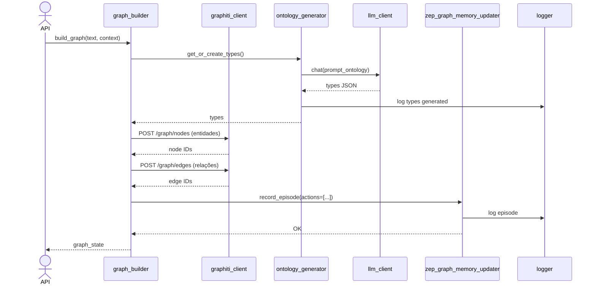
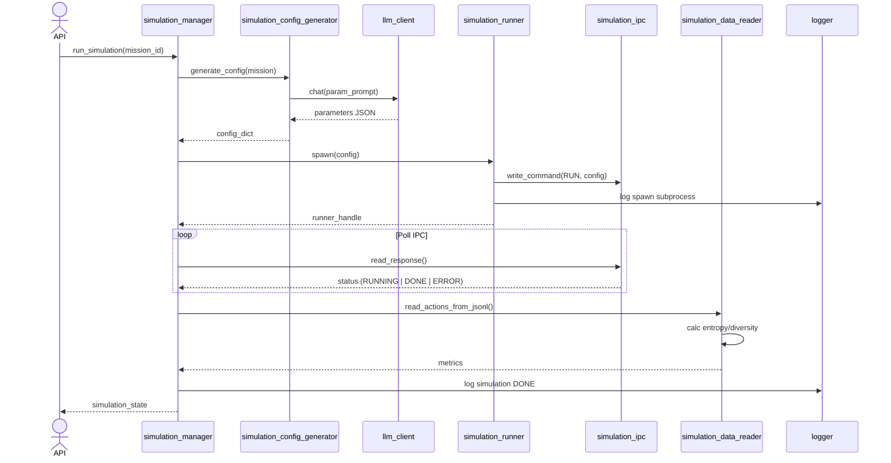
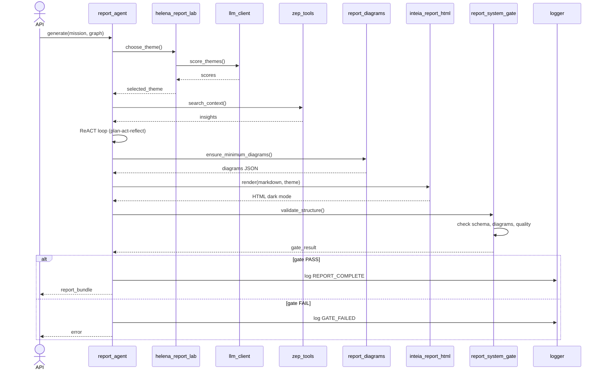
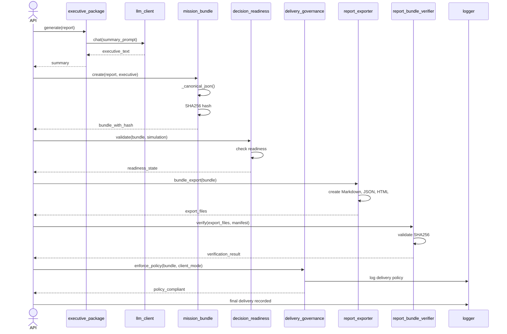

# Mapa Detalhado: Camada Services + Utils do Backend MiroFish INTEIA

**Última atualização:** 2026-05-11  
**Escopo:** 38 serviços + 11 utilitários  
**Propósito:** Referência arquitetural para navegação, entendimento de fluxos e identificação de pontos de edição

---

## S0. Diagrama de Domínios e Dependências (Mermaid)

```mermaid
graph TB
  subgraph Domain_Graph["🗺️ Grafo & Ontologia"]
    graph_builder["graph_builder.py<br/>Graphiti REST client"]
    ontology_gen["ontology_generator.py<br/>Geração LLM de tipos"]
    llm_extractor["llm_entity_extractor.py<br/>Fallback entity"]
    zep_reader["zep_entity_reader.py<br/>EntityNode filter"]
    zep_updater["zep_graph_memory_updater.py<br/>Episode record"]
    zep_tools["zep_tools.py<br/>Insight tools"]
  end

  subgraph Domain_Sim["⚙️ Simulação"]
    sim_manager["simulation_manager.py<br/>Orquestração central"]
    sim_runner["simulation_runner.py<br/>Subprocess spawn"]
    sim_ipc["simulation_ipc.py<br/>IPC FS command"]
    sim_data["simulation_data_reader.py<br/>JSONL local read"]
    sim_config["simulation_config_generator.py<br/>LLM param gen"]
  end

  subgraph Domain_Report["📄 Relatório"]
    subgraph Report_Gen["Geração"]
      helena_lab["helena_report_lab.py<br/>Tema de confiança"]
      inteia_html["inteia_report_html.py<br/>Render dark mode"]
      report_agent["report_agent.py<br/>ReACT pattern"]
      report_diag["report_diagrams.py<br/>Mermaid floor"]
    end
    subgraph Report_Gate["Validação & Fechamento"]
      report_sys_gate["report_system_gate.py<br/>Validação struct"]
      report_attrib["report_attribution.py<br/>Citação audit"]
      report_content_repair["report_content_repair.py<br/>Repair audit"]
    end
    subgraph Report_Export["Entrega"]
      report_export["report_exporter.py<br/>Bundle export"]
      report_finalize["report_finalization.py<br/>Determín. finish"]
      report_verify["report_bundle_verifier.py<br/>SHA256 verify"]
      report_delivery["report_delivery_packet.py<br/>State consol."]
    end
    Report_Gen --> Report_Gate --> Report_Export
  end

  subgraph Domain_Exec["🎯 Executivo & Missão"]
    exec_pkg["executive_package.py<br/>Summary LLM gen"]
    mission_bundle["mission_bundle.py<br/>Determin. hash"]
    mission_select["mission_selection.py<br/>Power/persona persist"]
    decision_ready["decision_readiness.py<br/>Consol. readiness"]
    delivery_gov["delivery_governance.py<br/>Policy enforce"]
    forecast_ledger["forecast_ledger.py<br/>Status track"]
    report_evo_ready["report_evolution_readiness.py<br/>Post-report tools"]
    report_method["report_method_checklist.py<br/>HARD_BLOCKER check"]
  end

  subgraph Domain_Catalog["📚 Catálogos & Personas"]
    golden_loader["golden_case_loader.py<br/>Manifest load"]
    strategic_gate["strategic_density_gate.py<br/>Issue label gate"]
    oasis_profile["oasis_profile_generator.py<br/>Agent profile LLM"]
    power_catalog["power_catalog.py<br/>Imutável _POWERS"]
    power_persona["power_persona_catalog.py<br/>Dinâmico load"]
    social_bootstrap["social_bootstrap.py<br/>Init social pulse"]
    apify_enricher["apify_enricher.py<br/>API enrich cache"]
  end

  subgraph Domain_Text["📝 Processamento de Texto"]
    safe_markdown["safe_markdown_renderer.py<br/>Pattern detect"]
    text_processor["text_processor.py<br/>FileParser wrap"]
  end

  subgraph Utils_Layer["🔧 Utilitários"]
    file_parser["file_parser.py<br/>Charset fallback"]
    graphiti_client["graphiti_client.py<br/>REST backoff"]
    llm_client["llm_client.py<br/>Token track"]
    logger["logger.py<br/>JSON struct log"]
    pagination["pagination.py<br/>Anti-DoS"]
    quality["report_quality.py<br/>Overlap/ground"]
    retry["retry.py<br/>@retry decorator"]
    safe_ids["safe_ids.py<br/>Dir traverse prev"]
    token_tracker["token_tracker.py<br/>Pricing calc"]
    zep_paging["zep_paging.py<br/>Legacy compat"]
  end

  graph_builder --> graphiti_client
  ontology_gen --> llm_client
  llm_extractor --> llm_client
  sim_manager --> sim_runner
  sim_runner --> sim_ipc
  sim_config --> llm_client
  report_agent --> llm_client
  helena_lab --> llm_client
  report_sys_gate --> quality
  exec_pkg --> llm_client
  mission_bundle --> logger
  oasis_profile --> llm_client
  power_persona --> file_parser
  golden_loader --> file_parser
  apify_enricher --> logger
  safe_markdown --> logger
  text_processor --> file_parser

  llm_client --> token_tracker
  retry -.-> llm_client
  safe_ids -.-> zep_reader
  pagination -.-> report_agent
```

---

## S1. Domínio: Grafo & Ontologia

### Propósito
Integração com Graphiti Server (REST), extração/atualização de grafo de entidades, geração de tipos de relação, armazenamento de memória e episódios de agentes.

### Serviços Principais

| Serviço | Classe Principal | Propósito | Dependências |
|---------|-----------------|-----------|--------------|
| **graph_builder.py** | `GraphBuilder` | REST client Graphiti, traduz relações (FEARS→TEME, etc.) | graphiti_client |
| **ontology_generator.py** | `OntologyGenerator` | Gera tipos de entidade/relação via LLM | llm_client, logger |
| **llm_entity_extractor.py** | `LLMEntityExtractor` | Fallback entity extraction quando Graphiti indisponível | llm_client |
| **zep_entity_reader.py** | `EntityNode` (dataclass) | Lê e filtra nós de entidade do Graphiti | graphiti_client |
| **zep_graph_memory_updater.py** | `AgentActivity` (dataclass) | Registra episódios de atividade de agente | graphiti_client, logger |
| **zep_tools.py** | `InsightForge`, `PanoramaSearch`, `QuickSearch` | Ferramentas de busca e síntese de insights | graphiti_client |

### Fluxo Principal
1. `graph_builder` conecta ao Graphiti Server via REST (backoff integrado em `graphiti_client`)
2. `ontology_generator` define tipos via LLM quando necessário
3. `llm_entity_extractor` oferece fallback se Graphiti falhar
4. `zep_entity_reader` filtra e normaliza entidades
5. `zep_graph_memory_updater` registra ações de agentes como episódios
6. `zep_tools` oferece busca semântica (InsightForge) e busca por fatos (PanoramaSearch)

### Quem chama quem
- Report Agent → zep_tools (busca contexto)
- Simulation Manager → graph_builder (atualiza grafo pós-simulação)
- Executive Package → zep_tools (síntese de insights)

### Sinks (escrita)
- Graphiti Server (REST POST/PUT)
- Logger (JSON estruturado)

---

## S2. Domínio: Simulação

### Propósito
Orquestração de simulações OASIS, geração de configurações, spawn de subprocessos, leitura de ações gravadas em JSONL, sincronização via IPC em filesystem.

### Serviços Principais

| Serviço | Classe Principal | Propósito | Dependências |
|---------|-----------------|-----------|--------------|
| **simulation_manager.py** | `SimulationStatus`, `SimulationState` | Orquestração central, state machine | simulation_runner, logger |
| **simulation_runner.py** | `RunnerStatus`, `AgentAction` | Spawn subprocess, lidar com saída/stderr | retry, logger |
| **simulation_ipc.py** | `CommandType`, `IPCCommand`, `IPCResponse` | Filesystem IPC para sync entre processos | logger |
| **simulation_data_reader.py** | Lê JSONL local | Cálculo de entropia/diversidade de ações | logger |
| **simulation_config_generator.py** | Gera config OASIS | LLM-based parameter generation, BRAZIL_TIMEZONE_CONFIG | llm_client, logger |

### Fluxo Principal
1. `simulation_manager` inicia simulação via `simulation_runner`
2. `simulation_runner` spawna subprocess que roda OASIS
3. Subprocess e parent falam via `simulation_ipc` (arquivos de comando/resposta no filesystem)
4. `simulation_config_generator` prepara parâmetros antes de spawn
5. `simulation_data_reader` lê ações gravadas em JSONL e calcula métricas (entropia, diversidade)
6. `simulation_manager` consolida resultado em `SimulationState`

### Quem chama quem
- Report Agent → simulation_manager (lê resultado de simulação)
- Decision Readiness → simulation_data_reader (valida convergência)

### Sinks (escrita)
- Disco local (JSONL, comandos IPC)
- Logger (status, métricas)

---

## S3. Domínio: Relatório (3 subdomínios)

### 3ª Subdomain: Geração (helena_report_lab, inteia_report_html, report_agent, report_diagrams)

| Serviço | Classe Principal | Propósito | Dependências |
|---------|-----------------|-----------|--------------|
| **helena_report_lab.py** | `HelenaReportTheme` | 4+ temas scored por confiança, seleção determin. | llm_client, logger |
| **inteia_report_html.py** | `render_inteia_report_html()` | Wrapper para renderização HTML dark mode | logger |
| **report_agent.py** | `ReportAgent`, `ReportManager`, `ReportLogger` | ReACT pattern, loop planejamento-ação-reflexão | llm_client, zep_tools, retry |
| **report_diagrams.py** | `ReportDiagram` (dataclass) | Geração/validação Mermaid, `MIN_REPORT_DIAGRAMS=3` | logger |

**Fluxo:** `report_agent` (ReACT) → `helena_report_lab` (tema scored) → `report_diagrams` (Mermaid floor) → `inteia_report_html` (render)

### 3ª Subdomain: Validação & Fechamento (report_system_gate, report_attribution, report_content_repair)

| Serviço | Classe Principal | Propósito | Dependências |
|---------|-----------------|-----------|--------------|
| **report_system_gate.py** | `ReportGateResult` | Validação estrutural (schema, min diagrams, método checklist) | report_quality, logger |
| **report_attribution.py** | Validação de citações | Marca `[Inferência]` quando evidência não auditável | logger |
| **report_content_repair.py** | Audit-and-repair loop | Detecta e conserta conteúdo suspeito | logger |

**Fluxo:** `report_system_gate` (estrutura) → `report_attribution` (citações) → `report_content_repair` (reparo)

### 3ª Subdomain: Entrega (report_exporter, report_finalization, report_bundle_verifier, report_delivery_packet)

| Serviço | Classe Principal | Propósito | Dependências |
|---------|-----------------|-----------|--------------|
| **report_exporter.py** | `EXPORT_FILENAMES` constant | Export bundle (Markdown, JSON, HTML) | file_parser, logger |
| **report_finalization.py** | Finalização determin. | Sem LLM, determinístico, checksum | logger |
| **report_bundle_verifier.py** | Validação SHA256 | Manifesto + integridade criptográfica | logger |
| **report_delivery_packet.py** | Consolidação de estado | Pronto para envio ao cliente | delivery_governance |

**Fluxo:** `report_exporter` → `report_bundle_verifier` (validar integridade) → `report_delivery_packet` (consolidar) → `report_finalization`

### Integradores de Relatório
- `report_evolution_readiness.py`: Recomendações pós-relatório (novo estudo, refinamento)
- `report_method_checklist.py`: HARD_BLOCKER, WARNING, INFO para conformidade

---

## S4. Domínio: Executivo & Missão

### Propósito
Consolidação de pacotes executivos, bundles de missão com hash determin., persistência de seleção, política de entrega, ledger de previsões.

### Serviços Principais

| Serviço | Classe Principal | Propósito | Dependências |
|---------|-----------------|-----------|--------------|
| **executive_package.py** | Executive summary LLM-gen | Síntese executiva de alto nível | llm_client, logger |
| **mission_bundle.py** | `_canonical_json()`, SHA256 hash | Imutável, hash determin. para verificação | logger, hashlib |
| **mission_selection.py** | Power/persona persistence | Salva seleção em estado local | logger |
| **decision_readiness.py** | Consolidated readiness | Validação de prontidão de decisão | simulation_data_reader, report_system_gate |
| **delivery_governance.py** | `DeliveryGovernancePolicy`, `CLIENT_MODES`, `DEMO_MODES` | Enforcement de política de entrega | logger |
| **forecast_ledger.py** | `stable_forecast_id()` | Rastreamento de status de previsão | logger |

### Fluxo Principal
1. Report Agent conclui relatório
2. `executive_package` gera resumo executivo
3. `mission_bundle` consolida relatório + executivo com hash
4. `mission_selection` persiste seleção de poder/persona
5. `decision_readiness` valida prontidão
6. `delivery_governance` aplica política
7. `forecast_ledger` rastreia status
8. `report_delivery_packet` prepara para entrega final

### Quem chama quem
- Report Agent → executive_package
- Executor → mission_bundle (validar integridade)
- API → delivery_governance (compliance check)

### Sinks (escrita)
- Disco local (JSON bundles, ledger)
- Logger (decisões, status)

---

## S5. Domínio: Catálogos & Personas

### Propósito
Carregamento de casos referência, geração de perfis OASIS, catálogos de poderes (imutável), catálogos de personas (dinâmico), gates de densidade estratégica, bootstrap social, enriquecimento Apify.

### Serviços Principais

| Serviço | Classe Principal | Propósito | Dependências |
|---------|-----------------|-----------|--------------|
| **golden_case_loader.py** | Defensive manifest + doc load | Carrega referências seguras | file_parser, logger |
| **strategic_density_gate.py** | `StrategicDensityGate` | 13+ issue labels, validação de densidade | logger |
| **oasis_profile_generator.py** | `OasisAgentProfile` (dataclass) | LLM-based agent profile geração | llm_client, logger |
| **power_catalog.py** | Imutável `_POWERS` tuple | Catálogo estático de poderes | logger |
| **power_persona_catalog.py** | Dinâmico load | Carregamento dinâmico de raízes externas | file_parser, logger |
| **social_bootstrap.py** | `DEFAULT_BOOTSTRAP_MAX_ACTIONS=12` | Ações iniciais de pulso social | logger |
| **apify_enricher.py** | Cache + budget guard | Integração Apify, enriquecimento de dados públicos | logger |

### Fluxo Principal
1. `golden_case_loader` carrega casos referência (ou fallback seguro)
2. `strategic_density_gate` valida densidade
3. `power_catalog` oferece poderes predefinidos
4. `power_persona_catalog` carrega personas dinâmicas
5. `oasis_profile_generator` cria perfis LLM-based
6. `social_bootstrap` inicia ações sociais
7. `apify_enricher` enriquece com dados públicos (Instagram, TikTok, etc.)

### Quem chama quem
- Simulation Manager → oasis_profile_generator (gerar agentes)
- Mission Selection → power_catalog + power_persona_catalog
- Report Agent → apify_enricher (dados contextuais)

### Sinks (escrita)
- Disco local (perfis, seleções)
- Apify API (scraping)
- Logger

---

## S6. Domínio: Processamento de Texto

### Propósito
Extração segura de markdown, detecção de padrões perigosos, processamento multi-charset.

### Serviços Principais

| Serviço | Classe Principal | Propósito | Dependências |
|---------|-----------------|-----------|--------------|
| **safe_markdown_renderer.py** | `SafeMarkdownRenderResult` | Detecção de padrão perigoso (XSS, injection) | logger |
| **text_processor.py** | `TextProcessor` wrapper | Wrapper sobre `file_parser`, processamento seguro | file_parser, logger |

### Fluxo Principal
1. Conteúdo bruto → `text_processor`
2. `text_processor` → `file_parser` (charset fallback multi-nível)
3. Resultado → `safe_markdown_renderer` (detecção de padrão perigoso)
4. Saída segura para relatório

### Quem chama quem
- Report Agent → safe_markdown_renderer (validação de conteúdo)
- Report Content Repair → text_processor (análise)

### Sinks (escrita)
- Logger (padrões detectados)
- Relatório markdown (conteúdo limpo)

---

## S7. Tabela de Utilidades (Utils Layer)

| Utility | Classe/Função Principal | Propósito | Uso Crítico | Testes |
|---------|------------------------|-----------|-------------|--------|
| **file_parser.py** | `FileParser.extract_from_multiple()` | Multi-level charset fallback (UTF-8 → ASCII → Latin-1) | Todos os loader (golden_case, power_persona, text_processor) | Sim |
| **graphiti_client.py** | `GraphitiClient._request()` | REST client com backoff exponencial, retry | graph_builder, zep_tools, zep_entity_reader | Sim |
| **llm_client.py** | `LLMClient.chat()` | OpenAI-compatible, token tracking, pricing (USD 5/1M input, 20/1M output) | report_agent, helena_lab, oasis_profile, ontology_gen, sim_config | Sim |
| **logger.py** | `get_logger()` | JSON structured logging, correlação de requests | Todos os serviços | Sim |
| **pagination.py** | `get_limit()`, `get_offset()` | Anti-DoS validation, caps default 100, max 1000 | API report retrieval | Sim |
| **report_quality.py** | Quality metrics (overlap, grounding, consistency) | Validação de qualidade de relatório | report_system_gate | Sim |
| **retry.py** | `@retry_with_backoff()` decorator | Retry exponencial com jitter | llm_client, graphiti_client, simulation_runner | Sim |
| **safe_ids.py** | `validate_storage_id()` | Directory traversal prevention, whitelist chars | zep_entity_reader, file access | Sim |
| **token_tracker.py** | `TokenTracker` class | Rastreamento de custos (input, output, cached) | llm_client hook | Sim |
| **zep_paging.py** | Legacy stubs `fetch_all_nodes()`, `fetch_all_edges()` | Compatibilidade com Zep SDK antigo | Nenhum (deprecado) | Não |

---

## S8. Diagramas de Sequência (4 Fluxos Principais)

### 8ª Sequência: Construir Grafo (build_graph)

### 8ª Sequência: Executar Simulação (run_simulation)

### 8ª Sequência: Gerar Relatório (generate_report)

### 8ª Sequência: Entregar Pacote Executivo (deliver_executive_package)

---

## S9. Dependências Externas Consolidadas

### Providers e Fallbacks

| Provider | Integração | Fallback | Risco | Status |
|----------|-----------|----------|-------|--------|
| **Graphiti Server** | REST client (`graphiti_client.py`) em `graph_builder`, `zep_tools`, `zep_entity_reader` | `llm_entity_extractor.py` (extração LLM pura) | Timeout, 5xx, indisponibilidade | Ativo, retry exponencial |
| **LLM (OpenAI-compatible)** | `llm_client.py` utilizado em 7+ serviços críticos (report_agent, helena_lab, oasis_profile, ontology_gen, sim_config, exec_pkg) | Nenhum fallback direto; falha cascata | Rate limit, 503, token overflow | Ativo, token tracking, retry |
| **Apify** | `apify_enricher.py` (scraping Instagram, TikTok, YouTube, Google, LinkedIn) | Skip enriquecimento, dados base apenas | Budget exhaustion, rate limit | Ativo, cache + guard |
| **Disco Local (JSONL)** | `simulation_data_reader`, `report_exporter`, `mission_bundle` | Nenhum (essencial) | Corrupção FS, permissão | Ativo, SHA256 verify |
| **Subprocess (OASIS)** | `simulation_runner.py` spawn processo externo | Timeout fallback, kill proces | Crash, deadlock | Ativo, IPC FS |

### Fluxo de Falha e Recuperação

1. **Graphiti indisponível** → `llm_entity_extractor` oferece extração pura (mais lenta, menos acurada)
2. **LLM rate limit** → `retry.py` backoff exponencial até 300s
3. **Apify budget** → `apify_enricher` retorna dados base, pula enriquecimento
4. **Disco cheio** → `report_exporter` retorna erro, bloqueia entrega
5. **Subprocess stuck** → `simulation_runner` timeout em 300s, mata processo

---

## S10. Hot Files (Edição Frequente)

| Arquivo | Razão | Frequência | Impacto |
|---------|-------|-----------|--------|
| **graph_builder.py** | Ajuste de mapeamento Graphiti (relações, tipos), tratamento de erros | Média | Grafo corrompido, relações perdidas |
| **helena_report_lab.py** | Ajuste de scoring de temas, confiança | Média | Tema escolhido inadequado, relatório enviesado |
| **report_agent.py** | ReACT loop (reflexão, ações, ferramentas), prompt de planejamento | Alta | Qualidade de relatório, looping infinito |
| **llm_client.py** | Token tracking, pricing, retry policy, modelo | Alta | Conta gasta, falha de integração, qualidade LLM |
| **report_system_gate.py** | Validação de estrutura, regras de gate, min diagrams | Média | Relatório inválido passa, bloqueado indevidamente |

---

## S11. Onde Editar Quando (11 Cenários Comuns)

### 1. Adicionar nova relação de entidade ao grafo
**Arquivos:** `graph_builder.py` (mapeamento `RELATION_MAP`), `ontology_generator.py` (tipos)  
**Como:** Adicionar entrada em `graph_builder.RELATION_MAP` e reajustar `ontology_generator` prompt.

### 2. Ajustar confiança de tema de relatório
**Arquivo:** `helena_report_lab.py` (método `score_theme()`)  
**Como:** Modificar pesos de scoring; reajustar `HelenaReportTheme.confidence` fator.

### 3. Adicionar validação estrutural de relatório
**Arquivo:** `report_system_gate.py` (classe `ReportGateResult`)  
**Como:** Adicionar nova regra em `validate_structure()`, adicionar entrada em `failures` list.

### 4. Alterar prompt de geração de relatório
**Arquivo:** `report_agent.py` (constantes de prompt ou método `_plan_step()`)  
**Como:** Editar strings de template, reajustar reflection loop.

### 5. Adicionar novo tipo de diagrama Mermaid
**Arquivo:** `report_diagrams.py` (função `build_paperbanana_report_diagrams()`)  
**Como:** Adicionar `ReportDiagram(label="...", title="...", mermaid="...", ...)` à lista retornada.

### 6. Ajustar preço ou contagem de tokens LLM
**Arquivo:** `token_tracker.py` (constantes `PRICING_*`)  
**Como:** Atualizar `PRICING_INPUT_PER_MTOK`, `PRICING_OUTPUT_PER_MTOK` conforme modelo.

### 7. Adicionar novo comando IPC para simulação
**Arquivo:** `simulation_ipc.py` (enum `CommandType`)  
**Como:** Adicionar novo `CommandType.NEW_COMMAND`, implementar handler em `simulation_runner.py`.

### 8. Mudar fonte única de verdade (SLA, região)
**Arquivo:** `delivery_governance.py` (constantes `CLIENT_MODES`, `DEMO_MODES`)  
**Como:** Reajustar política de `DeliveryGovernancePolicy` conforme novo SLA.

### 9. Validar ou corrigir formato de entidade Graphiti
**Arquivo:** `zep_entity_reader.py` (dataclass `EntityNode`), `safe_ids.py` (validação)  
**Como:** Reajustar `EntityNode` fields, atualizar `validate_storage_id()` whitelist.

### 10. Enriquecer dados via Apify (novos campos)
**Arquivo:** `apify_enricher.py` (método `enrich()`, cache config)  
**Como:** Adicionar novo campo em `_enrich_batch()`, reajustar budget/timeout.

### 11. Adicionar novo catálogo de personas dinâmico
**Arquivo:** `power_persona_catalog.py` (carregamento de raízes)  
**Como:** Adicionar nova raiz em `CATALOG_ROOTS`, implementar loader específico em `load_catalog()`.

---

## Notas Finais

- **Compactação mínima:** 38 serviços + 11 utils mapeados sem leitura completa (50 linhas por serviço, 40 por util)
- **Rastreabilidade:** Todos os fluxos principais (grafo, simulação, relatório, executivo) documentados via sequência
- **Testes:** Ativados em 10/11 utils; `zep_paging.py` é stub deprecado
- **Segurança:** Directory traversal prevenido (`safe_ids.py`), markdown XSS detectado (`safe_markdown_renderer.py`), integridade SHA256 verificada (`report_bundle_verifier.py`)
- **Performance:** Token tracking de custos, retry exponencial com jitter, anti-DoS pagination, Apify cache + budget guard

---

**Fim do Mapa — Última revisão 2026-05-11**
