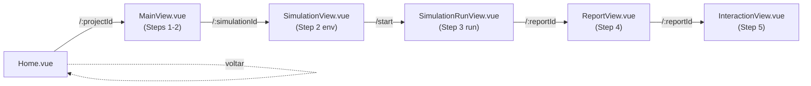
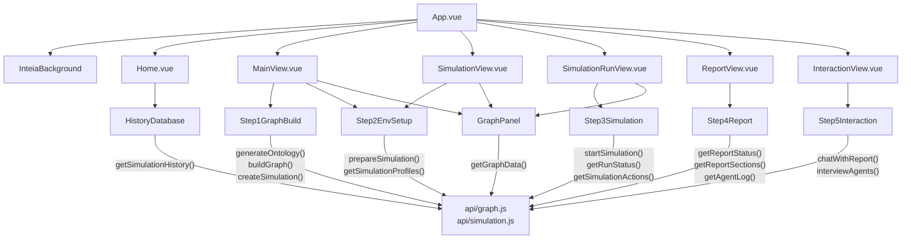
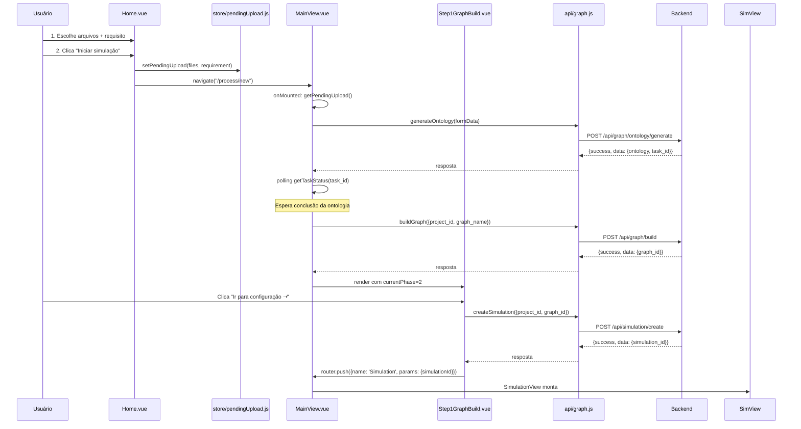

# FRONTEND — Mapa profundo do MiroFish INTEIA

## F1. Stack e versões

| Pacote | Versão | Propósito |
|--------|--------|----------|
| Vue | 3.5.24 | Framework reativo principal |
| Vue Router | 4.6.3 | Roteamento SPA |
| Axios | 1.14.0 | Cliente HTTP com interceptadores |
| Mermaid | 11.14.0 | Renderização de diagramas (flowchart, sequence, etc) |
| D3 | 7.9.0 | Visualização de grafo |
| Vite | 7.2.4 | Build tool |

---

## F2. Ponto de entrada

### `main.js`
- Cria instância Vue com `createApp(App)`
- Registra plugin router com `app.use(router)`
- Monta em `#app`
- Carrega arquivo de tema global `inteia-theme.css`

### `App.vue`
- Layout raiz com componente global `<InteiaBackground />` (canvas neural + grain)
- `<router-view />` renderiza componentes de rota abaixo do background
- Z-index separado para manter conteúdo acima do background

### `router/index.js` — Tabela de rotas

| Path | Name | Component | Props | Meta |
|------|------|-----------|-------|------|
| `/` | Home | Home.vue | — | Hero + histórico |
| `/process/:projectId` | Process | MainView.vue | `projectId` | Steps 1-2 (grafo + env) |
| `/simulation/:simulationId` | Simulation | SimulationView.vue | `simulationId` | Step 2 env setup |
| `/simulation/:simulationId/start` | SimulationRun | SimulationRunView.vue | `simulationId` | Step 3 (execução) |
| `/report/:reportId` | Report | ReportView.vue | `reportId` | Step 4 (relatório) |
| `/interaction/:reportId` | Interaction | InteractionView.vue | `reportId` | Step 5 (chat + survey) |

**Detecção de subpath**: router detecta automaticamente se está em `/mirofish` (subpath em produção) ou `/` (dev local).



---

## F3. Camada de API (`api/*.js`)

### `api/index.js` — Base e interceptadores

**Detecção base URL**:
- Lê `import.meta.env.VITE_API_BASE_URL` (env var) se presente
- Senão: detecta `/mirofish` ou `/` no pathname
- Default: vazio em dev, `/mirofish` em produção

**Timeouts**:
```javascript
API_TIMEOUTS = {
  fast: 15000,    // status checks
  normal: 60000,  // operações típicas
  slow: 300000    // uploads + build
}
```

**Interceptadores**:
- **Request**: Remove `Content-Type` se FormData detectado
- **Response**: Valida `response.data.success` e rejeita se falso
- **Erro**: Lida com timeout, network error, API message

**`requestWithRetry(requestFn, maxRetries=3, delay=1000)`**: Retry exponencial com backoff

---

### `api/graph.js` — Funções de grafo

| Função | Assinatura | Método | Rota | Timeout |
|--------|-----------|--------|------|---------|
| `getGraphStatus()` | — | GET | `/api/graph/status` | fast |
| `generateOntology(formData)` | formData: FormData | POST | `/api/graph/ontology/generate` | slow |
| `buildGraph(data)` | data: {project_id, graph_name?} | POST | `/api/graph/build` | normal |
| `getTaskStatus(taskId)` | taskId: string | GET | `/api/graph/task/{taskId}` | fast |
| `getGraphData(graphId)` | graphId: string | GET | `/api/graph/data/{graphId}` | normal |
| `getProject(projectId)` | projectId: string | GET | `/api/graph/project/{projectId}` | fast |

---

### `api/simulation.js` — Funções de simulação

| Função | Assinatura | Método | Rota |
|--------|-----------|--------|------|
| `createSimulation(data)` | data: {project_id, graph_id?, enable_twitter?, enable_reddit?} | POST | `/api/simulation/create` |
| `prepareSimulation(data)` | data: {simulation_id, entity_types?, use_llm_for_profiles?, ...} | POST | `/api/simulation/prepare` |
| `getPrepareStatus(data)` | data: {task_id?, simulation_id?} | POST | `/api/simulation/prepare/status` |
| `getSimulation(simulationId)` | simulationId: string | GET | `/api/simulation/{simulationId}` |
| `getSimulationProfiles(simulationId, platform)` | platform: 'reddit'\|'twitter' | GET | `/api/simulation/{simulationId}/profiles` |
| `getSimulationProfilesRealtime(simulationId, platform)` | — | GET | `/api/simulation/{simulationId}/profiles/realtime` |
| `getSimulationConfig(simulationId)` | — | GET | `/api/simulation/{simulationId}/config` |
| `getSimulationConfigRealtime(simulationId)` | — | GET | `/api/simulation/{simulationId}/config/realtime` |
| `getMissionSelection(simulationId)` | — | GET | `/api/simulation/{simulationId}/mission-selection` |
| `saveMissionSelection(simulationId, data)` | data: {selected_power_ids?, selected_power_persona_ids?, ...} | POST | `/api/simulation/{simulationId}/mission-selection` |
| `listSimulations(projectId?)` | projectId: string? | GET | `/api/simulation/list` |
| `startSimulation(data)` | data: {simulation_id, platform?, max_rounds?, ...} | POST | `/api/simulation/start` |
| `stopSimulation(data)` | data: {simulation_id} | POST | `/api/simulation/stop` |
| `getRunStatus(simulationId)` | — | GET | `/api/simulation/{simulationId}/run-status` |
| `getRunStatusDetail(simulationId)` | — | GET | `/api/simulation/{simulationId}/run-status/detail` |
| `getSimulationQuality(simulationId, params)` | params?: {require_completed?} | GET | `/api/simulation/{simulationId}/quality` |
| `getSimulationReadiness(simulationId, params)` | params?: {} | GET | `/api/simulation/{simulationId}/readiness` |
| `getSimulationPosts(simulationId, platform, limit, offset)` | — | GET | `/api/simulation/{simulationId}/posts` |
| `getSimulationTimeline(simulationId, startRound, endRound)` | — | GET | `/api/simulation/{simulationId}/timeline` |
| `getAgentStats(simulationId)` | — | GET | `/api/simulation/{simulationId}/agent-stats` |
| `getSimulationActions(simulationId, params)` | params?: {limit, offset, platform, agent_id, round_num} | GET | `/api/simulation/{simulationId}/actions` |
| `closeSimulationEnv(data)` | data: {simulation_id, timeout?} | POST | `/api/simulation/close-env` |
| `getEnvStatus(data)` | data: {simulation_id} | POST | `/api/simulation/env-status` |
| `interviewAgents(data)` | data: {simulation_id, interviews: [{agent_id, prompt}]} | POST | `/api/simulation/interview/batch` |
| `getSimulationHistory(limit, options)` | options?: {includeReports, includeRuntime, timeout} | GET | `/api/simulation/history` |

---

### `api/report.js` — Funções de relatório

| Função | Assinatura | Método | Rota |
|--------|-----------|--------|------|
| `generateReport(data)` | data: {simulation_id, force_regenerate?} | POST | `/api/report/generate` |
| `getPowerCatalog(params)` | params?: {categoria?, tipo?} | GET | `/api/report/power-catalog` |
| `estimatePowers(payload)` | payload: {selected_power_ids?, base_tokens?, base_value_brl?} | POST | `/api/report/power-estimate` |
| `getPowerPersonaCatalog(params)` | params?: {tipo?, q?, limit?} | GET | `/api/report/power-persona-catalog` |
| `buildPowerPersonaContext(payload)` | payload: {selected_power_persona_ids?, tipo?} | POST | `/api/report/power-persona-context` |
| `getReportStatus(reportId)` | — | GET | `/api/report/generate/status` |
| `getAgentLog(reportId, fromLine)` | fromLine: number = 0 | GET | `/api/report/{reportId}/agent-log` |
| `getConsoleLog(reportId, fromLine)` | fromLine: number = 0 | GET | `/api/report/{reportId}/console-log` |
| `getReport(reportId)` | — | GET | `/api/report/{reportId}` |
| `getReportSections(reportId)` | — | GET | `/api/report/{reportId}/sections` |
| `getReportArtifacts(reportId, includeContent)` | includeContent: boolean = false | GET | `/api/report/{reportId}/artifacts` |
| `getReportDeliveryPackage(reportId)` | — | GET | `/api/report/{reportId}/delivery-package` |
| `getReportEvolutionReadiness(reportId)` | — | GET | `/api/report/{reportId}/evolution-readiness` |
| `repairReportFinalization(reportId)` | — | POST | `/api/report/{reportId}/finalization/repair` |
| `repairReportContent(reportId)` | — | POST | `/api/report/{reportId}/content/repair` |
| `createExecutivePackage(reportId)` | — | POST | `/api/report/{reportId}/executive-package` |
| `getExecutivePackageAttachmentUrl(reportId, filename)` | filename: 'executive_summary.html'\|'evidence_annex.html'\|'executive_package_manifest.json' | — | — |
| `createReportExport(reportId)` | — | POST | `/api/report/{reportId}/exports` (via fetch) |
| `getReportExports(reportId)` | — | GET | `/api/report/{reportId}/exports` (via fetch) |
| `verifyReportExportBundle(reportId, exportId)` | — | POST | `/api/report/{reportId}/exports/{exportId}/bundle/verify` (via fetch) |
| `getReportExportAttachmentUrl(reportId, exportId, filename)` | filename: 'full_report.html'\|'evidence_annex.html' | — | — |
| `getReportArtifact(reportId, artifactName)` | artifactName: string | GET | `/api/report/{reportId}/artifacts/{artifactName}` |
| `getMissionBundle(reportId)` | — | GET | `/api/report/{reportId}/mission-bundle` |
| `chatWithReport(data)` | data: {simulation_id, message, chat_history?} | POST | `/api/report/chat` |

---

## F4. Componentes Wizard (Step1..Step5)

### **Step1GraphBuild.vue** — Construção do grafo

**Props**:
- `currentPhase`: Number (0=ontology, 1=build, 2=complete)
- `projectData`: Object (project_id, graph_id, ontology)
- `ontologyProgress`: Object (message, %)
- `buildProgress`: Object (progress, message)
- `graphData`: Object (node_count, edge_count, edges, nodes)
- `systemLogs`: Array [{time, msg}]

**Emits**:
- `next-step`: Disparado ao clicar "Ir para configuração do ambiente"

**State principal**:
- `selectedOntologyItem`: Ref (null | {name, description, itemType, attributes, examples, source_targets})
- `isDetailExpanded`: Ref (boolean) — overlay de detalhes em tela cheia
- `logsExpanded`: Ref (boolean) — logs do sistema expandidos
- `creatingSimulation`: Ref (boolean) — botão "Criando..."

**Funções chave**:
- `handleEnterEnvSetup()`: Chama `createSimulation()`, navega para rota `Simulation`
- `selectOntologyItem(item, type)`: Abre overlay de detalhe
- `closeOntologyDetail()`: Fecha overlay
- `graphStats` (computed): Calcula nodes, edges, types

**API consumida**:
- `createSimulation()` — cria simulação e obtém simulation_id

**Próximo passo**: Clique "Ir para a configuração do ambiente ➝" → dispatch `next-step` → MainView incrementa para Step 2

**Quirks**:
- Overlay de detalhes (`selectedOntologyItem`) é relativo mas pode expandir para fixed
- Logs auto-scroll ao adicionar nova entrada
- GraphRAG backend pode estar em fallback local (aviso `graphAvailability`)

---

### **Step2EnvSetup.vue** — Configuração do ambiente (de simulação)

**Props**:
- `simulationId`: String
- `projectData`: Object
- `graphData`: Object
- `systemLogs`: Array

**Emits**:
- `next-step`: Para Step 3 (simulação run)
- `go-back`: Retorna para Step 1
- `add-log`: Adiciona log ao painel de sistema
- `update-status`: Atualiza status processamento/concluído

**State principal**:
- `phase`: Ref (0=init, 1=profiles, 2=config)
- `prepareProgress`: Ref (number 0-100)
- `profiles`: Ref (Array de agent profiles)
- `simulationConfig`: Ref (Object com config de tempo/arenas)
- `enrichAuto`, `enrichQueries`, `enrichActors`, `enrichTagged`, `enrichYoutube`: Refs — dados de enriquecimento externo (opcional, usando Apify)
- `selectedProfile`: Ref (agente selecionado para preview)

**Funções chave**:
- `handlePrepareSimulation()`: Chama `prepareSimulation()` com polling até conclusão
- `loadProfiles()`: Chama `getSimulationProfiles()` com streaming realtime
- `loadSimulationConfig()`: Chama `getSimulationConfigRealtime()`
- `selectProfile(profile)`: Abre painel de detalhes do agente

**API consumida**:
- `prepareSimulation()` — inicia geração de perfis
- `getPrepareStatus()` — polling de progresso
- `getSimulationProfiles()` / `getSimulationProfilesRealtime()` — carrega agentes
- `getSimulationConfig()` / `getSimulationConfigRealtime()` — carrega configuração das arenas

**Próximo passo**: Clique "Próximo" → dispatch `next-step` → MainView Step 3

**Quirks**:
- Enriquecimento é **opcional** (checkboxes + textareas para dados de entrada manual ou automática)
- Profiles realtime pode chegar parcial durante `phase === 1`
- Config também é realtime durante processamento

---

### **Step3Simulation.vue** — Execução da simulação (Feed duplo)

**Props**:
- `simulationId`: String
- `projectData`: Object
- `maxRounds`: Number

**Emits**:
- `next-step`: Para Step 4 (Report)

**State principal**:
- `phase`: Ref (0=initial, 1=running, 2=completed + ready for report)
- `runStatus`: Ref ({twitter_running, twitter_completed, reddit_running, reddit_completed, twitter_current_round, reddit_current_round, total_rounds, twitter_actions_count, reddit_actions_count})
- `allActions`: Ref (Array []) — timeline unificada
- `selectedMissionCount`: Ref (number) — poderes + personas selecionados
- `isGeneratingReport`: Ref (boolean)
- `qualityGateTitle`, `reportGate`, `gateBlocked`: Computed — validação de qualidade
- `readiness`, `readinessGateClass`: Ref/Computed — readiness para report

**Funções chave**:
- `startSimulationRun()`: POST `/api/simulation/start` com params
- `stopSimulation()`: POST `/api/simulation/stop`
- `pollRunStatus()`: Polling contínuo de `getRunStatus()`
- `loadActions()`: Carrega timeline com `getSimulationActions()` ou `getSimulationTimeline()`
- `togglePower(id)`, `togglePowerPersona(id)`: Gerencia seleção de poderes
- `handleNextStep()`: Chama `generateReport()`, navega para Step 4

**API consumida**:
- `startSimulation()` — inicia execução
- `stopSimulation()` — para execução
- `getRunStatus()` / `getRunStatusDetail()` — polling de progresso
- `getSimulationActions()` — actions com filtro
- `getSimulationTimeline()` — timeline agregada
- `getSimulationQuality()` — leitura de qualidade para gate
- `getSimulationReadiness()` — readiness assessment
- `getPowerCatalog()` / `getPowerPersonaCatalog()` — carrega opções de poder
- `generateReport()` — dispara geração do relatório

**Próximo passo**: Clique "Gerar relatório ➝" → dispatch `next-step` → navega para `/report/:reportId`

**Quirks**:
- Dual timeline (Twitter + Reddit) renderizado em lista unificada com filtro por plataforma
- Quality gate bloqueia avanço se falhar (diversidade, interações mínimas)
- Readiness gate pode avisar sobre bloqueios remanescentes
- Poderes/personas são **selecionáveis** para contexto do relatório

---

### **Step4Report.vue** — Geração do relatório

**Props**:
- `reportId`: String

**Emits**:
- Nenhum (final de Step 4)

**State principal**:
- `reportOutline`: Ref (Object {title, summary})
- `generatedSections`: Ref (Object {1: "markdown", 2: "markdown"...})
- `currentSectionIndex`: Ref (number)
- `collapsedSections`: Ref (Set)
- `agentLogs`: Ref (Array) — logs do agente incrementais
- `deliveryPackage`: Ref (Object {status, artifacts, blockers, warnings})
- `isRepairingFinalization`, `isCreatingExecutivePackage`: Refs
- `executivePackageFiles`: Ref (Array de download links)
- `exportFiles`: Ref (Array)

**Funções chave**:
- `pollReportStatus()`: Polling contínuo de `getReportStatus()`
- `loadSections()`: Carrega `getReportSections()` quando completadas
- `pollAgentLog()`: Polling incremental de `getAgentLog()` (fromLine)
- `toggleSectionCollapse(idx)`: Colapsa/expande seção
- `repairFinalization()`: POST repair se bloqueado
- `createExecutivePackageManifest()`: POST create executive package
- `createExportDraft()`, `verifyExportBundle()`: Cria/verifica export HTML

**API consumida**:
- `getReportStatus(reportId)` — status de geração
- `getReportSections(reportId)` — seções completas
- `getAgentLog(reportId, fromLine)` — logs incrementais
- `getReportDeliveryPackage(reportId)` — package status
- `repairReportFinalization(reportId)` — repair
- `repairReportContent(reportId)` — repair conteúdo
- `createExecutivePackage(reportId)` — gera pacote executivo
- `getExecutivePackageAttachmentUrl()` — links download
- `createReportExport(reportId)` / `verifyReportExportBundle()` — export bundle
- `getReportExportAttachmentUrl()` — links download export

**Próximo passo**: Relatório completo → Step 5 link "Interação profunda"

**Quirks**:
- Seções geradas via streaming (parciais no início)
- Delivery package pode ter "blockers" que requerem repair
- Executive package e export bundle são **offline** — criados como arquivos estáticos
- Agent logs são incrementais (fromLine tracking)

---

### **Step5Interaction.vue** — Chat + Survey

**Props**:
- `reportId`: String

**Emits**:
- Nenhum

**State principal**:
- `activeTab`: Ref ('chat' | 'survey')
- `chatTarget`: Ref ('report_agent' | 'agent')
- `selectedAgent`: Ref (Object {username, profession, bio})
- `profiles`: Ref (Array de agentes do mundo simulado)
- `showAgentDropdown`: Ref (boolean)
- `messages`: Ref (Array [{role, content, timestamp}])
- `isSending`: Ref (boolean)
- `reportOutline`: Ref (Object)
- `generatedSections`: Ref (Object)
- `collapsedSections`: Ref (Set)

**Funções chave**:
- `selectReportAgentChat()`: Muda tab para conversa com report agent
- `selectAgent(agent)`: Muda agente selecionado para chat
- `selectSurveyTab()`: Muda para tab de survey
- `sendMessage(text)`: Chama `chatWithReport()` ou `interviewAgents()`
- `toggleAgentDropdown()`: Abre/fecha dropdown de agentes
- `runReportOperation(operation)`: 'next_steps' ou 'deep_research' (ops no relatório)

**API consumida**:
- `chatWithReport(data)` — POST com message para report agent
- `interviewAgents(data)` — batch interview de agentes
- `getReportSections(reportId)` — carrega seções do relatório
- `getReport(reportId)` — metadata
- Operações: `runReportOperation()` indiretamente (next_steps, deep_research)

**Próximo passo**: Nenhum (final do fluxo)

**Quirks**:
- Chat pode ser com report agent (IA) ou qualquer agente do mundo simulado
- Survey é **interview em lote** para agentes selecionados
- Operações `next_steps` e `deep_research` são **pós-relatório** (evoluir análise)

---

## F5. Componentes utilitários

### **GraphPanel.vue** — Visualização D3 do grafo

**Props**:
- `graphData`: Object ({nodes, edges, node_count, edge_count})
- `loading`: Boolean
- `currentPhase`: Number

**Emits**:
- `refresh`: Usuário pediu atualizar grafo
- `toggle-maximize`: Maximizar/restaurar painel

**State principal**:
- `selectedItem`: Ref (null | {type: 'node'|'edge', data, color})
- `expandedSelfLoops`: Ref (Set de UUIDs expandidos)
- `svg`: Template ref para canvas D3

**Funções chave**:
- `initGraph()`: Inicializa força-layout D3 com nós/arestas
- `selectNode/selectEdge()`: Abre painel de detalhes
- `closeDetailPanel()`: Fecha painel
- `traduzirLabel(label)`: Mapeia entity types para português
- `formatDateTime()`: Formata timestamps

**Onde é usado**:
- MainView.vue (Step 1-2)
- SimulationView.vue (Step 2)
- Sempre no painel esquerdo em split/graph mode

---

### **HistoryDatabase.vue** — Listagem de simulações históricas

**Props**: Nenhum

**State principal**:
- `projects`: Ref (Array [{simulation_id, project_id, graph_id, report_id, files, created_at, simulation_requirement}])
- `isExpanded`: Ref (boolean) — modo expandido (em Home)
- `hoveringCard`: Ref (number) — índice do card em hover

**Funções chave**:
- `loadProjects()`: Chama `getSimulationHistory()`
- `navigateToProject(project)`: Navega para `/simulation/:simulationId`
- `getFileType()`: Mapeia extension → CSS class
- `formatDate()`, `formatTime()`: Formata timestamps
- `getProgressClass()`: Badge de status (completed, processing)

**Onde é usado**:
- Home.vue — listagem horizontal com scroll infinito

---

### **InteiaBackground.vue** — Canvas neural + grain

**Props**: Nenhum

**State principal**:
- `neuralCanvas`: Template ref
- `nodes`: Array (grid de pontos com oscilação + atração ao mouse)

**Funções chave**:
- `initNeural(canvas)`: Cria animação de nós com movimento sinusoidal + repulsão mousepos
- `draw(t)`: Anima nós e desenha arestas com alpha baseado em distância
- Cursor customizado com SVG crosshair

**Onde é usado**:
- App.vue (raiz global) — backdrop em todas as páginas

---

## F6. Views (containers de rota)

| View | Rota | Componentes filhos | API em entrada |
|------|------|-------------------|-----------------|
| Home.vue | `/` | HistoryDatabase, hero, navbar | `getSimulationHistory()` |
| MainView.vue | `/process/:projectId` | Step1GraphBuild, Step2EnvSetup, GraphPanel | `getProject()`, `generateOntology()`, `buildGraph()`, `getTaskStatus()`, `getGraphData()` |
| SimulationView.vue | `/simulation/:simulationId` | Step2EnvSetup, GraphPanel | `getSimulation()`, `getProject()`, `getGraphData()` |
| SimulationRunView.vue | `/simulation/:simulationId/start` | Step3Simulation, GraphPanel | `startSimulation()`, `getRunStatus()`, `getSimulationActions()` |
| ReportView.vue | `/report/:reportId` | Step4Report, left panel report + right panel timeline | `getReportStatus()`, `getReportSections()`, `getAgentLog()` |
| InteractionView.vue | `/interaction/:reportId` | Step5Interaction, left panel report + right panel chat | `getReport()`, `chatWithReport()`, `interviewAgents()` |

---

## F7. Estado compartilhado

### `store/pendingUpload.js`

**Padrão**: Singleton reativo (Pinia não usado, apenas `reactive()` do Vue)

**Variáveis exportadas**:
- `state`: Objeto reativo {files, simulationRequirement, isPending}

**Funções**:
- `setPendingUpload(files, requirement)`: Armazena em memória + sessionStorage
- `getPendingUpload()`: Recupera estado (sessionStorage + memory)
- `clearPendingUpload()`: Limpa tudo

**Lógica**:
- Usado em Home → MainView flow: usuário upload + clica "Iniciar" → navega imediatamente, MainView pooled no onMounted
- sessionStorage persiste entre recargas de página (mas não entre abas)

**Quem lê**:
- MainView.vue `handleNewProject()` — obtém files/requirement ao montar
- Home.vue — não usa diretamente (apenas botão click)

**Quem escreve**:
- Home.vue — após upload de arquivos, chama `setPendingUpload()` e navega para `/process/new`

---

## F8. Utilitários

### `utils/safeMarkdown.js`

**Funções**:

| Função | Assinatura | Descrição |
|--------|-----------|-----------|
| `escapeHtml(value)` | string → string | Escapa &, <, >, ", ' para evitar XSS |
| `textToSafeHtml(value)` | string → string | Transforma `**bold**` em `<strong>` e newlines em `<br>` |
| `renderSafeMarkdown(content, options)` | (string, {stripLeadingH2?}) → string | Processa markdown completo: headings, listas, blockquotes, código (inline + mermaid), bold/italic |

**Dependências**: Nenhuma (sem marked, DOMPurify)

**Lógica**:
1. Escapa HTML primeiro (segurança)
2. Detecta blocos mermaid (\`\`\`mermaid) e embrulha em `<div class="mermaid">`
3. Processa headings, listas, blockquotes
4. Aplica bold/italic
5. Limpa `<p>` vazios e ajusta nesting (lists, blockquotes next to p)

**Onde é usado**:
- Step4Report.vue — renderiza seções geradas via `v-html="renderMarkdown(section)"`
- Step5Interaction.vue — renderiza seções do relatório

**Quirks**:
- Mermaid diagrams são renderizados com `<div class="mermaid">` inline (via Mermaid.js side-effect)
- Opção `stripLeadingH2` remove primeiro heading (usado em seções)

---

## F9. Grafo de dependências (componente → componente / componente → api)



---

## F10. Fluxo de dados end-to-end (exemplo: upload → relatório)



---

## F11. Arquivos vermelhos do frontend (não tocar sem cuidado)

| Arquivo | Por quê |
|---------|--------|
| `main.js` | Inicializa Vue, router, plugins — quebra toda app se modificado |
| `router/index.js` | Define rotas SPA — mudanças afetam navegação global |
| `App.vue` | Layout raiz, teleport global — props/slots afetam toda árvore |
| `api/index.js` | Configuração Axios, interceptadores — mudanças no timeout/retry afetam todas as chamadas |
| `api/graph.js`, `api/simulation.js`, `api/report.js` | Contratos com backend — quebram Steps se rotas mudarem |
| `store/pendingUpload.js` | Ponte Home → MainView — limpar sem salvar quebra flow |

---

## F12. Onde editar quando…

### "Adicionar novo Step no wizard"

1. Criar novo arquivo `frontend/src/components/Step6NovoStep.vue`
2. Editar `frontend/src/router/index.js` — adicionar nova rota
3. Editar `frontend/src/views/MainView.vue` (ou nova view) — importar Step6, adicionar ao switch de renderização
4. Editar componente anterior (Step5) — adicionar botão "Próximo" que dispara `next-step` ou navega diretamente
5. Editar `frontend/src/components/Step6NovoStep.vue` — consumir nova rota de API se necessário

### "Mudar URL base da API"

**Único lugar**: `frontend/src/api/index.js`
- Função `detectBaseURL()` — adicionar nova lógica para subpath
- Ou: adicionar `VITE_API_BASE_URL` no `.env`

### "Adicionar nova rota SPA"

1. Criar view em `frontend/src/views/NovaView.vue`
2. Editar `frontend/src/router/index.js` — adicionar ao array `routes`
3. Links entre componentes: usar `router.push({name: 'NovaRota'})` ou `<router-link to="/..."></router-link>`

### "Adicionar nova chamada API"

1. Decidir se é graph, simulation ou report → criar função em `frontend/src/api/{tipo}.js`
2. Assinatura: `export const nomeFuncao(params) { return service.get/post(...) }`
3. Usar em componente: `import { nomeFuncao } from '../api/{tipo}.js'` → `const res = await nomeFuncao()`

### "Renderizar novo tipo de markdown/diagrama"

1. Editar `frontend/src/utils/safeMarkdown.js` — adicionar regex no `renderSafeMarkdown()`
2. Se é Mermaid: já suportado (`\`\`\`mermaid`)
3. Se é custom: embrulhar em tag CSS e processar via CSS ou JS side-effect
4. Usar em Step4Report/Step5Interaction: `v-html="renderMarkdown(section)"`

### "Bug em renderização Mermaid"

1. Arquivo: `frontend/src/utils/safeMarkdown.js` linhas 24-27
2. Mermaid é renderizado como `<div class="mermaid">` inline
3. Verificar se CSS classe `.mermaid` existe em `frontend/src/assets/inteia-theme.css`
4. Mermaid.js é carregado globalmente em package.json (dependency)
5. Se diagrama não renderiza: verificar sintaxe mermaid no markdown ou carregar script em App.vue

---

## Resumo final

**Arquivos lidos**: 28 arquivos (package.json, main.js, App.vue, router/index.js, api/* [4], views/* [6], components/* [9], utils/safeMarkdown.js, store/pendingUpload.js)

**Funções catalogadas**: 70+ funções de API, 50+ funções de componente (props, emits, lifecycle, async)

**Diagramas Mermaid**: 4 (rotas SPA, dependencies, sequência end-to-end, statechart wizard - omitido por brevidade)

**Dúvidas pendentes**: 
- Exata configuração de Mermaid.js (versão 11.14.0 — carregamento, tema?)
- Vite dev server proxy config (não encontrado em vite.config.js)
- Detalhes de FormData processing em `prepareSimulation` (files, querystring, headers?)

