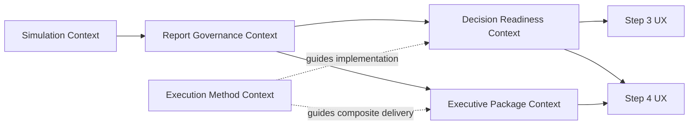
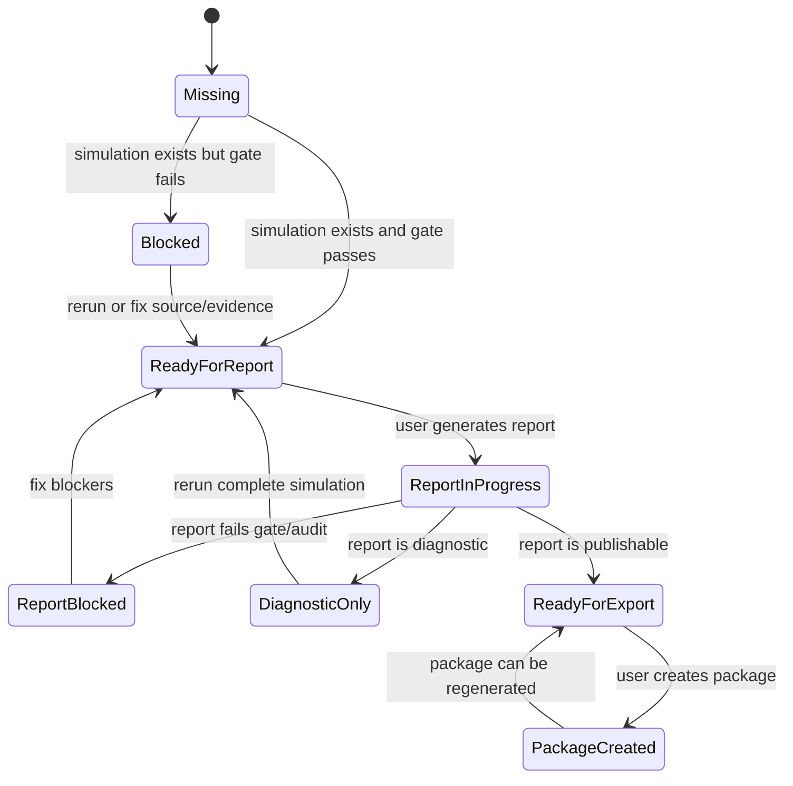

# DDD: Mirofish Systemic Intelligence UX

**Status:** Ready for implementation planning  
**Date:** 2026-05-06  
**Domain:** Simulation readiness, report governance, and executive delivery packaging  
**Related PRD:** `docs/prd/2026-05-06-mirofish-systemic-intelligence-ux-prd.md`  
**Related plan:** `docs/superpowers/plans/2026-05-06-mirofish-systemic-intelligence-ux-plan.md`

---

## 1. Domain Intent

The domain is not "multi-agent orchestration". The domain is controlled transformation of simulation evidence into reliable strategic deliverables.

Mirofish should answer:

```text
Given a simulation and its report evidence, what is the safest next product action?
```

Ralph Loop, OpenSwarm-inspired handoffs, and AutoResearch are supporting methods. They do not own the product domain.

## 2. Ubiquitous Language

| Term | Meaning |
| --- | --- |
| Simulation | A Mirofish run that produces social actions, traces, diversity metrics, and downstream report inputs. |
| Source Material | Extracted project text used as report grounding. |
| Structural Gate | Backend gate that decides if simulation evidence is strong enough for report generation. |
| Quality Gate | User-facing view of structural gate and simulation quality. |
| Report | Generated strategic document tied to one simulation. |
| Delivery Status | Report-level status such as publishable, diagnostic-only, blocked, failed, or in progress. |
| Evidence Artifact | JSON artifact saved by the report system to explain custody, claims, forecasts, citations, or cost. |
| Decision Readiness | Product-level interpretation of simulation/report state into readiness flags and next action. |
| Next Action | The single safest action the user can take from the current state. |
| Executive Package | Post-report deliverable package generated only from a publishable report. |
| Evidence Annex | Human-readable package artifact containing audit inputs and evidence references. |
| Composite Package | Internal Ralph-run mode for multi-artifact work such as research + data + docs + deck. |
| AutoResearch Signal | Internal learning flag from Ralph runs indicating whether the method should improve. |

## 3. Bounded Contexts

### Simulation Context

Owns:

- simulation identity;
- project and graph linkage;
- run status;
- OASIS/platform trace;
- action counts;
- diversity metrics.

Existing code:

- `backend/app/services/simulation_manager.py`
- `backend/app/services/simulation_runner.py`
- `backend/app/api/simulation.py`

### Report Governance Context

Owns:

- structural report gate;
- delivery governance;
- report status;
- report artifacts;
- evidence audit.

Existing code:

- `backend/app/services/report_system_gate.py`
- `backend/app/services/delivery_governance.py`
- `backend/app/services/report_agent.py`
- `backend/app/api/report.py`

### Decision Readiness Context

Owns:

- product-level readiness state;
- readiness booleans;
- next action;
- mapping between technical blockers and user-facing product action.

New code:

- `backend/app/services/decision_readiness.py`
- `GET /api/simulation/<simulation_id>/readiness`

This context does not own gates. It interprets them.

### Executive Package Context

Owns:

- package eligibility;
- package file creation;
- package manifest;
- evidence annex.

New code:

- `backend/app/services/executive_package.py`
- `POST /api/report/<report_id>/executive-package`

This context does not generate reports. It packages publishable reports.

### Execution Method Context

Owns:

- Ralph run records;
- composite package handoff rules;
- AutoResearch method learning;
- execution verification discipline.

Files:

- `.ralph/RALPH.md`
- `.ralph/SWARM.md`
- `.ralph/TASK_TEMPLATE.md`
- `.ralph/METRICS.schema.json`
- `.ralph/AUTORESEARCH.md`
- `runs/LOOP-*`

This context is internal and must not leak into normal product UI.

## 4. Context Map



Dependency rules:

- Decision Readiness depends on Simulation and Report Governance.
- Executive Package depends on Report Governance.
- UI depends on Decision Readiness and Report artifacts.
- Execution Method may guide implementation, but product services must not depend on Ralph runtime files.

## 5. Aggregates

### Simulation Aggregate

Root:

- `SimulationState`

Important fields:

- `simulation_id`
- `project_id`
- `graph_id`
- `status`
- generated config/profile/run metadata

Invariants:

- A simulation must exist before readiness can be evaluated.
- A report readiness check must require completed simulation when evaluating publishable flow.
- Missing source material must block or degrade readiness through the structural gate.

### Report Aggregate

Root:

- `Report`

Important fields:

- `report_id`
- `simulation_id`
- `status`
- `content`
- `error`

Important behavior:

- `delivery_status()`

Invariants:

- A report is not package-eligible unless `delivery_status() == "publishable"`.
- Diagnostic reports are not client-deliverable.
- Failed or blocked reports are not package-eligible.

### DecisionReadiness Aggregate

Root:

- Readiness result dictionary returned by `evaluate_decision_readiness()`.

Fields:

```json
{
  "simulation_id": "sim_1",
  "project_id": "proj_1",
  "graph_id": "graph_1",
  "simulation_status": "completed",
  "report_id": "report_1",
  "report_delivery_status": "publishable",
  "status": "ready_for_export",
  "ready_for_report": false,
  "ready_for_export": true,
  "blocking_issues": [],
  "next_action": {
    "kind": "build_executive_package",
    "label": "Gerar pacote executivo auditavel",
    "enabled": true,
    "reason": ""
  },
  "gate": {},
  "metrics": {}
}
```

Invariants:

- `ready_for_export` implies report delivery status is `publishable`.
- `ready_for_report` implies structural gate passed and no publishable report already exists.
- `blocked` implies `ready_for_report == false` and `ready_for_export == false`.
- `next_action` must always exist.
- There must be exactly one primary `next_action`.

### ExecutivePackage Aggregate

Root:

- package manifest.

Fields:

- `report_id`
- `simulation_id`
- `status`
- `created_at`
- `source_delivery_status`
- `files`
- `artifact_inputs`

Invariants:

- Package creation fails closed unless source delivery status is `publishable`.
- Manifest must list generated files.
- Evidence annex must be generated with available artifact inputs.
- Missing optional artifacts can reduce annex detail but cannot create false evidence.

## 6. Value Objects

### ReadinessStatus

Allowed values:

- `missing`
- `blocked`
- `ready_for_report`
- `report_in_progress`
- `report_blocked`
- `diagnostic_only`
- `ready_for_export`

### NextAction

Fields:

- `kind`
- `label`
- `enabled`
- `reason`

Allowed `kind` values:

- `select_simulation`
- `finish_simulation`
- `fix_simulation_quality`
- `review_source_material`
- `review_blockers`
- `generate_report`
- `wait_report`
- `regenerate_report`
- `rerun_complete_simulation`
- `build_executive_package`

### GateSnapshot

Serializable snapshot from `evaluate_report_system_gate().to_dict()`.

### ArtifactInput

Names of report artifacts used by package generation:

- `system_gate.json`
- `evidence_manifest.json`
- `evidence_audit.json`
- `mission_bundle.json`
- `forecast_ledger.json`
- `cost_meter.json`

## 7. Domain Services

### DecisionReadinessService

Function:

```python
evaluate_decision_readiness(
    simulation_id: str,
    *,
    graph_id: Optional[str] = None,
    delivery_mode: Optional[str] = None,
) -> Dict[str, Any]
```

Responsibilities:

- Load simulation.
- Load source material if available.
- Evaluate structural gate with completed-simulation requirement.
- Load report by simulation.
- Read report delivery status.
- Return canonical readiness status, flags, blockers, metrics, and next action.

Non-responsibilities:

- Generate simulation.
- Generate report.
- Generate package.
- Modify gates.
- Call external services.

### ExecutivePackageService

Function:

```python
build_executive_package(report_id: str, *, output_dir: Optional[Path] = None) -> Dict[str, Any]
```

Responsibilities:

- Load report.
- Verify delivery status is publishable.
- Load available evidence artifacts.
- Write executive summary HTML.
- Write evidence annex HTML.
- Save package manifest.

Non-responsibilities:

- Produce new claims.
- Re-evaluate report content with LLM.
- Publish or send package externally.
- Weaken evidence requirements.

## 8. Application Services and API

### Simulation API

Endpoint:

```text
GET /api/simulation/<simulation_id>/readiness
```

Controller responsibility:

- Parse optional `graph_id` and `delivery_mode`.
- Call `evaluate_decision_readiness()`.
- Return JSON.
- Return 404 only for missing simulation.

### Report API

Endpoint:

```text
POST /api/report/<report_id>/executive-package
```

Controller responsibility:

- Call `build_executive_package()`.
- Return manifest on success.
- Return 400 on package eligibility failure.
- Return 500 on unexpected local errors.

## 9. State Model



## 10. Decision Table

| Condition | Readiness Status | ready_for_report | ready_for_export | Next Action |
| --- | --- | ---: | ---: | --- |
| Simulation missing | `missing` | false | false | `select_simulation` |
| Structural gate fails | `blocked` | false | false | blocker-specific action |
| Gate passes, no report | `ready_for_report` | true | false | `generate_report` |
| Report in progress | `report_in_progress` | false | false | `wait_report` |
| Report blocked or failed | `report_blocked` | true | false | `regenerate_report` |
| Report diagnostic-only | `diagnostic_only` | false | false | `rerun_complete_simulation` |
| Report publishable | `ready_for_export` | false | true | `build_executive_package` |

## 11. Anti-Corruption Layer

Decision Readiness is an anti-corruption layer between technical gate details and product UI.

It prevents Vue components from duplicating domain rules such as:

- whether a simulation is complete enough;
- whether a report is diagnostic-only;
- whether a publishable report exists;
- whether package generation is safe.

The UI should consume:

- `status`
- `ready_for_report`
- `ready_for_export`
- `blocking_issues`
- `next_action`

The UI should not inspect low-level gate internals except for display metrics already used in audit panels.

## 12. Invariants

- A package cannot be created from a non-publishable report.
- A diagnostic report cannot be treated as deliverable.
- Readiness cannot bypass `evaluate_report_system_gate()`.
- There is always one next action.
- A blocked readiness state cannot enable report or package action.
- Internal method terms cannot appear in normal user-facing UI.
- AutoResearch cannot apply production-affecting patches automatically.
- Composite package handoffs are internal execution artifacts, not product state.

## 13. Domain Events

These are conceptual events. They do not require an event bus in the first implementation.

- `SimulationReadinessEvaluated`
- `ReportReadyForGeneration`
- `ReportBlockedForDelivery`
- `ReportMarkedDiagnosticOnly`
- `ReportMarkedPublishable`
- `ExecutivePackageRequested`
- `ExecutivePackageCreated`
- `ExecutivePackageRejected`
- `RalphRunCompleted`
- `AutoResearchSignalRecorded`

## 14. Error Model

### Missing Simulation

Return:

```json
{
  "success": false,
  "error": "Simulacao nao encontrada: sim_1",
  "data": {
    "status": "missing",
    "ready_for_report": false,
    "ready_for_export": false
  }
}
```

### Non-Publishable Package Request

Return HTTP 400:

```json
{
  "success": false,
  "error": "Pacote executivo exige relatorio publicavel"
}
```

### Missing Optional Artifact

Do not fail package generation. Exclude the missing artifact from `artifact_inputs`.

## 15. Testing Strategy

### Decision Readiness Tests

Cover:

- missing simulation;
- blocked gate;
- gate passed with no report;
- report in progress;
- report blocked;
- diagnostic report;
- publishable report.

### Executive Package Tests

Cover:

- non-publishable report blocks package;
- missing report blocks package;
- publishable report creates summary, annex, and manifest;
- missing optional artifacts do not crash package creation.

### Frontend Verification

Verify:

- Step 3 shows readiness title and next action.
- Step 3 report button remains governed by existing gate.
- Step 4 package control is enabled only for publishable reports.
- UI text does not expose internal method terms.

## 16. Implementation Boundaries

Do not move existing report gate logic into `decision_readiness.py`.

Do not move package eligibility into Vue.

Do not add OpenSwarm as a dependency.

Do not add a long-running agent runtime.

Do not trigger report or package generation from readiness evaluation.

## 17. Ralph, Swarm, and AutoResearch Integration

### Ralph

Ralph guides implementation execution:

```text
one task -> verify -> record output -> record learning -> stop
```

### Swarm Pattern

Use only for internal composite packages:

```text
research/data/docs/slides/visual/review handoffs -> integration -> verification
```

### AutoResearch

Use only after enough evidence exists:

```text
runs/LOOP-* -> metrics -> weak signal -> experiment -> proposed method patch
```

None of these three should become product runtime dependencies for readiness or package generation.

## 18. Execution Guidance

Implementation should follow this order:

1. Decision Readiness service and tests.
2. Readiness API endpoint.
3. Step 3 readiness panel.
4. Step 4 readiness/package awareness.
5. Executive Package service and tests.
6. Minimal `.ralph/SWARM.md` and method updates.
7. AutoResearch target only after enough Ralph runs.

The PRD defines product behavior. This DDD defines domain boundaries and invariants. The implementation plan defines exact code steps.
