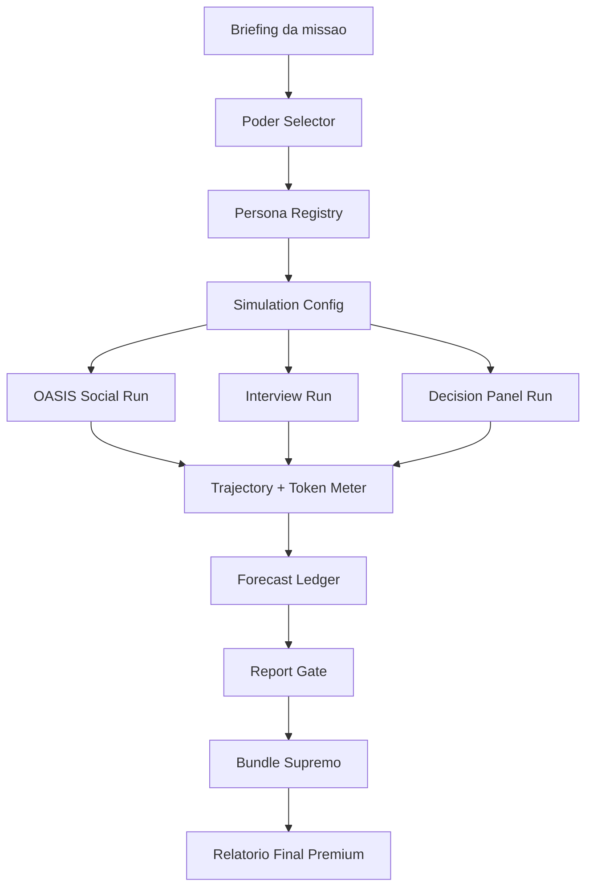

# MiroFish Upgrade Harness Poder Preditivo Implementation Plan

> **For agentic workers:** REQUIRED SUB-SKILL: Use superpowers:subagent-driven-development (recommended) or superpowers:executing-plans to implement this plan task-by-task. Steps use checkbox (`- [ ]`) syntax for tracking.

**Goal:** transformar o MiroFish em uma plataforma vendavel de previsao, simulacao social e relatorio executivo premium, com custo cognitivo ao vivo, poderes selecionaveis, personas sinteticas, consultores lendarios e entrega final auditavel por metodo.

**Architecture:** manter o MiroFish como nucleo Flask + Vue + OASIS, acrescentando contratos pequenos em JSON/Pydantic e componentes Vue dedicados. Helena Megapower, Hermes, Vox Sintetica e Vila INTEIA entram por adapters e snapshots, nunca como pipelines concorrentes acoplados ao runtime principal.

**Tech Stack:** Python 3.11, Flask, Pydantic/dataclasses, Vue 3, API REST existente, arquivos JSON/JSONL em `Config.OASIS_SIMULATION_DATA_DIR`, pytest, npm build.

---

## 1. Principio De Produto

O usuario deve sentir que esta operando uma sala de comando de previsao de elite: cara, rara, tecnica e poderosa. A interface deve mostrar que cada etapa mobiliza inteligencia, agentes, evidencias, simulacao, disputa de hipoteses e custo cognitivo real.

O produto nao vende "tokens". Vende **missao de inteligencia**. Tokens entram como materia-prima visivel; o preco final representa computacao, harness, curadoria, operacao INTEIA, experiencia acumulada e margem.

Linguagem de cliente:

- "Investimento cognitivo da missao"
- "Poderes ativos"
- "Forca computacional mobilizada"
- "Corte de consultores"
- "Painel de decisao sintetica"
- "Grau de confianca operacional"
- "Condicoes de validade"
- "Sinais de reversao"
- "Custo total da missao"

Linguagem banida da superficie cliente:

- bloco defensivo generico
- texto juridico enfraquecedor
- frase que diminua a autoridade do metodo
- explicacao de bastidor que enfraqueca o valor entregue

## 2. Resultado Esperado

Ao criar uma missao, o usuario escolhe:

1. objetivo da previsao ou decisao;
2. documentos e evidencias;
3. poderes de previsao;
4. personas, consultores, eleitores, magistrados, parlamentares ou pessoas selecionadas;
5. intensidade da simulacao;
6. nivel de relatorio final.

Durante a execucao, o MiroFish mostra:

- fase atual;
- tokens de entrada e saida;
- custo bruto estimado no modelo de referencia premium;
- multiplicador INTEIA aplicado;
- custo acumulado da missao;
- poderes ativos e quanto cada um esta consumindo;
- agentes/personas mobilizados;
- eventos gerados;
- previsoes congeladas;
- score de confianca operacional.

No final, o relatorio mostra:

- custo total da missao;
- tokens equivalentes mobilizados;
- modelo de referencia usado no calculo;
- multiplicador INTEIA;
- poderes ativados;
- consultores/personas participantes;
- previsoes principais;
- evidencias mobilizadas;
- tese vencedora;
- tese adversaria mais forte;
- condicoes de validade;
- sinais que mudariam a conclusao.

## 2.1 Ajuste A Partir De Resultado Real Do MiroFish

Diagnostico de uma execucao real recente:

- a simulacao funcionou e produziu valor estrategico;
- o sistema carregou grafo, entidades, relacoes, ferramentas de busca, entrevistas e Helena Strategos;
- o rumo estrategico foi coerente;
- o bloqueio foi correto porque havia citacoes sem suporte, numeros sem suporte e uma secao fraca em grounding;
- `InterviewAgents` retornou resultados, mas depois foi registrado como falha e caiu para `quick_search`, sinal de problema de validacao/integracao;
- frases boas de sintese apareceram entre aspas como se fossem citacoes literais;
- prazos estrategicos apareceram como se fossem dados factuais, quando deveriam ser tratados como sugestao operacional.

Decisao de produto:

- antes de vender custo, poderes e personas, o MiroFish precisa produzir **relatorio final rastreavel**;
- nenhuma frase pode parecer citacao literal sem origem identificada;
- toda sintese estrategica deve entrar como `[Inferencia da simulacao]`;
- todo prazo recomendado deve entrar como `[Sugestao operacional]`;
- a UI deve mostrar qual secao passou e qual secao ficou fraca;
- `InterviewAgents` so pode cair para fallback quando a estrutura de retorno estiver realmente sem resultados aproveitaveis.

Novo Bloco 0 de execucao:

1. corrigir rastreabilidade de citacoes e inferencias;
2. corrigir validacao/fallback de `InterviewAgents`;
3. expor grounding por secao no painel;
4. bloquear relatorio generico por baixa densidade estrategica;
5. somente depois iniciar medidor de custo premium.

### 2.2 Barra De Qualidade A Partir Do Exemplo Real

O exemplo real mostrou que o sistema atual consegue rodar, mas ainda pode entregar um texto que nao corresponde ao custo cognitivo consumido. Isso vira uma regra de produto:

> Se uma missao mobiliza simulacao, grafo, entrevistas, Helena, ferramentas e tokens premium, o relatorio final precisa trazer decisao superior, nao texto correto e generico.

Um relatorio publicavel precisa ter:

- **tese vencedora nao obvia**: a recomendacao precisa mostrar escolha entre caminhos, nao apenas repetir prudencia generica;
- **tese adversaria mais forte**: como o outro lado, decisor, MP, juiz, publico ou mercado atacaria a estrategia;
- **cortes recomendados**: o que retirar da peca, campanha, narrativa ou decisao;
- **pedidos/acoes seguras e perigosas**: separar o que pode ser feito agora do que parece precipitado;
- **matriz 15/30/60** quando houver cronograma operacional;
- **documentos ou evidencias indispensaveis**;
- **perguntas provaveis do decisor**;
- **gatilhos de reversao**: sinais que mudariam a conclusao;
- **ganho em relacao ao obvio**: pelo menos tres insights que nao seriam obtidos com uma leitura superficial.

Novo gate:

```python
StrategicDensityGate = {
    "non_generic_score": 0.0,
    "actionability_score": 0.0,
    "adversarial_score": 0.0,
    "evidence_binding_score": 0.0,
    "decision_delta_score": 0.0,
    "passes_gate": False,
}
```

Regra:

- abaixo de `0.70`: nao entrega ao cliente;
- entre `0.70` e `0.84`: entrega somente apos revisao Helena;
- `0.85+`: relatorio premium;
- se o custo cognitivo passar do piso premium e o `decision_delta_score` for baixo, o sistema deve acionar nova rodada adversarial antes do final.

### 2.3 Caso De Ouro Para Teste

Usar como fixture de desenvolvimento:

`C:\Users\IgorPC\.claude\projects\reconvencao-igor-melissa\NOva fase\processo-0812709-43-2025\04_pacote_simulacao_019df099-261a-7730-82c5-90038f7b1750`

Esse pacote contem:

- manifesto com 20 documentos;
- JSON com 19 entradas, criando caso real de mismatch entre manifesto e indice;
- analise estrategica refeita;
- prompt de simulacao;
- PDFs principais;
- textos Markdown extraidos.

O MiroFish precisa usar esse pacote para provar que:

- detecta mismatch manifesto/JSON;
- separa fato documentado, inferencia e sugestao operacional;
- nao usa aspas sem origem;
- produz Red Team duro;
- gera matriz de acao;
- gera pedido principal e subsidiarios;
- identifica documentos prioritarios;
- produz relatorio realmente util.

## 3. Modelo De Custo

### 3.1 Configuracao Base

Criar configuracao versionada em backend:

```python
PREMIUM_PRICEBOOK = {
    "version": "2026-05-05-gpt-5-5-pro-reference",
    "reference_model": "gpt-5.5-pro",
    "input_usd_per_million": 30.0,
    "output_usd_per_million": 180.0,
    "fast_mode_cost_multiplier": 2.5,
    "fast_mode_speed_label": "1.5x",
    "inteia_value_multiplier": 5.0,
    "default_fx_usd_brl": 5.80,
    "premium_floor_brl": 5000.0,
}
```

O preco de referencia deve ficar em configuracao e ser exposto no `cost_model_version`. Quando o preco mudar, muda a configuracao, nao a regra de negocio.

### 3.2 Formula

```text
api_reference_usd =
  input_tokens / 1_000_000 * input_usd_per_million
  + output_tokens / 1_000_000 * output_usd_per_million

mode_adjusted_usd =
  api_reference_usd * fast_mode_cost_multiplier quando modo rapido estiver ativo
  api_reference_usd quando modo padrao estiver ativo

inteia_value_usd =
  mode_adjusted_usd * inteia_value_multiplier

mission_price_brl =
  max(inteia_value_usd * fx_usd_brl + powers_fixed_brl, premium_floor_brl quando aplicavel)
```

### 3.3 Separacao Visual

O cliente deve ver:

- `Computacao premium equivalente`
- `Harness INTEIA aplicado`
- `Poderes adicionados`
- `Total da missao`

Isso preserva autoridade e evita confundir custo de fornecedor com valor final da operacao.

## 4. Catalogo De Poderes

Cada poder tem nome, descricao curta, custo estimado, impacto esperado e contratos de execucao.

| Poder | Objetivo | Custo |
| --- | --- | --- |
| Oraculo Premium | usar calculo pelo modelo de referencia mais caro | tokens |
| Modo Rapido | prioridade/velocidade 1.5x no calculo comercial | tokens x 2.5 |
| Corte Helena | revisao estrategica, tese, Red Team e recomendacao | tokens |
| Consultores Lendarios | personas especialistas opinam e disputam tese | tokens por consultor |
| Vox Personas | simular pessoas selecionadas para entrevista/decisao | tokens por entrevista |
| Eleitores Sinteticos | simular populacoes por estado/segmento | tokens por segmento e rodada |
| Painel Judicial | magistrados/juizes sinteticos analisam caso | tokens por julgador e rodada |
| Painel Parlamentar | bancadas/parlamentares sinteticos reagem | tokens por ator e rodada |
| Contrarians | oposicao estruturada a tese dominante | tokens por rodada |
| Leitura Profunda | extrair evidencias de documentos densos | tokens por lote |
| Forecast Ledger | congelar previsoes e preparar medicao futura | baixo |
| Bundle Supremo | gerar manifesto, hashes e cadeia de entrega | baixo |

## 5. Personas E Populacoes

### 5.1 Fontes

Entradas planejadas:

- `C:\Users\IgorPC\voxsintetica-platform`: contratos VoterTwin, opinion agents, traces e metricas.
- `C:\Users\IgorPC\.claude\projects\C--Agentes-vila-inteia`: consultores lendarios, contrarians e acervo de sessoes.
- `C:\Users\IgorPC\.hermes`: memoria e catalogo de competencias por snapshot sanitizado.
- pastas futuras de eleitores, magistrados, juizes, parlamentares e pessoas selecionadas.

### 5.2 Contrato Canonico

Criar `SyntheticPersonaProfile`:

```python
{
    "id": "persona_...",
    "source": "vila|vox|hermes_snapshot|manual",
    "category": "consultor|eleitor|magistrado|parlamentar|pessoa|contrarian",
    "display_name": "Nome visivel",
    "role": "papel na missao",
    "jurisdiction": "BR|SE|SP|...",
    "segment": "classe/estado/campo de decisao",
    "expertise": ["politica", "juridico", "midia"],
    "traits": {
        "openness": 0.7,
        "agreeableness": 0.4,
        "risk_tolerance": 0.8,
        "empathy": 0.6,
        "contrarianism": 0.9
    },
    "worldview": {
        "poder": "texto curto",
        "dinheiro": "texto curto",
        "governo": "texto curto",
        "futuro": "texto curto"
    },
    "voice": {
        "style": "assertivo",
        "typical_questions": ["qual e o incentivo real?"],
        "vocabulary": ["coalizao", "risco", "narrativa"]
    },
    "simulation_policy": {
        "can_be_interviewed": True,
        "can_join_social_simulation": True,
        "can_vote": False,
        "can_issue_opinion": True,
        "max_rounds": 3
    }
}
```

### 5.3 UX De Selecao

Nova etapa visual: **Forja De Participantes**.

Filtros:

- tipo: consultor, eleitor, magistrado, parlamentar, pessoa, contrarian;
- origem: Vox, Vila, Hermes, manual;
- tema;
- estado;
- custo estimado;
- intensidade;
- papel: entrevistar, simular, julgar, votar, criticar, sintetizar.

O usuario pode montar uma corte:

- 3 consultores lendarios;
- 12 eleitores sinteticos de Sergipe;
- 5 magistrados sinteticos;
- 8 parlamentares por bancada;
- 2 contrarians;
- 1 sintetizador Helena.

## 6. Arquitetura Alvo



## 7. Arquivos Planejados

### Backend

- Create: `backend/app/services/cost_meter.py`
  - calcula custo por modelo, fase, poder e missao.
- Create: `backend/app/services/report_attribution.py`
  - classifica citacoes, inferencias, prazos operacionais e origens de trechos.
- Create: `backend/app/services/strategic_density_gate.py`
  - mede densidade estrategica, acionabilidade, adversarialidade e ganho decisorio.
- Create: `backend/app/services/golden_case_loader.py`
  - carrega pacotes de teste como o caso `019df099...`, sem acoplar caminho fixo ao produto.
- Create: `backend/app/services/power_catalog.py`
  - declara poderes disponiveis, custo fixo/opcional e requisitos.
- Create: `backend/app/services/persona_registry.py`
  - carrega personas por adapter, normaliza e filtra.
- Create: `backend/app/services/persona_adapters.py`
  - adapters Vox, Vila, HermesSnapshot e manual.
- Create: `backend/app/services/forecast_ledger.py`
  - registra previsoes, probabilidade, base rate, janela e status.
- Create: `backend/app/services/mission_bundle.py`
  - gera manifesto, hashes e resumo final de custo/poderes.
- Create: `backend/app/api/cost.py`
  - endpoints de custo atual, estimativa e pricebook.
- Create: `backend/app/api/personas.py`
  - endpoints de catalogo, selecao e preview de custo.
- Modify: `backend/app/api/__init__.py`
  - registrar blueprints novos.
- Modify: `backend/app/api/simulation.py`
  - aceitar `selected_powers`, `selected_personas`, `cost_mode`.
- Modify: `backend/app/services/simulation_config_generator.py`
  - persistir poderes/personas no `simulation_config.json`.
- Modify: `backend/app/services/simulation_runner.py`
  - emitir eventos de custo por fase e registrar tokens por poder.
- Modify: `backend/app/services/report_agent.py`
  - corrigir uso de aspas, persistir origem de entrevistas, incluir custo total, poderes, personas e previsoes no relatorio final.
- Modify: `backend/app/utils/report_quality.py`
  - retornar detalhes por secao, origem de citacoes, prazos operacionais e densidade estrategica.
- Modify: `backend/app/utils/token_tracker.py`
  - migrar de preco fixo simples para pricebook premium versionado.

### Frontend

- Create: `frontend/src/api/cost.js`
  - chamadas para pricebook, estimativa e custo da missao.
- Create: `frontend/src/api/personas.js`
  - chamadas para catalogo e selecao de personas.
- Create: `frontend/src/components/CostMeterPanel.vue`
  - painel premium de custo vivo.
- Create: `frontend/src/components/PowerSelector.vue`
  - seletor de poderes com impacto e preco estimado.
- Create: `frontend/src/components/PersonaForge.vue`
  - selecao de consultores, eleitores, magistrados, parlamentares e pessoas.
- Create: `frontend/src/components/ForecastLedgerPanel.vue`
  - previsoes congeladas e grau de confianca operacional.
- Modify: `frontend/src/components/Step2EnvSetup.vue`
  - inserir Forja De Participantes e Poder Selector antes da simulacao.
- Modify: `frontend/src/components/Step3Simulation.vue`
  - mostrar custo por fase durante execucao.
- Modify: `frontend/src/components/Step4Report.vue`
  - mostrar custo final, poderes mobilizados e painel de grounding por secao.
- Modify: `frontend/src/api/simulation.js`
  - enviar poderes/personas/cost_mode.

### Tests

- Create: `backend/tests/test_cost_meter.py`
- Create: `backend/tests/test_report_attribution.py`
- Create: `backend/tests/test_strategic_density_gate.py`
- Create: `backend/tests/test_golden_case_loader.py`
- Modify: `backend/tests/test_report_quality.py`
- Create: `backend/tests/test_power_catalog.py`
- Create: `backend/tests/test_persona_registry.py`
- Create: `backend/tests/test_forecast_ledger.py`
- Create: `backend/tests/test_mission_bundle.py`
- Modify: `backend/tests/test_token_tracker.py`
- Modify: `backend/tests/test_simulation_manager.py`

## 8. Tarefas De Implementacao

### Task 0A: Report Attribution Gate

**Files:**
- Create: `backend/app/services/report_attribution.py`
- Modify: `backend/app/utils/report_quality.py`
- Test: `backend/tests/test_report_attribution.py`

- [ ] **Step 1: Write failing tests**

```python
from app.services.report_attribution import (
    normalize_report_attribution,
    classify_direct_quotes,
    label_operational_deadlines,
)


def test_unsupported_quote_is_converted_to_simulation_inference():
    content = 'A tese central e: "O foco deve ser a previsibilidade da rotina".'
    result = normalize_report_attribution(content, evidence_texts=["calendario de visitas"])
    assert '"O foco deve ser a previsibilidade da rotina"' not in result["content"]
    assert "[Inferencia da simulacao] O foco deve ser a previsibilidade da rotina" in result["content"]
    assert result["converted_quotes_count"] == 1


def test_supported_quote_remains_literal_with_origin():
    content = 'O documento afirma: "calendario de visitas".'
    result = normalize_report_attribution(content, evidence_texts=["No processo consta calendario de visitas."])
    assert '"calendario de visitas"' in result["content"]
    assert result["converted_quotes_count"] == 0
    quotes = classify_direct_quotes(result["content"], evidence_texts=["No processo consta calendario de visitas."])
    assert quotes[0]["supported"] is True


def test_operational_deadlines_are_labeled_before_numeric_audit():
    content = "Nos proximos 15, 30 e 60 dias, organizar documentos e registros."
    result = label_operational_deadlines(content)
    assert "[Sugestao operacional]" in result
```

- [ ] **Step 2: Run test to verify failure**

Run:

```bash
cd backend
.venv\Scripts\python.exe -m pytest tests/test_report_attribution.py -v
```

Expected: fails because `app.services.report_attribution` does not exist.

- [ ] **Step 3: Implement service**

Create `backend/app/services/report_attribution.py`:

```python
import re
from typing import Iterable

from ..utils.report_quality import extract_direct_quotes, quote_supported_by_evidence

QUOTE_PATTERN = re.compile(r'["“”]([^"“”]{8,})["“”]')
DEADLINE_PATTERN = re.compile(r"\b(\d{1,3})\s*(?:dias?|semanas?|meses?)\b", re.IGNORECASE)


def classify_direct_quotes(content: str, evidence_texts: Iterable[str]) -> list[dict]:
    quotes = extract_direct_quotes(content)
    return [
        {
            "quote": quote,
            "supported": quote_supported_by_evidence(quote, evidence_texts),
            "origin_type": "evidence" if quote_supported_by_evidence(quote, evidence_texts) else "simulation_inference",
        }
        for quote in quotes
    ]


def normalize_report_attribution(content: str, evidence_texts: Iterable[str]) -> dict:
    evidence_list = list(evidence_texts or [])
    converted = 0

    def replace(match: re.Match) -> str:
        nonlocal converted
        quote = re.sub(r"\s+", " ", match.group(1)).strip()
        if quote_supported_by_evidence(quote, evidence_list):
            return match.group(0)
        converted += 1
        return f"[Inferencia da simulacao] {quote}"

    normalized = QUOTE_PATTERN.sub(replace, content or "")
    normalized = label_operational_deadlines(normalized)
    return {
        "content": normalized,
        "converted_quotes_count": converted,
        "quotes": classify_direct_quotes(normalized, evidence_list),
    }


def label_operational_deadlines(content: str) -> str:
    lines = []
    for line in (content or "").splitlines():
        stripped = line.strip()
        if DEADLINE_PATTERN.search(stripped) and "[Sugestao operacional]" not in stripped:
            lines.append(line.replace(stripped, f"[Sugestao operacional] {stripped}", 1))
        else:
            lines.append(line)
    return "\n".join(lines)
```

- [ ] **Step 4: Run tests**

Run:

```bash
cd backend
.venv\Scripts\python.exe -m pytest tests/test_report_attribution.py -v
```

Expected: pass.

### Task 0B: Apply Attribution Normalization To Report Sections

**Files:**
- Modify: `backend/app/services/report_agent.py`
- Modify: `backend/tests/test_report_quality.py`

- [ ] **Step 1: Write failing test**

Add to `backend/tests/test_report_quality.py`:

```python
from app.services.report_attribution import normalize_report_attribution


def test_report_section_normalization_removes_unsupported_literal_synthesis():
    section = 'A conclusao estrategica foi "manter rotina previsivel".'
    normalized = normalize_report_attribution(section, evidence_texts=["mensagens e calendario"])
    assert '"manter rotina previsivel"' not in normalized["content"]
    assert "[Inferencia da simulacao] manter rotina previsivel" in normalized["content"]
```

- [ ] **Step 2: Run failing test**

Run:

```bash
cd backend
.venv\Scripts\python.exe -m pytest tests/test_report_quality.py::test_report_section_normalization_removes_unsupported_literal_synthesis -v
```

Expected: fails until Task 0A exists and report agent is wired.

- [ ] **Step 3: Wire into report generation**

In `ReportAgent.generate_report()`, before persisting each generated section, call:

```python
from .report_attribution import normalize_report_attribution

attribution = normalize_report_attribution(section_content, evidence_context.get("evidence_texts", []))
section_content = attribution["content"]
section_attribution = attribution["quotes"]
```

Persist `section_attribution` in section progress/log details so the UI can show origin status.

- [ ] **Step 4: Run tests**

Run:

```bash
cd backend
.venv\Scripts\python.exe -m pytest tests/test_report_quality.py tests/test_report_attribution.py -v
```

Expected: pass.

### Task 0C: InterviewAgents Fallback Integrity

**Files:**
- Modify: `backend/app/services/report_agent.py`
- Test: `backend/tests/test_report_quality.py`

- [ ] **Step 1: Write failing test for usable interview payload**

Add:

```python
from app.services.report_agent import ReportAgent


def test_interview_agents_result_with_success_and_items_is_not_failure(monkeypatch):
    agent = ReportAgent(simulation_id="sim_test", graph_id="graph_test", simulation_requirement="teste")
    payload = {
        "success": True,
        "results": [{"agent_name": "A", "answer": "resposta util"} for _ in range(8)],
    }
    assert agent._is_usable_interview_result(payload) is True
```

- [ ] **Step 2: Run failing test**

Run:

```bash
cd backend
.venv\Scripts\python.exe -m pytest tests/test_report_quality.py::test_interview_agents_result_with_success_and_items_is_not_failure -v
```

Expected: fails because `_is_usable_interview_result` does not exist.

- [ ] **Step 3: Implement helper and use it**

In `ReportAgent`:

```python
def _is_usable_interview_result(self, payload: object) -> bool:
    if isinstance(payload, str):
        try:
            payload = json.loads(payload)
        except json.JSONDecodeError:
            return bool(payload.strip())
    if not isinstance(payload, dict):
        return False
    if payload.get("success") is False:
        return False
    results = payload.get("results") or payload.get("data") or payload.get("interviews")
    return isinstance(results, list) and len(results) > 0
```

Use this helper wherever `interview_agents` decides failure/fallback. A payload with `success=True` and non-empty results must be logged as successful and preserved as evidence.

- [ ] **Step 4: Run targeted tests**

Run:

```bash
cd backend
.venv\Scripts\python.exe -m pytest tests/test_report_quality.py -v
```

Expected: pass.

### Task 0D: Section Grounding Panel

**Files:**
- Modify: `frontend/src/components/Step4Report.vue`
- Modify: `backend/app/utils/report_quality.py`

- [ ] **Step 1: Backend contract**

`render_qc_block()` already receives `sections_eval`. Ensure the report record exposes a machine-readable field:

```python
{
    "sections_grounding": [
        {
            "section_index": 1,
            "title": "Sintese estrategica",
            "score": 0.72,
            "passes_gate": True,
            "has_number": True,
            "has_quote": False,
            "entity_hits": 8
        }
    ]
}
```

- [ ] **Step 2: Frontend display**

In `Step4Report.vue`, add a compact panel near existing quality gate:

- title: `Grounding das secoes`
- each section: `Secao N`, score, status, entity hits;
- weak section: use status `Fraca`;
- passed section: use status `Forte`.

- [ ] **Step 3: Build**

Run:

```bash
npm run build
```

Expected: build passes.

### Task 0E: Strategic Density Gate

**Files:**
- Create: `backend/app/services/strategic_density_gate.py`
- Modify: `backend/app/services/report_agent.py`
- Test: `backend/tests/test_strategic_density_gate.py`

- [ ] **Step 1: Write failing tests**

```python
from app.services.strategic_density_gate import StrategicDensityGate


def test_generic_report_fails_density_gate():
    report = """
    O melhor caminho e agir com prudencia, manter comunicacao clara e buscar estabilidade.
    E importante organizar documentos e evitar conflitos.
    """
    result = StrategicDensityGate().evaluate(report)
    assert result["passes_gate"] is False
    assert result["non_generic_score"] < 0.70
    assert "tese_adversaria_ausente" in result["issues"]


def test_actionable_adversarial_report_passes_density_gate():
    report = """
    Tese vencedora: modular o pedido como reducao de risco, nao como confronto.
    Tese adversaria mais forte: a autora dira que os embargos rediscutem merito.
    Cortar da peca: qualquer frase que sugira descumprimento ou ataque ao juizo.
    Pedido seguro agora: calendario operacional e transicao gradual.
    Pedido perigoso agora: nulidade total como primeiro pedido liminar.
    Matriz 15/30/60: em 15 dias consolidar comprovantes; em 30 dias memorial; em 60 dias avaliar estudo.
    Documentos indispensaveis: IDs 257716387, 271866597, 272902574, 272931330 e 274563093.
    Perguntas provaveis do decisor: por que a rotina anterior protege melhor a crianca?
    Gatilhos de reversao: novo incidente reiterado, laudo tecnico forte ou descumprimento documentado.
    Ganho sobre o obvio: o pedido principal deve ser modulado, e a nulidade deve operar como fundamento.
    """
    result = StrategicDensityGate().evaluate(report)
    assert result["passes_gate"] is True
    assert result["decision_delta_score"] >= 0.85
```

- [ ] **Step 2: Run failing test**

Run:

```bash
cd backend
.venv\Scripts\python.exe -m pytest tests/test_strategic_density_gate.py -v
```

Expected: fails because `app.services.strategic_density_gate` does not exist.

- [ ] **Step 3: Implement deterministic gate**

Create `backend/app/services/strategic_density_gate.py`:

```python
import re


class StrategicDensityGate:
    REQUIRED_PATTERNS = {
        "tese_vencedora": r"tese vencedora|estrategia vencedora|caminho recomendado",
        "tese_adversaria": r"tese adversaria|red team|autor[ae] dira|oposicao dira|decisor pode",
        "cortes": r"cortar|retirar|evitar|nao usar",
        "safe_unsafe": r"pedido seguro|acao segura|pedido perigoso|acao perigosa|precipitado",
        "matrix": r"15/30/60|15 dias|30 dias|60 dias",
        "documents": r"documentos indispensaveis|evidencias indispensaveis|IDs? ",
        "questions": r"perguntas provaveis|o decisor perguntaria|juiz pode perguntar",
        "reversal": r"gatilhos de reversao|sinais de reversao|mudaria a conclusao",
        "delta": r"ganho sobre o obvio|nao obvio|o ponto decisivo|decisao superior",
    }

    GENERIC_TERMS = [
        "agir com prudencia",
        "comunicacao clara",
        "organizar documentos",
        "evitar conflitos",
        "buscar estabilidade",
    ]

    def evaluate(self, report: str) -> dict:
        text = (report or "").lower()
        hits = {
            name: bool(re.search(pattern, text, flags=re.IGNORECASE))
            for name, pattern in self.REQUIRED_PATTERNS.items()
        }
        issues = [f"{name}_ausente" for name, ok in hits.items() if not ok]
        generic_hits = sum(1 for term in self.GENERIC_TERMS if term in text)
        coverage = sum(1 for ok in hits.values() if ok) / len(hits)
        non_generic_score = max(0.0, min(1.0, coverage - generic_hits * 0.08))
        actionability_score = self._score_keys(hits, ["cortes", "safe_unsafe", "matrix", "documents"])
        adversarial_score = self._score_keys(hits, ["tese_adversaria", "questions", "reversal"])
        evidence_binding_score = self._score_keys(hits, ["documents", "reversal"])
        decision_delta_score = self._score_keys(hits, ["tese_vencedora", "delta", "safe_unsafe"])
        final_score = round(
            non_generic_score * 0.25
            + actionability_score * 0.25
            + adversarial_score * 0.20
            + evidence_binding_score * 0.15
            + decision_delta_score * 0.15,
            3,
        )
        return {
            "non_generic_score": round(non_generic_score, 3),
            "actionability_score": round(actionability_score, 3),
            "adversarial_score": round(adversarial_score, 3),
            "evidence_binding_score": round(evidence_binding_score, 3),
            "decision_delta_score": round(decision_delta_score, 3),
            "final_score": final_score,
            "passes_gate": final_score >= 0.70 and decision_delta_score >= 0.70,
            "issues": issues,
            "hits": hits,
        }

    def _score_keys(self, hits: dict[str, bool], keys: list[str]) -> float:
        return sum(1 for key in keys if hits.get(key)) / max(len(keys), 1)
```

- [ ] **Step 4: Wire gate into report finalization**

In `ReportAgent.generate_report()`, after assembling `markdown_content` and before marking `publishable`, evaluate:

```python
from .strategic_density_gate import StrategicDensityGate

strategic_density = StrategicDensityGate().evaluate(full_markdown)
report.quality_gate["strategic_density"] = strategic_density
if not strategic_density["passes_gate"]:
    report.quality_gate["passes_gate"] = False
    report.quality_gate.setdefault("issues", []).extend(strategic_density["issues"])
```

- [ ] **Step 5: Run tests**

Run:

```bash
cd backend
.venv\Scripts\python.exe -m pytest tests/test_strategic_density_gate.py tests/test_report_quality.py -v
```

Expected: pass.

### Task 0F: Golden Case Loader

**Files:**
- Create: `backend/app/services/golden_case_loader.py`
- Test: `backend/tests/test_golden_case_loader.py`

- [ ] **Step 1: Write failing tests**

```python
from pathlib import Path

from app.services.golden_case_loader import GoldenCaseLoader


def test_loader_detects_manifest_json_mismatch(tmp_path):
    case_dir = tmp_path / "case"
    case_dir.mkdir()
    (case_dir / "00_MANIFESTO_DOCUMENTOS_PRINCIPAIS.md").write_text("| 1 | `A` |\\n| 2 | `B` |", encoding="utf-8")
    (case_dir / "documentos_principais.json").write_text('[{"ordem": 1, "id_pje": "A"}]', encoding="utf-8")
    result = GoldenCaseLoader(case_dir).inspect()
    assert result["manifest_documents"] == 2
    assert result["json_documents"] == 1
    assert result["manifest_json_mismatch"] is True
```

- [ ] **Step 2: Implement loader**

```python
import json
import re
from pathlib import Path


class GoldenCaseLoader:
    def __init__(self, case_dir: str | Path):
        self.case_dir = Path(case_dir)

    def inspect(self) -> dict:
        manifest_path = self.case_dir / "00_MANIFESTO_DOCUMENTOS_PRINCIPAIS.md"
        json_path = self.case_dir / "documentos_principais.json"
        manifest_text = manifest_path.read_text(encoding="utf-8") if manifest_path.exists() else ""
        manifest_documents = len(re.findall(r"^\\|\\s*\\d+\\s*\\|", manifest_text, flags=re.MULTILINE))
        if json_path.exists():
            json_documents = len(json.loads(json_path.read_text(encoding="utf-8")))
        else:
            json_documents = 0
        return {
            "case_dir": str(self.case_dir),
            "manifest_documents": manifest_documents,
            "json_documents": json_documents,
            "manifest_json_mismatch": manifest_documents != json_documents,
            "has_prompt": (self.case_dir / "02_PROMPT_PARA_SIMULACAO.md").exists(),
            "has_strategy": (self.case_dir / "01_ANALISE_ESTRATEGICA_REFEITA.md").exists(),
        }
```

- [ ] **Step 3: Run tests**

Run:

```bash
cd backend
.venv\Scripts\python.exe -m pytest tests/test_golden_case_loader.py -v
```

Expected: pass.

### Task 1: Cost Meter Premium

**Files:**
- Create: `backend/app/services/cost_meter.py`
- Test: `backend/tests/test_cost_meter.py`

- [ ] **Step 1: Write failing tests**

```python
from app.services.cost_meter import CostMeter, PREMIUM_PRICEBOOK

def test_reference_cost_uses_gpt_55_pro_pricebook():
    meter = CostMeter(pricebook=PREMIUM_PRICEBOOK)
    result = meter.estimate(prompt_tokens=1_000_000, completion_tokens=1_000_000)
    assert result["api_reference_usd"] == 210.0
    assert result["inteia_value_usd"] == 1050.0
    assert result["cost_model_version"] == "2026-05-05-gpt-5-5-pro-reference"

def test_fast_mode_applies_priority_multiplier_before_inteia_multiplier():
    meter = CostMeter(pricebook=PREMIUM_PRICEBOOK)
    result = meter.estimate(
        prompt_tokens=1_000_000,
        completion_tokens=0,
        fast_mode=True,
    )
    assert result["api_reference_usd"] == 30.0
    assert result["mode_adjusted_usd"] == 75.0
    assert result["inteia_value_usd"] == 375.0

def test_premium_floor_applies_to_client_total():
    meter = CostMeter(pricebook=PREMIUM_PRICEBOOK)
    result = meter.estimate(
        prompt_tokens=10_000,
        completion_tokens=2_000,
        apply_premium_floor=True,
    )
    assert result["client_total_brl"] == 5000.0
```

- [ ] **Step 2: Run test to verify failure**

Run:

```bash
cd backend
.venv\Scripts\python.exe -m pytest tests/test_cost_meter.py -v
```

Expected: fails because `app.services.cost_meter` does not exist.

- [ ] **Step 3: Implement service**

Create `backend/app/services/cost_meter.py` with:

```python
from dataclasses import dataclass, field
from typing import Any

PREMIUM_PRICEBOOK = {
    "version": "2026-05-05-gpt-5-5-pro-reference",
    "reference_model": "gpt-5.5-pro",
    "input_usd_per_million": 30.0,
    "output_usd_per_million": 180.0,
    "fast_mode_cost_multiplier": 2.5,
    "fast_mode_speed_label": "1.5x",
    "inteia_value_multiplier": 5.0,
    "default_fx_usd_brl": 5.80,
    "premium_floor_brl": 5000.0,
}


@dataclass
class CostMeter:
    pricebook: dict[str, Any] = field(default_factory=lambda: dict(PREMIUM_PRICEBOOK))

    def estimate(
        self,
        prompt_tokens: int,
        completion_tokens: int,
        *,
        fast_mode: bool = False,
        powers_fixed_brl: float = 0.0,
        apply_premium_floor: bool = False,
    ) -> dict[str, Any]:
        input_usd = prompt_tokens / 1_000_000 * self.pricebook["input_usd_per_million"]
        output_usd = completion_tokens / 1_000_000 * self.pricebook["output_usd_per_million"]
        api_reference_usd = round(input_usd + output_usd, 6)
        speed_multiplier = self.pricebook["fast_mode_cost_multiplier"] if fast_mode else 1.0
        mode_adjusted_usd = round(api_reference_usd * speed_multiplier, 6)
        inteia_value_usd = round(mode_adjusted_usd * self.pricebook["inteia_value_multiplier"], 6)
        subtotal_brl = round(
            inteia_value_usd * self.pricebook["default_fx_usd_brl"] + powers_fixed_brl,
            2,
        )
        client_total_brl = subtotal_brl
        if apply_premium_floor:
            client_total_brl = max(client_total_brl, self.pricebook["premium_floor_brl"])
        return {
            "cost_model_version": self.pricebook["version"],
            "reference_model": self.pricebook["reference_model"],
            "prompt_tokens": prompt_tokens,
            "completion_tokens": completion_tokens,
            "total_tokens": prompt_tokens + completion_tokens,
            "fast_mode": fast_mode,
            "speed_label": self.pricebook["fast_mode_speed_label"] if fast_mode else "padrao",
            "api_reference_usd": api_reference_usd,
            "mode_adjusted_usd": mode_adjusted_usd,
            "inteia_multiplier": self.pricebook["inteia_value_multiplier"],
            "inteia_value_usd": inteia_value_usd,
            "powers_fixed_brl": round(powers_fixed_brl, 2),
            "client_total_brl": round(client_total_brl, 2),
        }
```

- [ ] **Step 4: Run tests**

Run:

```bash
cd backend
.venv\Scripts\python.exe -m pytest tests/test_cost_meter.py -v
```

Expected: all tests pass.

### Task 2: Token Tracker Uses Premium Pricebook

**Files:**
- Modify: `backend/app/utils/token_tracker.py`
- Modify: `backend/tests/test_token_tracker.py`

- [ ] **Step 1: Add test**

Add:

```python
def test_session_cost_uses_premium_reference_pricebook():
    from app.utils.token_tracker import TokenTracker

    tracker = TokenTracker()
    tracker.start_session("sim_cost")
    tracker.track(1_000_000, 1_000_000, session_id="sim_cost")
    data = tracker.get_session("sim_cost")
    assert data["premium_cost"]["api_reference_usd"] == 210.0
    assert data["premium_cost"]["inteia_value_usd"] == 1050.0
    assert data["premium_cost"]["reference_model"] == "gpt-5.5-pro"
```

- [ ] **Step 2: Run test**

Run:

```bash
cd backend
.venv\Scripts\python.exe -m pytest tests/test_token_tracker.py::test_session_cost_uses_premium_reference_pricebook -v
```

Expected: fails because `premium_cost` is missing.

- [ ] **Step 3: Implement**

Modify `TokenUsage.to_dict()` to import and use `CostMeter`:

```python
from ..services.cost_meter import CostMeter

def to_dict(self) -> dict:
    premium_cost = CostMeter().estimate(
        prompt_tokens=self.prompt_tokens,
        completion_tokens=self.completion_tokens,
    )
    return {
        "prompt_tokens": self.prompt_tokens,
        "completion_tokens": self.completion_tokens,
        "total_tokens": self.total_tokens,
        "total_requests": self.total_requests,
        "total_errors": self.total_errors,
        "cost_usd": round(self.cost_usd, 6),
        "cost_brl": round(self.cost_brl, 4),
        "premium_cost": premium_cost,
        "elapsed_seconds": round(self.elapsed_seconds, 1),
        "cost_per_minute_usd": round(
            self.cost_usd / max(self.elapsed_seconds / 60, 0.1), 6
        ),
    }
```

- [ ] **Step 4: Run tests**

Run:

```bash
cd backend
.venv\Scripts\python.exe -m pytest tests/test_token_tracker.py tests/test_cost_meter.py -v
```

Expected: all tests pass.

### Task 3: Power Catalog

**Files:**
- Create: `backend/app/services/power_catalog.py`
- Test: `backend/tests/test_power_catalog.py`

- [ ] **Step 1: Write failing tests**

```python
from app.services.power_catalog import PowerCatalog

def test_catalog_contains_core_powers():
    catalog = PowerCatalog()
    ids = {power["id"] for power in catalog.list_powers()}
    assert "legendary_consultants" in ids
    assert "vox_personas" in ids
    assert "synthetic_voters" in ids
    assert "judicial_panel" in ids
    assert "parliamentary_panel" in ids
    assert "forecast_ledger" in ids

def test_estimate_fixed_power_addons():
    catalog = PowerCatalog()
    total = catalog.estimate_fixed_brl(["bundle_supreme", "forecast_ledger"])
    assert total == 750.0
```

- [ ] **Step 2: Implement minimal catalog**

```python
class PowerCatalog:
    POWERS = [
        {"id": "oracle_premium", "name": "Oraculo Premium", "fixed_brl": 0.0},
        {"id": "fast_mode", "name": "Modo Rapido", "fixed_brl": 0.0},
        {"id": "helena_court", "name": "Corte Helena", "fixed_brl": 0.0},
        {"id": "legendary_consultants", "name": "Consultores Lendarios", "fixed_brl": 0.0},
        {"id": "vox_personas", "name": "Vox Personas", "fixed_brl": 0.0},
        {"id": "synthetic_voters", "name": "Eleitores Sinteticos", "fixed_brl": 0.0},
        {"id": "judicial_panel", "name": "Painel Judicial", "fixed_brl": 0.0},
        {"id": "parliamentary_panel", "name": "Painel Parlamentar", "fixed_brl": 0.0},
        {"id": "contrarians", "name": "Contrarians", "fixed_brl": 0.0},
        {"id": "deep_reading", "name": "Leitura Profunda", "fixed_brl": 0.0},
        {"id": "forecast_ledger", "name": "Forecast Ledger", "fixed_brl": 250.0},
        {"id": "bundle_supreme", "name": "Bundle Supremo", "fixed_brl": 500.0},
    ]

    def list_powers(self) -> list[dict]:
        return list(self.POWERS)

    def estimate_fixed_brl(self, selected_power_ids: list[str]) -> float:
        selected = set(selected_power_ids)
        return sum(power["fixed_brl"] for power in self.POWERS if power["id"] in selected)
```

- [ ] **Step 3: Run tests**

```bash
cd backend
.venv\Scripts\python.exe -m pytest tests/test_power_catalog.py -v
```

Expected: pass.

### Task 4: Cost API

**Files:**
- Create: `backend/app/api/cost.py`
- Modify: `backend/app/api/__init__.py`
- Test: `backend/tests/test_cost_api.py`

- [ ] **Step 1: Add endpoint tests**

```python
def test_pricebook_endpoint(client):
    response = client.get("/api/cost/pricebook")
    assert response.status_code == 200
    data = response.get_json()["data"]
    assert data["reference_model"] == "gpt-5.5-pro"

def test_estimate_endpoint(client):
    response = client.post("/api/cost/estimate", json={
        "prompt_tokens": 1_000_000,
        "completion_tokens": 1_000_000,
        "selected_powers": ["bundle_supreme", "forecast_ledger"],
        "apply_premium_floor": False,
    })
    assert response.status_code == 200
    data = response.get_json()["data"]
    assert data["client_total_brl"] == 6840.0
```

- [ ] **Step 2: Implement blueprint**

```python
from flask import Blueprint, jsonify, request

from ..services.cost_meter import CostMeter, PREMIUM_PRICEBOOK
from ..services.power_catalog import PowerCatalog

cost_bp = Blueprint("cost", __name__, url_prefix="/api/cost")

@cost_bp.route("/pricebook", methods=["GET"])
def pricebook():
    return jsonify({"success": True, "data": PREMIUM_PRICEBOOK})

@cost_bp.route("/estimate", methods=["POST"])
def estimate():
    data = request.get_json() or {}
    powers_fixed_brl = PowerCatalog().estimate_fixed_brl(data.get("selected_powers", []))
    result = CostMeter().estimate(
        prompt_tokens=int(data.get("prompt_tokens", 0)),
        completion_tokens=int(data.get("completion_tokens", 0)),
        fast_mode=bool(data.get("fast_mode", False)),
        powers_fixed_brl=powers_fixed_brl,
        apply_premium_floor=bool(data.get("apply_premium_floor", False)),
    )
    return jsonify({"success": True, "data": result})
```

- [ ] **Step 3: Register blueprint**

Add to `backend/app/api/__init__.py`:

```python
from .cost import cost_bp
```

Register it wherever the existing API blueprints are registered.

- [ ] **Step 4: Run API tests**

```bash
cd backend
.venv\Scripts\python.exe -m pytest tests/test_cost_api.py -v
```

Expected: pass.

### Task 5: Persona Registry

**Files:**
- Create: `backend/app/services/persona_registry.py`
- Create: `backend/app/services/persona_adapters.py`
- Test: `backend/tests/test_persona_registry.py`

- [ ] **Step 1: Tests**

```python
from app.services.persona_registry import PersonaRegistry

def test_registry_normalizes_manual_persona():
    registry = PersonaRegistry()
    persona = registry.normalize({
        "id": "p1",
        "display_name": "Estrategista",
        "category": "consultor",
        "expertise": ["politica"],
    })
    assert persona["id"] == "p1"
    assert persona["category"] == "consultor"
    assert persona["simulation_policy"]["can_be_interviewed"] is True

def test_registry_filters_by_category():
    registry = PersonaRegistry(seed_personas=[
        {"id": "a", "display_name": "A", "category": "consultor"},
        {"id": "b", "display_name": "B", "category": "magistrado"},
    ])
    result = registry.search(category="magistrado")
    assert [p["id"] for p in result] == ["b"]
```

- [ ] **Step 2: Implement registry**

```python
DEFAULT_POLICY = {
    "can_be_interviewed": True,
    "can_join_social_simulation": True,
    "can_vote": False,
    "can_issue_opinion": True,
    "max_rounds": 3,
}

class PersonaRegistry:
    def __init__(self, seed_personas=None):
        self._personas = [self.normalize(p) for p in (seed_personas or [])]

    def normalize(self, raw: dict) -> dict:
        return {
            "id": raw["id"],
            "source": raw.get("source", "manual"),
            "category": raw.get("category", "consultor"),
            "display_name": raw.get("display_name") or raw.get("name") or raw["id"],
            "role": raw.get("role", ""),
            "jurisdiction": raw.get("jurisdiction", ""),
            "segment": raw.get("segment", ""),
            "expertise": raw.get("expertise", []),
            "traits": raw.get("traits", {}),
            "worldview": raw.get("worldview", {}),
            "voice": raw.get("voice", {
                "style": "assertivo",
                "typical_questions": [],
                "vocabulary": [],
            }),
            "simulation_policy": {**DEFAULT_POLICY, **raw.get("simulation_policy", {})},
        }

    def list_all(self) -> list[dict]:
        return list(self._personas)

    def search(self, category: str | None = None) -> list[dict]:
        result = self._personas
        if category:
            result = [p for p in result if p["category"] == category]
        return result
```

- [ ] **Step 3: Run tests**

```bash
cd backend
.venv\Scripts\python.exe -m pytest tests/test_persona_registry.py -v
```

Expected: pass.

### Task 6: Personas API

**Files:**
- Create: `backend/app/api/personas.py`
- Modify: `backend/app/api/__init__.py`
- Test: `backend/tests/test_personas_api.py`

- [ ] **Step 1: Test API**

```python
def test_personas_endpoint_lists_profiles(client):
    response = client.get("/api/personas")
    assert response.status_code == 200
    body = response.get_json()
    assert body["success"] is True
    assert "personas" in body["data"]
```

- [ ] **Step 2: Implement endpoint**

```python
from flask import Blueprint, jsonify, request
from ..services.persona_registry import PersonaRegistry

personas_bp = Blueprint("personas", __name__, url_prefix="/api/personas")

@personas_bp.route("", methods=["GET"])
def list_personas():
    category = request.args.get("category")
    registry = PersonaRegistry()
    return jsonify({
        "success": True,
        "data": {
            "personas": registry.search(category=category),
        },
    })
```

- [ ] **Step 3: Register blueprint and run tests**

```bash
cd backend
.venv\Scripts\python.exe -m pytest tests/test_personas_api.py -v
```

Expected: pass.

### Task 7: Simulation Config Accepts Powers And Personas

**Files:**
- Modify: `backend/app/services/simulation_config_generator.py`
- Modify: `backend/app/api/simulation.py`
- Test: `backend/tests/test_simulation_manager.py`

- [ ] **Step 1: Test payload persistence**

```python
def test_simulation_create_accepts_power_and_persona_selection(client, monkeypatch):
    payload = {
        "project_id": "proj_test",
        "selected_powers": ["legendary_consultants", "forecast_ledger"],
        "selected_personas": ["persona_a", "persona_b"],
        "cost_mode": {"fast_mode": True, "apply_premium_floor": True},
    }
    # Use existing project fixtures from conftest or monkeypatch ProjectManager.
    # Expected final state dictionary includes selected_powers and selected_personas.
```

- [ ] **Step 2: Implement data pass-through**

In `create_simulation()`, read:

```python
selected_powers = data.get("selected_powers", [])
selected_personas = data.get("selected_personas", [])
cost_mode = data.get("cost_mode", {})
```

Pass them into `SimulationManager.create_simulation(...)` and persist in state/config.

- [ ] **Step 3: Run tests**

```bash
cd backend
.venv\Scripts\python.exe -m pytest tests/test_simulation_manager.py -v
```

Expected: pass.

### Task 8: Frontend Cost API And Panel

**Files:**
- Create: `frontend/src/api/cost.js`
- Create: `frontend/src/components/CostMeterPanel.vue`

- [ ] **Step 1: API module**

```javascript
import api from './index'

export const costApi = {
  getPricebook() {
    return api.get('/cost/pricebook')
  },
  estimate(payload) {
    return api.post('/cost/estimate', payload)
  }
}
```

- [ ] **Step 2: Component contract**

`CostMeterPanel.vue` props:

```javascript
const props = defineProps({
  cost: { type: Object, default: null },
  phase: { type: String, default: '' },
  powers: { type: Array, default: () => [] }
})
```

Visible fields:

- Forca computacional mobilizada
- Modelo de referencia
- Tokens equivalentes
- Harness INTEIA
- Poderes ativos
- Total da missao

- [ ] **Step 3: Build**

```bash
npm run build
```

Expected: frontend build passes.

### Task 9: Power Selector

**Files:**
- Create: `frontend/src/components/PowerSelector.vue`
- Modify: `frontend/src/components/Step2EnvSetup.vue`

- [ ] **Step 1: Component state**

`PowerSelector.vue` emits:

```javascript
emit('update:selectedPowers', selectedIds)
emit('estimateRequested', selectedIds)
```

Default selected powers:

```javascript
[
  'oracle_premium',
  'forecast_ledger',
  'bundle_supreme'
]
```

- [ ] **Step 2: UX copy**

Use exact labels:

- Oraculo Premium
- Corte Helena
- Consultores Lendarios
- Vox Personas
- Eleitores Sinteticos
- Painel Judicial
- Painel Parlamentar
- Contrarians
- Leitura Profunda
- Bundle Supremo

- [ ] **Step 3: Build**

```bash
npm run build
```

Expected: build passes.

### Task 10: Persona Forge

**Files:**
- Create: `frontend/src/api/personas.js`
- Create: `frontend/src/components/PersonaForge.vue`
- Modify: `frontend/src/components/Step2EnvSetup.vue`

- [ ] **Step 1: API**

```javascript
import api from './index'

export const personasApi = {
  list(params = {}) {
    return api.get('/personas', { params })
  }
}
```

- [ ] **Step 2: Component features**

Filters:

- categoria;
- origem;
- estado;
- papel na missao;
- custo estimado;
- selecionados.

Actions:

- selecionar;
- remover;
- selecionar corte recomendada;
- limpar selecao.

- [ ] **Step 3: Integration**

`Step2EnvSetup.vue` must include `PersonaForge` before the simulation preparation call and pass selected IDs into the API payload.

- [ ] **Step 4: Build**

```bash
npm run build
```

Expected: build passes.

### Task 11: Forecast Ledger

**Files:**
- Create: `backend/app/services/forecast_ledger.py`
- Test: `backend/tests/test_forecast_ledger.py`

- [ ] **Step 1: Tests**

```python
from app.services.forecast_ledger import ForecastLedger

def test_forecast_record_contains_probability_window_and_base_rate():
    ledger = ForecastLedger()
    forecast = ledger.create_forecast(
        claim="A tese principal vence no painel judicial",
        probability=0.72,
        window="30 dias",
        base_rate=0.41,
        indicators=["apoio documental", "forca narrativa"],
    )
    assert forecast["probability"] == 0.72
    assert forecast["base_rate"] == 0.41
    assert forecast["status"] == "frozen"
```

- [ ] **Step 2: Implement**

```python
from datetime import datetime, timezone
from uuid import uuid4

class ForecastLedger:
    def create_forecast(
        self,
        *,
        claim: str,
        probability: float,
        window: str,
        base_rate: float | None,
        indicators: list[str],
    ) -> dict:
        if probability < 0 or probability > 1:
            raise ValueError("probability must be between 0 and 1")
        return {
            "forecast_id": f"fc_{uuid4().hex[:12]}",
            "claim": claim,
            "probability": probability,
            "window": window,
            "base_rate": base_rate,
            "indicators": indicators,
            "status": "frozen",
            "created_at": datetime.now(timezone.utc).isoformat(),
        }
```

- [ ] **Step 3: Run tests**

```bash
cd backend
.venv\Scripts\python.exe -m pytest tests/test_forecast_ledger.py -v
```

Expected: pass.

### Task 12: Final Report Premium Sections

**Files:**
- Modify: `backend/app/services/report_agent.py`
- Modify: `frontend/src/components/Step4Report.vue`
- Test: `backend/tests/test_report_quality.py`

- [ ] **Step 1: Add report quality assertions**

```python
def test_premium_report_contains_cost_and_power_sections():
    report = """
    INVESTIMENTO COGNITIVO DA MISSAO
    PODERES MOBILIZADOS
    GRAU DE CONFIANCA OPERACIONAL
    SINAIS DE REVERSAO
    """
    assert "INVESTIMENTO COGNITIVO DA MISSAO" in report
    assert "PODERES MOBILIZADOS" in report
```

- [ ] **Step 2: Report prompt/output contract**

Required sections:

- Investimento Cognitivo Da Missao
- Poderes Mobilizados
- Participantes Sinteticos
- Previsoes Centrais
- Tese Vencedora
- Forca Adversaria Mais Forte
- Condicoes De Validade
- Sinais De Reversao
- Decisao Recomendada

- [ ] **Step 3: Run tests**

```bash
cd backend
.venv\Scripts\python.exe -m pytest tests/test_report_quality.py -v
```

Expected: pass.

### Task 13: Mission Bundle

**Files:**
- Create: `backend/app/services/mission_bundle.py`
- Test: `backend/tests/test_mission_bundle.py`

- [ ] **Step 1: Test bundle manifest**

```python
from app.services.mission_bundle import MissionBundle

def test_bundle_manifest_contains_cost_powers_and_hashes(tmp_path):
    artifact = tmp_path / "report.md"
    artifact.write_text("relatorio premium", encoding="utf-8")
    bundle = MissionBundle().build_manifest(
        mission_id="sim_1",
        artifacts=[artifact],
        cost_summary={"client_total_brl": 5000.0},
        powers=["forecast_ledger"],
    )
    assert bundle["mission_id"] == "sim_1"
    assert bundle["cost_summary"]["client_total_brl"] == 5000.0
    assert bundle["powers"] == ["forecast_ledger"]
    assert len(bundle["artifacts"][0]["sha256"]) == 64
```

- [ ] **Step 2: Implement**

```python
import hashlib
from pathlib import Path

class MissionBundle:
    def build_manifest(self, *, mission_id: str, artifacts: list[Path], cost_summary: dict, powers: list[str]) -> dict:
        entries = []
        for artifact in artifacts:
            data = artifact.read_bytes()
            entries.append({
                "path": str(artifact),
                "sha256": hashlib.sha256(data).hexdigest(),
                "bytes": len(data),
            })
        return {
            "mission_id": mission_id,
            "cost_summary": cost_summary,
            "powers": powers,
            "artifacts": entries,
        }
```

- [ ] **Step 3: Run tests**

```bash
cd backend
.venv\Scripts\python.exe -m pytest tests/test_mission_bundle.py -v
```

Expected: pass.

## 9. Sequencia Recomendada De Entrega

### Sprint A: Saneamento E Medidor

1. corrigir rastreabilidade do relatorio final;
2. corrigir fallback de `InterviewAgents`;
3. expor grounding por secao no painel;
4. implementar gate de densidade estrategica;
5. transformar pacote `019df099...` em caso de ouro;
6. corrigir bugs P0 ja identificados;
7. implementar `CostMeter`;
8. atualizar `TokenTracker`;
9. criar API de custo;
10. mostrar custo vivo no Step 3;
11. mostrar custo final no Step 4.

Saida vendavel: cliente ve valor acumulando e o sistema bloqueia relatorio caro que nao entrega inteligencia correspondente.

### Sprint B: Poderes E Personas

1. criar `PowerCatalog`;
2. criar `PersonaRegistry`;
3. criar APIs de persona;
4. criar `PowerSelector`;
5. criar `PersonaForge`;
6. passar selecao para a simulacao.

Saida vendavel: usuario monta a propria corte de previsao.

### Sprint C: Previsao Defensavel

1. criar `ForecastLedger`;
2. adicionar base rate;
3. congelar previsoes;
4. registrar sinais de reversao;
5. incluir previsoes no relatorio.

Saida vendavel: MiroFish deixa de ser so simulacao e vira maquina de previsoes mensuraveis.

### Sprint D: Bundle Supremo

1. gerar manifesto;
2. gerar hashes;
3. consolidar custo/poderes/personas/previsoes;
4. bloquear entrega sem artefatos centrais;
5. gerar painel final.

Saida vendavel: relatorio premium com cadeia de valor clara.

## 10. Criterios De Aceite

- O usuario consegue selecionar poderes antes de rodar.
- O usuario consegue selecionar personas por tipo.
- O custo estimado aparece antes da execucao.
- O custo acumulado aparece durante a execucao.
- O relatorio final mostra custo total, tokens, poderes e participantes.
- O relatorio final nao apresenta sintese simulada como citacao literal.
- Toda citacao literal tem origem no corpus, entrevista, acao simulada ou fato do grafo.
- Toda sintese estrategica sem origem literal aparece como `[Inferencia da simulacao]`.
- Todo prazo operacional recomendado aparece como `[Sugestao operacional]`.
- O painel mostra quais secoes ficaram fortes e quais ficaram fracas no grounding.
- `InterviewAgents` com `success=True` e resultados nao vazios nao cai para fallback.
- Relatorio generico falha no `StrategicDensityGate`.
- Relatorio premium precisa conter tese vencedora, tese adversaria, cortes, matriz operacional, documentos indispensaveis, perguntas do decisor e gatilhos de reversao.
- O pacote `019df099...` e reconhecido como caso de ouro e seu mismatch manifesto/JSON e detectado.
- O backend calcula custo sem depender do frontend.
- O preco de referencia fica versionado.
- O sistema passa em `pytest backend/tests`.
- O frontend passa em `npm run build`.
- Nenhum adapter le arquivos de credencial, sessoes privadas, logs vivos ou bancos vivos.
- Personas externas entram por normalizacao, selecao e carregamento sob demanda.
- O relatorio final usa linguagem assertiva, estrategica e premium.

## 11. Self-Review

Spec coverage:

- Medidor de custo por fase: Task 1, 2, 4, 8.
- Relatorio rastreavel a partir do resultado real do MiroFish: Task 0A, 0B, 0C, 0D.
- Barra anti-generica e caso de ouro: Task 0E, 0F.
- Modelo premium `gpt-5.5-pro` + modo rapido: Task 1.
- Multiplicador INTEIA x5 e piso premium: Task 1.
- Poderes adicionais com custo: Task 3, 9.
- Simulacao com personas Vox: Task 5, 6, 7, 10.
- Consultores lendarios: Task 5, 10.
- Eleitores, magistrados, parlamentares: Task 5, 10.
- Relatorio final premium: Task 12, 13.
- Evitar sistema remendado: arquitetura por adapters e contratos.

Placeholder scan:

- O plano evita tarefas vagas e define arquivos, contratos, testes e comandos.
- Pontos que dependem de fixtures existentes foram marcados como integracao ao test harness atual, nao como regra solta.

Type consistency:

- `CostMeter.estimate()` e `TokenUsage.to_dict()` usam os mesmos campos.
- `PowerCatalog.estimate_fixed_brl()` alimenta `CostMeter.estimate()`.
- `PersonaRegistry.normalize()` gera contrato consumido por API e frontend.

## 12. Execucao Recomendada

Plan complete and saved to `docs/superpowers/plans/2026-05-05-mirofish-upgrade-harness-poder-preditivo.md`. Two execution options:

1. Subagent-Driven (recommended) - dispatch fresh subagent per task, review between tasks, fast iteration.
2. Inline Execution - execute tasks in this session using executing-plans, batch execution with checkpoints.
